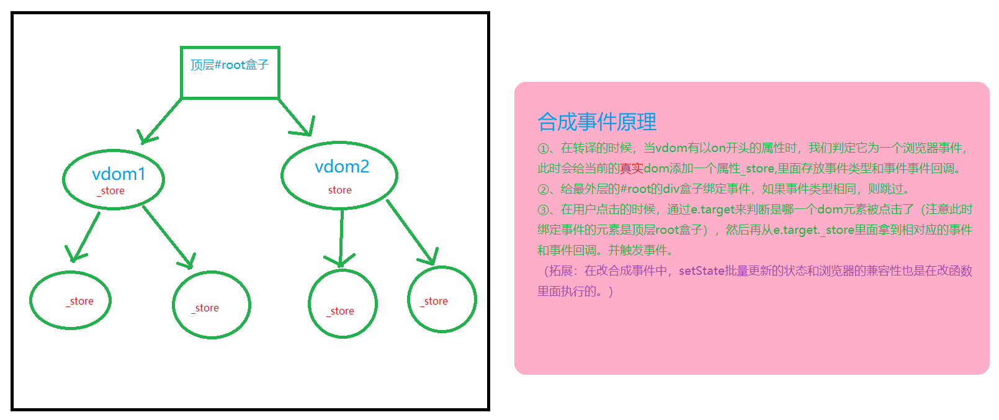

# React源码解读

## 一、React编译流程

### 1.1 图文介绍


### 1.2 部分核心代码

```js
/**
 * 将虚拟DOM转化成真实DOM
 * @param {*} vdom 虚拟DOM
 * @param {*} container 容器
 */
function createDOM(vdom) {
	const { type, props } = vdom;
	let dom; // 真实dom
	if (type === REACT_TEXT) {
		// 说明是元素节点
		dom = document.createTextNode(props);
	} else {
		dom = document.createElement(type);
	}
	if (props) {
		updateProps(dom, null, props);
		const children = props.children;
		if (typeof props === 'object' && children.type) {
			mount(children, dom);
		} else if (Array.isArray(children)) {
            // 循环递归
			reconcileChildren(children, dom);
		}
	}
    // 做一个标识，后面用
    vdom.dom = dom;
    return dom;
}
```

## 二、函数组件与类组件

- 函数组件与类组件的类型同为`function`，那么它们是如何区分的？

  ```js
  // React.Component类中有一个静态属性isReactComponent,专门用于区分这两种组件的
  export class Component {
  	static isReactComponent = true;
  	constructor(props) {
  		this.props = props;
  		this.state = {};
  		this.updater = new Updater(this);
  	}
  }
  
  
  function createDOM(vdom) {
  	if (type === REACT_TEXT) {
          ...
  	} else if (typeof type === 'function') {
  		// 通过isReactComponent判断是类组件还是函数组件
  		if (type.isReactComponent) { 
  			return mountClassComponent(vdom);
  		}
  		return mountFunctionComponent(vdom);
  	} else {
          ...
  	}
  	...
  	return dom;
  }
  ```

- 组件更新原理？

  1. 初次挂载的时候，已经在页面上放置了一个div容器，我们可以称之为‘父容器’。
  2. 更新的时候，拿到新的state状态，重新调用render方法返回新的虚拟DOM，进而生成新的真实DOM
  3. 用新的真实DOM替换掉老的div就实现更新了

  <font color="#f00">代码示例如下↓</font>

  ```js
  forceUpdate() {
      // 获取此组件上一次render渲染出来的虚拟DOM
      const oldRenderVdom = this.oldRenderVdom;
      const oldDOM = findDOM(oldRenderVdom);
      const newVdom = this.render();
      compareTwoVdom(oldDOM.parentNode, oldRenderVdom, newVdom);
      this.oldRenderVdom = newVdom;
  }
  
  /**
   * 进行DOM-DIFF对比
   * @param {*} parentDOM 父真实DOM节点
   * @param {*} oldVdom 老的虚拟DOM
   * @param {*} newVdom 新的虚拟DOM
   */
  export function compareTwoVdom(parentDOM, oldVdom, newVdom) {
  	// 获取老的真实DOM
  	let oldDOM = findDOM(oldVdom);
  	let newDOM = createDOM(newVdom);
  	parentDOM.replaceChild(newDOM, oldDOM);
  }
  ```

## 三、事件和更新原理

### 1.1  setState异步机制

> 我们都知道，setState在类组件中，即是同步的也是异步的，分为两种情况
>
> <font color="#08e">①、setState在自定义合成事件和钩子函数中是<font color='#f00'>`异步`</font>的</font>
>
> <font color="#08e">①、在原生DOM事件和定时器中是<font color='#f00'>`同步`</font>的</font>

同时，我们也发现，setState是批量更新的，这主要是为了解决render函数频繁被调用导致的性能浪费而考虑的。

### 1.2 setState批量更新机制

1. React.Component类中有一个更新器，名为`updateQueue`,大致有`isBatchingUpdate`、`updates`、`batchUpdate`函数
2. <font color='#f00'>`isBatchingUpdate`</font>用于判断是否批量，如果是则把要更新的属性存入到updates中，如果不是，立马调用`batchUpdate`函数
3. `updates`用于收集setstate传递过来的对象或者函数
4. `batchUpdate`做的事情主要是区分setState传递来的是函数还是对象，然后通过三点运算符将原state合并一起，并进行强制更新视图

```js
export let updateQueue = {
	isBatchingUpdate: false, // 更新队列中有个标识，表示是否执行批量更新
	updaters: new Set(), // updater实例的集合
	batchUpdate() {
		// 批量更新update实例的方法
		for (const iterator of this.updaters) {
			iterator.updateComponent();
		}
		// 更新完之后将isBatchingUpdate改回来
		this.isBatchingUpdate = false;
		this.updaters.clear();
	},
};
```

### 1.3 自定义合成事件



## 四、虚拟DOM diff算法

> 虚拟dom diff的对比，总共有三种diff，即<font color='#f00'>`Tree Diff`</font>、<font color='#f00'>`Component Diff`</font>、<font color='#f00'>`Element Diff`</font>,其中最为核心的当属第三种。

对比步骤如下↓

1. 如果新、旧vdom都没有，什么都不做，直接`return`
2. 如果老的有，新的没有，删除老的vdom
3. 如果老的没有，新的有，插入即可
4. 如果新旧vdom都有，但是类型不一样，删除老的，插入新的
5. 如果新旧vdom都有，并且类型一样，开始走`Element-Diff`

### 4.1 Element-Diff详细流程

