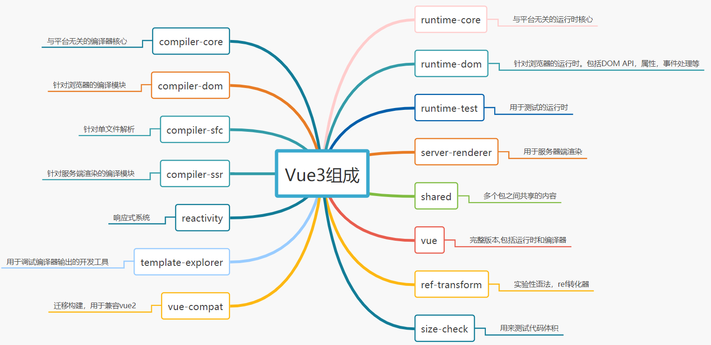
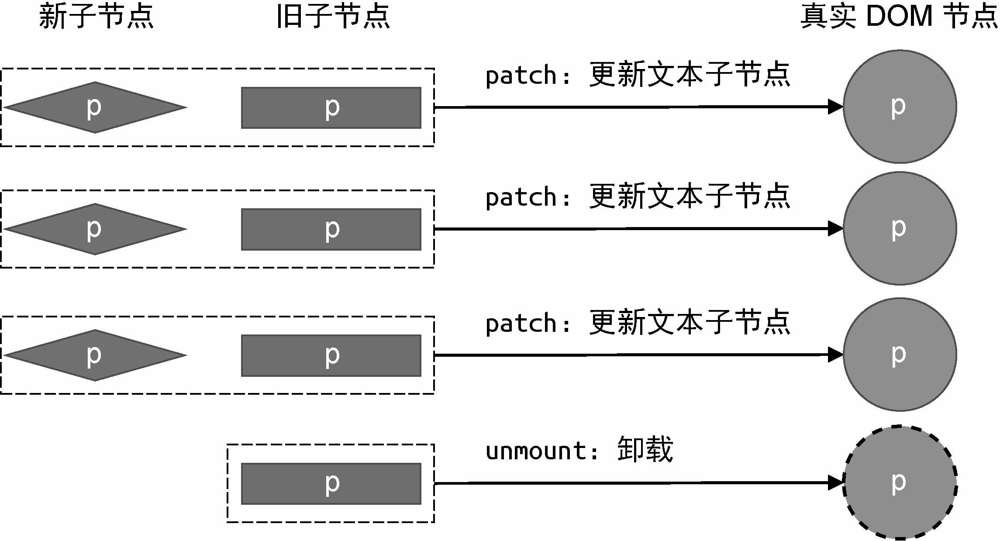
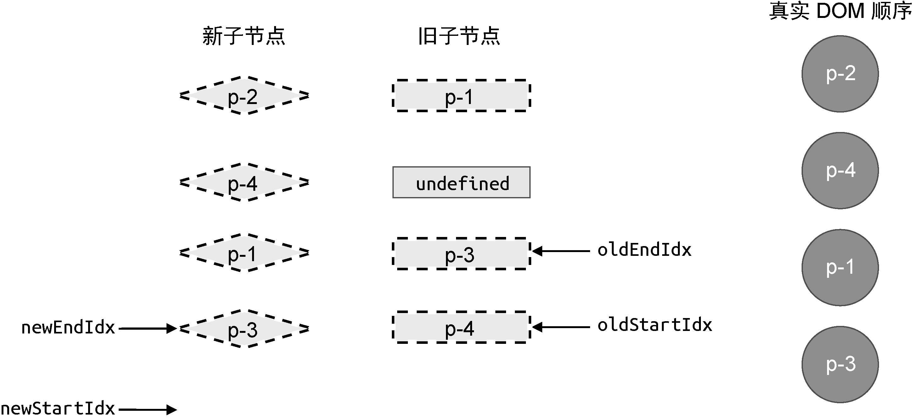

# Vue3源码共读

#### 介绍
共读vue3源码，并手写一个自己的vue3，一起来学习一下吧~

# 版本区别

- 源码采用 `monorepo` 方式进行管理，将模块拆分到package目录中
- `Vue3` 采用`ts`开发,增强类型检测。 `Vue2` 则采用`flow` 
- Vue3的性能优化，支持tree-shaking, 不使用就不会被打包。而vue2是由一个个类堆起来的，并且好多方法都放在原型上，无法tree-shaking
- Vue3后期引入RFC,使得每个版本改动可控rfcs

> 内部代码优化

- `Vue3` 劫持数据采用proxy `Vue2` 劫持数据采用`defineProperty`。 `defineProperty`有性能问题和缺陷
- `Vue3`中对模板编译进行了优化，编译时 生成了Block tree，可以对子节点的动态节点进行收集，可以减少比较，并且采用了 `patchFlag` 标记动态节点
- `Vue3` 采用`compositionApi` 进行组织功能，解决反复横跳，优化复用逻辑 （mixin带来的数据来源不清晰、命名冲突等）, 相比`optionsApi` 类型推断更加方便
- 增加了 `Fragment`,`Teleport`，`Suspense`组件

# 架构分析

## 一、Monorepo介绍

​	`Monorepo` 是管理项目代码的一个方式，指在一个项目仓库(`repo`)中管理多个模块/包(package)

1. 优点
   - **可见性（Visibility）**：每个人都可以看到其他人的代码，这样可以带来更好的协作和跨团队贡献——不同团队的开发人员都可以修复代码中的bug，而你甚至都不知道这个bug的存在。
   - **更简单的依赖关系管理（Simpler dependency management）**：共享依赖关系很简单，因为所有模块都托管在同一个存储库中，因此都不需要包管理器。
   - **唯一依赖源（Single source of truth）**：每个依赖只有一个版本，意味着没有版本冲突，没有依赖地狱。
   - **一致性（Consistency）**：当你把所有代码库放在一个地方时，执行代码质量标准和统一的风格会更容易。
   - **共享时间线（Shared timeline）**：API或共享库的变更会立即被暴露出来，迫使不同团队提前沟通合作，每个人都得努力跟上变化。
   - **原子提交（Atomic commits）**：原子提交使大规模重构更容易，开发人员可以在一次提交中更新多个包或项目。
   - **隐式CI（Implicit CI）**：因为所有代码已经统一维护在一个地方，因此可以保证持续集成[3]。
   - **统一的CI/CD（Unified CI/CD）**：可以为代码库中的每个项目使用相同的CI/CD[4]部署流程。
   - **统一的构建流程（Unified build process）**：代码库中的每个应用程序可以共享一致的构建流程[5]。
2. 缺点	
   - **仓库体积大 **：由于多个包都统一放在一个仓库里面，必然会导致仓库体积庞大。
   - **性能差（Bad performance）**：单一代码库难以扩大规模，像git blame这样的命令可能会不合理的花费很长时间执行，IDE也开始变得缓慢，生产力受到影响，对每个提交测试整个repo变得不可行。
   - **破坏主线（Broken main/master）**：主线损坏会影响到在单一代码库中工作的每个人，这既可以被看作是灾难，也可以看作是保证测试既可以保持简洁又可以跟上开发的好机会。
   - **学习曲线（Learning curve）**：如果代码库包含了许多紧密耦合的项目，那么新成员的学习曲线会更陡峭。
   - **大量的数据（Large volumes of data）**：单一代码库每天都要处理大量的数据和提交。
   - **所有权（Ownership）**：维护文件的所有权更有挑战性，因为像Git或Mercurial这样的系统没有内置的目录权限。
   - **Code reviews**：通知可能会变得非常嘈杂。例如，GitHub有有限的通知设置，不适合大量的pull request和code review。

## 二、Vue3项目结构

- **`reactivity`**:响应式系统

- **`runtime-core`**:与平台无关的运行时核心 (可以创建针对特定平台的运行时 - 自定义渲染器)

- **`runtime-dom`**: 针对浏览器的运行时。包括`DOM API`，属性，事件处理等

- **`runtime-test`**:用于测试

- **`server-renderer`**:用于服务器端渲染

- **`compiler-core`**:与平台无关的编译器核心

- **`compiler-dom`**: 针对浏览器的编译模块

- **`compiler-ssr`**: 针对服务端渲染的编译模块

- **`compiler-sfc`**: 针对单文件解析

- **`size-check`**:用来测试代码体积

- **`template-explorer`**：用于调试编译器输出的开发工具

- **`shared`**：多个包之间共享的内容

- **`vue`**:完整版本,包括运行时和编译器

  

  ------
  
  ```
                              +---------------------+
                              |                     |
                              |  @vue/compiler-sfc  |
                              |                     |
                              +-----+--------+------+
                                    |        |
                                    v        v
                 +---------------------+    +----------------------+
                 |                     |    |                      |
       +-------->|  @vue/compiler-dom  +--->|  @vue/compiler-core  |
       |         |                     |    |                      |
  +----+----+    +---------------------+    +----------------------+
  |         |
  |   vue   |
  |         |
  +----+----+   +---------------------+    +----------------------+    +-------------------+
      |         |                     |    |                      |    |                   |
      +-------->|  @vue/runtime-dom   +--->|  @vue/runtime-core   +--->|  @vue/reactivity  |
                |                     |    |                      |    |                   |
                +---------------------+    +----------------------+    +-------------------+
  ```

## 三、设计思想

### 1.声明式框架

> Vue3 依旧是声明式的框架，用起来简单。

**命令式**和**声明式**区别

- 早在 JQ 的时代编写的代码都是命令式的，命令式框架重要特点就是关注过程
- 声明式框架更加关注结果。命令式的代码封装到了 Vuejs 中，过程靠 vuejs 来实现

> 声明式代码更加简单，不需要关注实现，按照要求填代码就可以 （给上原材料就出结果）

```ts
- 命令式编程：
let numbers = [1,2,3,4,5]
let total = 0
for(let i = 0; i < numbers.length; i++) {
  total += numbers[i] - 关注了过程
}
console.log(total)

- 声明式编程：
let total2 = numbers.reduce(function (memo,current) {
  return memo + current
},0)
console.log(total2)
```

### 2.采用虚拟ODM

新旧虚拟节点，找到变化在进行更新。虚拟 DOM 就是一个对象，用来描述真实 DOM 的。

```ts
const vnode = {
  __v_isVNode: true,
  __v_skip: true,
  type,
  props,
  key: props && normalizeKey(props),
  ref: props && normalizeRef(props),
  children,
  component: null,
  el: null,
  patchFlag,
  dynamicProps,
  dynamicChildren: null,
  appContext: null,
};
```

## 3.区分编译时和运行时

- 我们需要有一个虚拟 DOM，调用渲染方法将虚拟 DOM 渲染成真实 DOM （缺点就是虚拟 DOM 编写麻烦）
- 专门写个编译时可以将模板编译成虚拟 DOM （在构建的时候进行编译性能更高，不需要再运行的时候进行编译，而且 vue3 在编译中做了很多优化）

## 4.vue3 新增设计

- Vue3.0 更注重模块上的拆分，在 2.0 中无法单独使用部分模块。需要引入完整的 Vuejs(例如只想使用使用响应式部分，但是需要引入完整的 Vuejs)， Vue3 中的模块之间耦合度低，模块可以独立使用。 **拆分模块**
- Vue2 中很多方法挂载到了实例中导致没有使用也会被打包（还有很多组件也是一样）。通过构建工具 Tree-shaking 机制实现按需引入，减少用户打包后体积。同时也移除了一些不需要的功能（filter、inline-template） **重写 API**
- Vue3 允许自定义渲染器，扩展能力强。不会发生以前的事情，改写 Vue 源码改造渲染方式。 **扩展更方便**
- 使用 RFC 来确保改动和设计都是经过 Vuejs 核心团队探讨并得到确认的。也让用户可以了解每一个功能采用或废弃的前因后果。 **采用[RFC](https://github.com/vuejs/rfcs/tree/master/active-rfcs)**

# 响应式模块

## 1.reactive

先说结论：<font color="#08e">vue3的响应式原理主要还是<font color="#f00">通过proxy配合Reflect反射形成的，其中Reflect主要是将内部的this指向指为当前的proxy代理对象。</font></font>

需要关注的点如下↓

- 判断传递进来的`target`是否为一个对象，如果不是，直接返回。
- 同一个对象重复代理，需要做缓存（使用Weakmap对象处理）。
- 禁止proxy代理对象嵌套proxy代理对象，需要做判断。如果是代理对象，直接返回。

针对于如上几点，我们编码如下

```ts
import { isObject } from "@vue/shared";
import { mutableHandlers } from "./baseHandlers";
export const enum ReactiveFlags {
  IS_REACTIVE = "__v_isReactive",
}
const reactiveMap = new WeakMap(); // key 只能是对象
export function reactive(target) {
  /*
    代理对象作为参数再次被代理时，两者应该是 ‘===’的关系，对应情形↓
    const p1 = reactive(obj)
    const p2 = reactive(p1)
    结果应该是 p1 === p2
  */
  if (!isObject(target)) {
    return target;
  }
  /*
    禁止嵌套，已经是proxy代理对象，就不用再次代理了,对应情形↓
    const p1 = reactive(obj);
    cosnt p2 = reactive(obj)
  */
  if (target[ReactiveFlags.IS_REACTIVE]) {
    return target;
  }
  const exisitsProxy = reactiveMap.get(target);
  if (exisitsProxy) {
    return exisitsProxy;
  }
  // 代理 ，我通过代理对象操作属性，你会去源对象上进行获取
  const proxy = new Proxy(target, mutableHandlers);
  // 缓存一下 代理过的对象，下次再进行代理的时候直接拿出来用即可
  // target -> proxy
  reactiveMap.set(target, proxy);
  return proxy;
}
```

## 2.effect 副作用函数

特点：

- 该函数默认一开始执行一次
- 通过ReactiveEffect实现依赖的收集

### 2.1 确立当前作用域下对应的**activeEffect**

1. 设定全局变量<font color='#f00'>`activeEffect`</font>,确定当前作用域对应的是哪一个`effect`

   > 这点主要是通过try finally语法配合`this.parent`、`activeEffect变量`来实现的

   补充：

   - 第一次执行的时候，parent=undefined,此时activeEffect = 当前第一个effect,即e1实例
   - （这个时候 return this.fn(),即 进入到第二个effect中）
   - 碰到第二个effect的时候，parent= e1,此时activeEffect指向第二个effect,即e2实例
   - (return this.fn之后，出栈，又再一次进入到e1的作用域中，执行finally代码块的代码，此时activeEffect指向e1实例，this.parent值为undefined)
   -  执行完第二个e2的作用域后，又回到了e1所在的作用域，继续执行，只剩下e1的finally代码，此时activeEffect的指向为undefined,this.parent也是undefined.
   - 结束所有流程。

```tsx
export let activeEffect = undefined; // 当前正在执行的effect
export class ReactiveEffect {
  active = true; // 标记effect是否处于激活状态
  deps = []; // 收集effect中使用到的属性
  parent = undefined;
  constructor(public fn) {}
  run() {
    if (!this.active) {
      // 不是激活状态，就不需要考虑依赖收集，也就是不需要将这个effect放到全局变量上
      return this.fn();
    }

    /* ★★★ 实现第一步的核心代码 ★★★  */
    try {
      this.parent = activeEffect; // 当前的effect就是他的父亲
      activeEffect = this; // 设置成正在激活的是当前effect
      return this.fn();
    } finally {
      activeEffect = this.parent; // 执行完毕后还原activeEffect
      this.parent = undefined;
    }
  }
}
export function effect(fn, options?) {
  const _effect = new ReactiveEffect(fn); // 创建响应式effect
  _effect.run(); // 让响应式effect默认执行
}
```

### 2.2 依赖收集的核心方法track的实现

```tsx
get(target, key, receiver) {
    if (key === ReactiveFlags.IS_REACTIVE) {
        return true;
    }
    const res = Reflect.get(target, key, receiver);
    track(target, 'get', key);  // 依赖收集
    return res;
}
```

```tsx
const targetMap = new WeakMap(); // 记录依赖关系
export function track(target, type, key) {
    // 取值操作没有发生在effect中,直接不管
    /*
    	接下来我们需要维护的映射对象如下↓
    	mapping = {
    		target: {
    			name: [activeEffect, activeEffect....]
    		}
    	}
    */
    if (activeEffect) {
        let depsMap = targetMap.get(target); // {对象：map}
        if (!depsMap) {
            targetMap.set(target, (depsMap = new Map()))
        }
        let dep = depsMap.get(key);
        if (!dep) {
            depsMap.set(key, (dep = new Set())) // {对象：{ 属性 :[ dep, dep ]}}
        }
        let shouldTrack = !dep.has(activeEffect)
        if (shouldTrack) {
            dep.add(activeEffect);
            activeEffect.deps.push(dep); // 让effect记住dep，这样后续可以用于清理
        }
    }
}
```


## 3.computed计算属性

> 计算属性的目的是根据状态衍生属性，我们希望这个属性有缓存功能。如果<font color="#f00">依赖的数据不变就不会重新计算。</font>

实现步骤

1. 判断传入的形参`getterOrOptions`的类型是否是一个函数还是对象，函数代表仅有getter，对象代表既有getter也有setter。
2. computed接受一个函数或者一个对象作为参数，返回值是<font color="#f00">`ComputeedRefImpl`</font>实例。并通过`.value`的方式获取值。
3. 运行computed的时候，需要把effect方法中的<font color="#f00">`ReactiveEffect`</font>这个核心类给拎出来，而不是直接调用effect方法，原因是无法控制什么时候执行effect传递的函数。
4. 取值的时候，返回当前`this.effect.run()`的返回值，即computed传递的函数的返回值。

具体源码实现

```tsx
import { isFunction } from "@vue/shared";
import {
  activeEffect,
  ReactiveEffect,
  track,
  trackEffects,
  triggerEffects,
} from "./effect";

const noop = () => {};

class ComputedRefImpl {
  public dep = undefined;
  public effect = undefined;
  public __v_isRef = true; // 意味着有这个属性 需要用.value来取值
  public _dirty = true; // true:重新执行 false: 走缓存
  public _value; // 默认的缓存结果
  constructor(getter, public setter) {
    // 这里源码中不能使用 effect(()=>{},{scheduler:()=>{}})
    this.effect = new ReactiveEffect(getter, () => {
      this._dirty = true;
      triggerEffects(this.dep);
    });
  }
  get value() {
    if (this._dirty) {
      // 取值才执行，并且把取到的值缓存起来
      this._value = this.effect.run();
      this._dirty = false; // 意味着取过了
    }
    return this._value;
  }
  set value(newValue) {
    this.setter(newValue);
  }
}


export function computed(getterOrOptions) {
  let onlyGetter = isFunction(getterOrOptions);
  let getter;
  let setter;

  if (onlyGetter) {
    getter = getterOrOptions;
    setter = noop;
  } else {
    getter = getterOrOptions.get;
    setter = getterOrOptions.set || noop; // 如果没有set,默认绑定一个空函数
  }
  // getter=方法必须存在
  return new ComputedRefImpl(getter, setter);
}
```

在上述源码中，还有一个问题：就是computed属性是否也能触发effect的更新呢？答案是<font color="#f00">不能</font>的。原因在于effect只收集到了reactive的值的响应，而computed计算属性需要重新编写脚才能实现。(简单的来说就是一个收集computed的属性对应的effect依赖，在特定的时间触发依赖的过程。这和reactive收集effect的依赖没有很大的差别。)

对于vue3源版本中是可以的。因此我们编码如下↓

```ts
export function trackEffects(dep) {
  let shouldTrack = !dep.has(activeEffect);
  if (shouldTrack) {
    dep.add(activeEffect);
    activeEffect.deps.push(dep); // 后续需要通过effect来清理的时候可以去使用
    // 一个属性对应多个effect， 一个effect对应着多个属性
    // 属性 和 effect的关系是多对多的关系
  }
}

class ComputedRefImpl {
  public dep = undefined; // 专门收集计算属性的effect的
  
  ...
  // 类的属性访问器 Object.defineProperty(实例,value,{get})
  get value() {
      // 如果有activeEffect 意味着这个计算属性在effct中使用
      // 需要让计算属性收集这个effect
      // 用户取值发生依赖收集
    if (activeEffect) {
      trackEffects(this.dep || (this.dep = new Set()));
    }
    if (this._dirty) {
      // 取值才执行，并且把取到的值缓存起来
      this._value = this.effect.run();
      this._dirty = false; // 意味着取过了
    }
    return this._value;
  }
}
```

## 4.watch监听属性

watch 的核心就是观测一个响应式数据，当数据变化时通知并执行回调 （那也就是说它本身就是一个 effect）

### 4.1监测响应式对象

```tsx
watch(state, (oldValue, newValue) => {
  // 监测一个响应式值的变化
  console.log(oldValue, newValue);
});
```

```tsx
function traverse(value, seen = new Set()) {
  if (!isObject(value)) {
    return value;
  }
  if (seen.has(value)) {
    return value;
  }
  seen.add(value);
  for (const k in value) {
    // 递归访问属性用于依赖收集
    traverse(value[k], seen);
  }
  return value;
}
export function isReactive(value) {
  return !!(value && value[ReactiveFlags.IS_REACTIVE]);
}
export function watch(source, cb) {
  let getter;
  if (isReactive(source)) {
    // 如果是响应式对象
    getter = () => traverse(source); // 包装成effect对应的fn, 函数内部进行遍历达到依赖收集的目的
  }
  let oldValue;
  const job = () => {
    const newValue = effect.run(); // 值变化时再次运行effect函数,获取新值
    cb(newValue, oldValue);
    oldValue = newValue;
  };
  const effect = new ReactiveEffect(getter, job); // 创建effect
  oldValue = effect.run(); // 运行保存老值
}
```

### 4.2 监听函数

```tsx
export function watch(source, cb) {
  let getter;
  if (isReactive(source)) {
    // 如果是响应式对象
    getter = () => traverse(source);
  } else if (isFunction(source)) {
    getter = source; // 如果是函数则让函数作为fn即可
  }
  // ...
}
```

### 4.3immediate实现

```tsx
export function watch(source,cb,{immediate} = {} as any){
	const effect = new ReactiveEffect(getter,job) // 创建effect
    if(immediate){ // 需要立即执行，则立刻执行任务
        job();
    }
    oldValue = effect.run();
}
```

### 4.4 watch 中 cleanup 实现

```tsx
const state = reactive({ flag: true, name: 'jw', age: 30 });
let timer = 3000
function getData(newVal) {
  return new Promise((resolve, reject) => {
    setTimeout(() => {
      resolve(newVal);
    }, timer -= 1000);
  });
}
watch(state, async (newValue, oldValue, onCleanup) => {
  let clear = false;
  onCleanup(() => {
    clear = true;
  });
  let r = await getData(newValue.name);
  if (!clear) {
    document.body.innerHTML = r;
  }
  // 监测一个响应式值的变化
}, { immediate: true });
state.age = 31;
state.age = 32;
```

```tsx
let cleanup;
let onCleanup = (fn) => {
  cleanup = fn;
};
const job = () => {
  const newValue = effect.run();
  if (cleanup) cleanup(); // 下次watch执行前调用上次注册的回调
  cb(newValue, oldValue, onCleanup); // 传入onCleanup函数
  oldValue = newValue;
};
```

### 4.5 watchEffect的实现

> 我们可以使用响应性属性编写一个方法，**每当它们的任何值更新时**，我们的方法就会重新运行。**`watchEffect`在初始化时也会立即运行**

```tsx
const state = reactive({ flag: true, name: 'jw', age: 30 });
watchEffect(() => app.innerHTML = state.name);
setTimeout(() => {
  state.name = 'Mr Jiang'
}, 1000)
```

```tsx
export function watch(source, cb, options) {
  return doWatch(source, cb, options);
}
export function watchEffect(effect, options) {
  return doWatch(effect, null, options);
}
```

```tsx
const job = () => {
  if (cb) {
    const newValue = effect.run(); // 值变化时再次运行effect函数,获取新值
    if (cleanup) cleanup(); // 下次watch执行前调用上次注册的回调
    cb(newValue, oldValue, onCleanup);
    oldValue = newValue;
  } else {
    effect.run(); // 重新执行effect即可
  }
};
```

## 5.ref的实现

TODO

## 6.toRef、toRefs、proxyRefs的实现

TODO

## 7.effectScope实现

TODO

# 响应器

## 1.runtime-dom

## 2.diff算法介绍

为了以最小的性能开销完成更新操作，需要比较两组子节点，用于比较的算法就叫作 Diff 算法。我们知道，操作 DOM 的性能开销通常比较大，而渲染器的核心 Diff 算法就是为了解决这个问题而诞生的。

### 2.1 简单 DIFF 算法

#### 2.1.1 减少DOM操作的性能开销

核心 Diff 只关心新旧虚拟节点都存在一组子节点的情况。在上一章中，我们针对两组子节点的更新，采用了一种简单直接的手段，即卸载全部旧子节点，再挂载全部新子节点。这么做的确可以完成更新，但由于没有复用任何 DOM 元素，所以会产生极大的性能开销。

以下面的新旧虚拟节点为例：

```js

 // 旧 vnode
 const oldVNode = {
   type: 'div',
   children: [
     { type: 'p', children: '1' },
     { type: 'p', children: '2' },
     { type: 'p', children: '3' }
   ]
 }

 // 新 vnode
 const newVNode = {
   type: 'div',
   children: [
     { type: 'p', children: '4' },
     { type: 'p', children: '5' },
     { type: 'p', children: '6' }
   ]
 }
```

　按照之前的做法，当更新子节点时，我们需要执行 6 次 DOM 操作：

- 卸载所有旧子节点，需要 3 次 DOM 删除操作；
- 挂载所有新子节点，需要 3 次 DOM 添加操作。

　　但是，通过观察上面新旧 `vnode` 的子节点，可以发现：

- 更新前后的所有子节点都是 `p` 标签，即标签元素不变；
- 只有 `p` 标签的子节点（文本节点）会发生变化。

　　例如，`oldVNode` 的第一个子节点是一个 `p` 标签，且该 `p` 标签的子节点类型是文本节点，内容是 `'1'`。而 `newVNode` 的第一个子节点也是一个 `p` 标签，它的子节点的类型也是文本节点，内容是 `'4'`。可以发现，更新前后改变的只有 `p` 标签文本节点的内容。所以，最理想的更新方式是，直接更新这个 `p` 标签的文本节点的内容。这样只需要一次 DOM 操作，即可完成一个 `p` 标签更新。新旧虚拟节点都有 3 个 `p` 标签作为子节点，所以一共只需要 3 次 DOM 操作就可以完成全部节点的更新。相比原来需要执行 6 次 DOM 操作才能完成更新的方式，其性能提升了一倍。

　　按照这个思路，我们可以重新实现两组子节点的更新逻辑，如下面 `patchChildren` 函数的代码所示：

```js

 function patchChildren(n1, n2, container) {
   if (typeof n2.children === 'string') {
     // 省略部分代码
   } else if (Array.isArray(n2.children)) {
     // 重新实现两组子节点的更新方式
     // 新旧 children
     const oldChildren = n1.children
     const newChildren = n2.children
     // 遍历旧的 children
     for (let i = 0; i < oldChildren.length; i++) {
       // 调用 patch 函数逐个更新子节点
       patch(oldChildren[i], newChildren[i])
     }
   } else {
     // 省略部分代码
   }
 }
```

在这段代码中，`oldChildren` 和 `newChildren` 分别是旧的一组子节点和新的一组子节点。我们遍历前者，并将两者中对应位置的节点分别传递给 `patch` 函数进行更新。`patch` 函数在执行更新时，发现新旧子节点只有文本内容不同，因此只会更新其文本节点的内容。这样，我们就成功地将 6 次 DOM 操作减少为 3 次。下图 是整个更新过程的示意图，其中**菱形**代表新子节点，**矩形**代表旧子节点，**圆形**代表真实 DOM 节点。


这种做法虽然能够减少 DOM 操作次数，但问题也很明显。在上面的代码中，我们通过遍历旧的一组子节点，并假设新的一组子节点的数量与之相同，只有在这种情况下，这段代码才能正确地工作。但是，新旧两组子节点的数量未必相同。当新的一组子节点的数量少于旧的一组子节点的数量时，意味着有些节点在更新后应该被卸载，如下图。



**卸载已经不存在的节点**

在下图中，旧的一组子节点中一共有 4 个 `p` 标签，而新的一组子节点中只有 3 个 `p` 标签。这说明，在更新过程中，需要将不存在的 `p` 标签卸载。类似地，新的一组子节点的数量也可能比旧的一组子节点的数量多。


**挂载新的节点**

在上图中，新的一组子节点比旧的一组子节点多了一个 `p` 标签。在这种情况下，我们应该挂载新增节点。

　　通过上面的分析我们意识到，在进行新旧两组子节点的更新时，不应该总是遍历旧的一组子节点或遍历新的一组子节点，而是应该遍历其中长度较短的那一组。这样，我们才能够尽可能多地调用 `patch` 函数进行更新。接着，再对比新旧两组子节点的长度，如果新的一组子节点更长，则说明有新子节点需要挂载，否则说明有旧子节点需要卸载。最终实现如下：

```js
 function patchChildren(n1, n2, container) {
   if (typeof n2.children === 'string') {
     // 省略部分代码
   } else if (Array.isArray(n2.children)) {
     const oldChildren = n1.children
     const newChildren = n2.children
     // 旧的一组子节点的长度
     const oldLen = oldChildren.length
     // 新的一组子节点的长度
     const newLen = newChildren.length
     // 两组子节点的公共长度，即两者中较短的那一组子节点的长度
     const commonLength = Math.min(oldLen, newLen)
     // 遍历 commonLength 次
     for (let i = 0; i < commonLength; i++) {
       patch(oldChildren[i], newChildren[i], container)
     }
     // 如果 newLen > oldLen，说明有新子节点需要挂载
     if (newLen > oldLen) {
       for (let i = commonLength; i < newLen; i++) {
         patch(null, newChildren[i], container)
       }
     } else if (oldLen > newLen) {
       // 如果 oldLen > newLen，说明有旧子节点需要卸载
       for (let i = commonLength; i < oldLen; i++) {
         unmount(oldChildren[i])
       }
     }
   } else {
     // 省略部分代码
   }
 }
```

这样，无论新旧两组子节点的数量关系如何，渲染器都能够正确地挂载或卸载它们。

#### 2.1.2 DOM复用与key的作用

　　在上一节中，我们通过减少 DOM 操作的次数，提升了更新性能。但这种方式仍然存在可优化的空间。举个例子，假设新旧两组子节点的内容如下：

```js
 // oldChildren
 [
   { type: 'p' },
   { type: 'div' },
   { type: 'span' }
 ]

 // newChildren
 [
   { type: 'span' },
   { type: 'p' },
   { type: 'div' }
 ]
```

如果使用上一节介绍的算法来完成上述两组子节点的更新，则需要 6 次 DOM 操作。

- 调用 `patch` 函数在旧子节点 `{ type: 'p' }` 与新子节点 `{ type: 'span' }` 之间打补丁，由于两者是不同的标签，所以 `patch` 函数会卸载 `{ type: 'p' }`，然后再挂载 `{ type: 'span' }`，这需要执行 2 次 DOM 操作。
- 与第 1 步类似，卸载旧子节点 `{ type: 'div' }`，然后再挂载新子节点 `{ type: 'p' }`，这也需要执行 2 次 DOM 操作。
- 与第 1 步类似，卸载旧子节点 `{ type: 'span' }`，然后再挂载新子节点 `{ type: 'div' }`，同样需要执行 2 次 DOM 操作。

　　因此，一共进行 6 次 DOM 操作才能完成上述案例的更新。但是，观察新旧两组子节点，很容易发现，二者只是顺序不同。所以最优的处理方式是，通过 DOM 的移动来完成子节点的更新，这要比不断地执行子节点的卸载和挂载性能更好。但是，想要通过 DOM 的移动来完成更新，必须要保证一个前提：新旧两组子节点中的确存在可复用的节点。这个很好理解，如果新的子节点没有在旧的一组子节点中出现，就无法通过移动节点的方式完成更新。所以现在问题变成了：应该如何确定新的子节点是否出现在旧的一组子节点中呢？拿上面的例子来说，怎么确定新的一组子节点中第 1 个子节点 `{ type: 'span' }` 与旧的一组子节点中第 3 个子节点相同呢？一种解决方案是，通过 `vnode.type` 来判断，只要 `vnode.type` 的值相同，我们就认为两者是相同的节点。但这种方式并不可靠，思考如下例子：

```js
 // oldChildren
 [
   { type: 'p', children: '1' },
   { type: 'p', children: '2' },
   { type: 'p', children: '3' }
 ]

 // newChildren
 [
   { type: 'p', children: '3' },
   { type: 'p', children: '1' },
   { type: 'p', children: '2' }
 ]
```

　　观察上面两组子节点，我们发现，这个案例可以通过移动 DOM 的方式来完成更新。但是所有节点的 `vnode.type` 属性值都相同，这导致我们无法确定新旧两组子节点中节点的对应关系，也就无法得知应该进行怎样的 DOM 移动才能完成更新。这时，我们就需要引入额外的 `key` 来作为 `vnode` 的标识，如下面的代码所示：

```js
 // oldChildren
 [
   { type: 'p', children: '1', key: 1 },
   { type: 'p', children: '2', key: 2 },
   { type: 'p', children: '3', key: 3 }
 ]

 // newChildren
 [
   { type: 'p', children: '3', key: 3 },
   { type: 'p', children: '1', key: 1 },
   { type: 'p', children: '2', key: 2 }
 ]
```

　　`key` 属性就像虚拟节点的“身份证”号，只要两个虚拟节点的 `type` 属性值和 `key` 属性值都相同，那么我们就认为它们是相同的，即可以进行 DOM 的复用。下图 展示了有 `key` 和 无 `key` 时新旧两组子节点的映射情况。


**有 `key` 与无 `key`**

由上图 可知，如果没有 `key`，我们无法知道新子节点与旧子节点间的映射关系，也就无法知道应该如何移动节点。有 `key` 的话情况则不同，我们根据子节点的 `key` 属性，能够明确知道新子节点在旧子节点中的位置，这样就可以进行相应的 DOM 移动操作了。

　　有必要强调的一点是，DOM 可复用并不意味着不需要更新，如下面的两个虚拟节点所示：

```js
const oldVNode = { type: 'p', key: 1, children: 'text 1' }
const newVNode = { type: 'p', key: 1, children: 'text 2' }
```

　　这两个虚拟节点拥有相同的 `key` 值和 `vnode.type` 属性值。这意味着，在更新时可以复用 DOM 元素，即只需要通过移动操作来完成更新。但仍需要对这两个虚拟节点进行打补丁操作，因为新的虚拟节点（`newVNode`）的文本子节点的内容已经改变了（由 `'text 1'` 变成 `'text 2'`）。因此，在讨论如何移动 DOM 之前，我们需要先完成打补丁操作，如下面 `patchChildren` 函数的代码所示：

```js
 function patchChildren(n1, n2, container) {
   if (typeof n2.children === 'string') {
     // 省略部分代码
   } else if (Array.isArray(n2.children)) {
     const oldChildren = n1.children
     const newChildren = n2.children

     // 遍历新的 children
     for (let i = 0; i < newChildren.length; i++) {
       const newVNode = newChildren[i]
       // 遍历旧的 children
       for (let j = 0; j < oldChildren.length; j++) {
         const oldVNode = oldChildren[j]
         // 如果找到了具有相同 key 值的两个节点，说明可以复用，但仍然需要调用 patch 函数更新
         if (newVNode.key === oldVNode.key) {
           patch(oldVNode, newVNode, container)
           break // 这里需要 break
         }
       }
     }

   } else {
     // 省略部分代码
   }
 }
```

　　在上面这段代码中，我们重新实现了新旧两组子节点的更新逻辑。可以看到，我们使用了两层 `for` 循环，外层循环用于遍历新的一组子节点，内层循环则遍历旧的一组子节点。在内层循环中，我们逐个对比新旧子节点的 `key` 值，试图在旧的子节点中找到可复用的节点。一旦找到，则调用 `patch` 函数进行打补丁。经过这一步操作之后，我们能够保证所有可复用的节点本身都已经更新完毕了。以下面的新旧两组子节点为例：

```js
 const oldVNode = {
   type: 'div',
   children: [
     { type: 'p', children: '1', key: 1 },
     { type: 'p', children: '2', key: 2 },
     { type: 'p', children: 'hello', key: 3 }
   ]
 }

 const newVNode = {
   type: 'div',
   children: [
     { type: 'p', children: 'world', key: 3 },
     { type: 'p', children: '1', key: 1 },
     { type: 'p', children: '2', key: 2 }
   ]
 }

 // 首次挂载
 renderer.render(oldVNode, document.querySelector('#app'))
 setTimeout(() => {
   // 1 秒钟后更新
   renderer.render(newVNode, document.querySelector('#app'))
 }, 1000);
```

​		运行上面这段代码，1 秒钟后，`key` 值为 3 的子节点对应的真实 DOM 的文本内容会由字符串 `'hello'` 更新为字符串 `'world'`。下面我们详细分析上面这段代码在执行更新操作时具体发生了什么。

- 第一步，取新的一组子节点中的第一个子节点，即 `key` 值为 3 的节点。尝试在旧的一组子节点中寻找具有相同 `key` 值的节点。我们发现，旧的子节点 `oldVNode[2]` 的 `key` 值为 3，于是调用 `patch` 函数进行打补丁。在这一步操作完成之后，渲染器会把 `key` 值为 3 的虚拟节点所对应的真实 DOM 的文本内容由字符串 `'hello'` 更新为字符串 `'world'`。
- 第二步，取新的一组子节点中的第二个子节点，即 `key` 值为 1 的节点。尝试在旧的一组子节点中寻找具有相同 `key` 值的节点。我们发现，旧的子节点 `oldVNode[0]` 的 `key` 值为 1，于是调用 `patch` 函数进行打补丁。由于 `key` 值等于 1 的新旧子节点没有任何差异，所以什么都不会做。
- 第三步，取新的一组子节点中的最后一个子节点，即 `key` 值为 2 的节点，最终结果与第二步相同。

　　经过上述更新操作后，所有节点对应的真实 DOM 元素都更新完毕了。但真实 DOM 仍然保持旧的一组子节点的顺序，即 `key` 值为 3 的节点对应的真实 DOM 仍然是最后一个子节点。由于在新的一组子节点中，`key` 值为 3 的节点已经变为第一个子节点了，因此我们还需要通过移动节点来完成真实 DOM 顺序的更新。

#### 2.1.3 找到需要移动的元素

　　现在，我们已经能够通过 `key` 值找到可复用的节点了。接下来需要思考的是，如何判断一个节点是否需要移动，以及如何移动。对于第一个问题，我们可以采用逆向思维的方式，先想一想在什么情况下节点不需要移动？答案很简单，当新旧两组子节点的节点顺序不变时，就不需要额外的移动操作，如下图所示。


**节点顺序不变**

在上图 中，新旧两组子节点的顺序没有发生变化，图中也给出了旧的一组子节点中各个节点的索引：

- `key` 值为 1 的节点在旧 `children` 数组中的索引为 `0`；
- `key` 值为 2 的节点在旧 `children` 数组中的索引为 `1`；
- `key` 值为 3 的节点在旧 `children` 数组中的索引为 `2`。

　　接着，我们对新旧两组子节点采用上一节介绍的更新算法，看看当新旧两组子节点的顺序没有发生变化时，更新算法具有怎样的特点。

- 第一步：取新的一组子节点中的第一个节点 `p-1`，它的 `key` 为 1。尝试在旧的一组子节点中找到具有相同 `key` 值的可复用节点，发现能够找到，并且该节点在旧的一组子节点中的索引为 `0`。
- 第二步：取新的一组子节点中的第二个节点 `p-2`，它的 `key` 为 2。尝试在旧的一组子节点中找到具有相同 `key` 值的可复用节点，发现能够找到，并且该节点在旧的一组子节点中的索引为 `1`。
- 第三步：取新的一组子节点中的第三个节点 `p-3`，它的 `key` 为 3。尝试在旧的一组子节点中找到具有相同 `key` 值的可复用节点，发现能够找到，并且该节点在旧的一组子节点中的索引为 `2`。

　　在这个过程中，每一次寻找可复用的节点时，都会记录该可复用节点在旧的一组子节点中的位置索引。如果把这些位置索引值按照先后顺序排列，则可以得到一个序列：`0`、`1`、`2`。这是一个递增的序列，在这种情况下不需要移动任何节点。

　　我们再来看看另外一个例子，如下图 所示


**节点顺序变化**

　同样，我们根据图 9-6 中给出的例子再次执行更新算法，看看这一次会有什么不同。

- 第一步：取新的一组子节点中的第一个节点 `p-3`，它的 `key` 为 3。尝试在旧的一组子节点中找到具有相同 `key` 值的可复用节点，发现能够找到，并且该节点在旧的一组子节点中的索引为 `2`。

- 第二步：取新的一组子节点中的第二个节点 `p-1`，它的 `key` 为 1。尝试在旧的一组子节点中找到具有相同 `key` 值的可复用节点，发现能够找到，并且该节点在旧的一组子节点中的索引为 `0`。

  到了这一步我们发现，索引值递增的顺序被打破了。节点 `p-1` 在旧 `children` 中的索引是 `0`，它小于节点 `p-3` 在旧 `children` 中的索引 `2`。这说明**节点** `p-1` **在旧** `children` **中排在节点** `p-3` **前面，但在新的** `children` **中，它排在节点** `p-3` **后面**。因此，我们能够得出一个结论：**节点** `p-1` **对应的真实** DOM **需要移动**。

- 第三步：取新的一组子节点中的第三个节点 `p-2`，它的 `key` 为 2。尝试在旧的一组子节点中找到具有相同 `key` 值的可复用节点，发现能够找到，并且该节点在旧的一组子节点中的索引为 `1`。

  到了这一步我们发现，节点 `p-2` 在旧 `children` 中的索引 `1` 要小于节点 `p-3` 在旧 `children` 中的索引 `2`。这说明，**节点** `p-2` **在旧** `children` **中排在节点** `p-3` **前面，但在新的** `children` **中，它排在节点** `p-3` **后面。因此，节点** `p-2` **对应的真实** DOM **也需要移动**。

　　以上就是 Diff 算法在执行更新的过程中，判断节点是否需要移动的方式。在上面的例子中，我们得出了节点 `p-1` 和节点 `p-2` 需要移动的结论。这是因为它们在旧 `children` 中的索引要小于节点 `p-3` 在旧 `children` 中的索引。如果我们按照先后顺序记录在寻找节点过程中所遇到的位置索引，将会得到序列：`2`、`0`、`1`。可以发现，这个序列不具有递增的趋势。

　　其实我们可以将节点 `p-3` 在旧 `children` 中的索引定义为：**在旧** `children` **中寻找具有相同** `key` **值节点的过程中，遇到的最大索引值**。如果在后续寻找的过程中，存在索引值比当前遇到的最大索引值还要小的节点，则意味着该节点需要移动。

　　我们可以用 `lastIndex` 变量存储整个寻找过程中遇到的最大索引值，如下面的代码所示：

```js
 function patchChildren(n1, n2, container) {
   if (typeof n2.children === 'string') {
     // 省略部分代码
   } else if (Array.isArray(n2.children)) {
     const oldChildren = n1.children
     const newChildren = n2.children

     // 用来存储寻找过程中遇到的最大索引值
     let lastIndex = 0
     for (let i = 0; i < newChildren.length; i++) {
       const newVNode = newChildren[i]
       for (let j = 0; j < oldChildren.length; j++) {
         const oldVNode = oldChildren[j]
         if (newVNode.key === oldVNode.key) {
           patch(oldVNode, newVNode, container)
           if (j < lastIndex) {
             // 如果当前找到的节点在旧 children 中的索引小于最大索引值 lastIndex，
             // 说明该节点对应的真实 DOM 需要移动
           } else {
               // 如果当前找到的节点在旧 children 中的索引不小于最大索引值，
             // 则更新 lastIndex 的值
             lastIndex = j
           }
           break // 这里需要 break
         }
       }
     }

   } else {
     // 省略部分代码
   }
 }
```

　　如以上代码及注释所示，如果新旧节点的 `key` 值相同，说明我们在旧 `children` 中找到了可复用 DOM 的节点。此时我们用该节点在旧 `children` 中的索引 `j` 与 `lastIndex` 进行比较，如果 `j` 小于 `lastIndex`，说明当前 `oldVNode` 对应的真实 DOM 需要移动，否则说明不需要移动。但此时应该将变量 `j` 的值赋给变量 `lastIndex`，以保证寻找节点的过程中，变量 `lastIndex` 始终存储着当前遇到的最大索引值。

　　现在，我们已经找到了需要移动的节点，下一节我们将讨论如何移动节点，从而完成节点顺序的更新。

#### 2.1.4 如何移动元素

　　在上一节中，我们讨论了如何判断节点是否需要移动。移动节点指的是，移动一个虚拟节点所对应的真实 DOM 节点，并不是移动虚拟节点本身。既然移动的是真实 DOM 节点，那么就需要取得对它的引用才行。我们知道，当一个虚拟节点被挂载后，其对应的真实 DOM 节点会存储在它的 `vnode.el` 属性中，如下图所示。


**虚拟节点引用了真实 DOM 元素**

　　因此，在代码中，我们可以通过旧子节点的 `vnode.el` 属性取得它对应的真实 DOM 节点。

　　当更新操作发生时，渲染器会调用 `patchElement` 函数在新旧虚拟节点之间进行打补丁。回顾一下 `patchElement` 函数的代码，如下

```js
 function patchElement(n1, n2) {
   // 新的 vnode 也引用了真实 DOM 元素
   const el = n2.el = n1.el
   // 省略部分代码
 }
```

　　可以看到，`patchElement` 函数首先将旧节点的 `n1.el` 属性赋值给新节点的 `n2.el` 属性。这个赋值语句的真正含义其实就是 DOM 元素的**复用**。在复用了 DOM 元素之后，新节点也将持有对真实 DOM 的引用，如下图所示。


**使新的子节点也引用真实 DOM 元素**

　　可以看到，无论是新子节点还是旧子节点，都存在对真实 DOM 的引用，在此基础上，我们就可以进行 DOM 移动操作了。

　　为了阐述具体应该怎样移动 DOM 节点，我们仍然引用上一节的更新案例，如下图 所示。


**新旧子节点的关系**

它的更新步骤如下。

- 第一步：取新的一组子节点中第一个节点 `p-3`，它的 `key` 为 3，尝试在旧的一组子节点中找到具有相同 `key` 值的可复用节点。发现能够找到，并且该节点在旧的一组子节点中的索引为 `2`。此时变量 `lastIndex` 的值为 `0`，索引 `2` 不小于 `0`，所以节点 `p-3` 对应的真实 DOM 不需要移动，但需要更新变量 `lastIndex` 的值为 `2`。

- 第二步：取新的一组子节点中第二个节点 `p-1`，它的 `key` 为 1，尝试在旧的一组子节点中找到具有相同 `key` 值的可复用节点。发现能够找到，并且该节点在旧的一组子节点中的索引为 `0`。此时变量 `lastIndex` 的值为 `2`，索引 `0` 小于 `2`，所以节点 `p-1` 对应的真实 DOM 需要移动。

  到了这一步，我们发现，节点 `p-1` 对应的真实 DOM 需要移动，但应该移动到哪里呢？我们知道，**新** `children` **的顺序其实就是更新后真实 DOM 节点应有的顺序**。所以节点 `p-1` 在新 `children` 中的位置就代表了真实 DOM 更新后的位置。由于节点 `p-1` 在新 `children` 中排在节点 `p-3` 后面，所以我们应该**把节点** `p-1` **所对应的真实** DOM **移动到节点** `p-3` **所对应的真实** DOM **后面**。移动后的结果如图 9-10 所示。

  可以看到，这样操作之后，此时真实 DOM 的顺序为 `p-2`、`p-3`、`p-1`。

- 第三步：取新的一组子节点中第三个节点 `p-2`，它的 `key` 为 2。尝试在旧的一组子节点中找到具有相同 `key` 值的可复用节点。发现能够找到，并且该节点在旧的一组子节点中的索引为 `1`。此时变量 `lastIndex` 的值为 `2`，索引 `1` 小于 `2`，所以节点 `p-2` 对应的真实 DOM 需要移动。


**把节点 `p-1` 对应的真实 DOM 移动到节点 `p-3` 对应的真实 DOM 后面**

　　第三步与第二步类似，节点 `p-2` 对应的真实 DOM 也需要移动。同样，由于节点 `p-2` 在新 `children` 中排在节点 `p-1` 后面，所以我们应该把节点 `p-2` 对应的真实 DOM 移动到节点 `p-1` 对应的真实 DOM 后面。移动后的结果如下图所示。


**把节点 `p-2` 对应的真实 DOM 移动到节点 `p-1` 对应的真实 DOM 后面**

　　经过这一步移动操作之后，我们发现，真实 DOM 的顺序与新的一组子节点的顺序相同了：`p-3`、`p-1`、`p-2`。至此，更新操作完成。

　　接下来，我们着手实现代码。其实并不复杂，如下面 `patchChildren` 函数的代码所示：

```js
 function patchChildren(n1, n2, container) {
   if (typeof n2.children === 'string') {
     // 省略部分代码
   } else if (Array.isArray(n2.children)) {
     const oldChildren = n1.children
     const newChildren = n2.children

     let lastIndex = 0
     for (let i = 0; i < newChildren.length; i++) {
       const newVNode = newChildren[i]
       let j = 0
       for (j; j < oldChildren.length; j++) {
         const oldVNode = oldChildren[j]
         if (newVNode.key === oldVNode.key) {
           patch(oldVNode, newVNode, container)
           if (j < lastIndex) {
             // 代码运行到这里，说明 newVNode 对应的真实 DOM 需要移动
             // 先获取 newVNode 的前一个 vnode，即 prevVNode
             const prevVNode = newChildren[i - 1]
             // 如果 prevVNode 不存在，则说明当前 newVNode 是第一个节点，它不需要移动
             if (prevVNode) {
               // 由于我们要将 newVNode 对应的真实 DOM 移动到 prevVNode 所对应真实 DOM 后面，
               // 所以我们需要获取 prevVNode 所对应真实 DOM 的下一个兄弟节点，并将其作为锚点
               const anchor = prevVNode.el.nextSibling
               // 调用 insert 方法将 newVNode 对应的真实 DOM 插入到锚点元素前面，
               // 也就是 prevVNode 对应真实 DOM 的后面
               insert(newVNode.el, container, anchor)
             }
           } else {
             lastIndex = j
           }
           break
         }
       }
     }

   } else {
     // 省略部分代码
   }
 }
```

　　在上面这段代码中，如果条件 `j < lastIndex` 成立，则说明当前 `newVNode` 所对应的真实 DOM 需要移动。根据前文的分析可知，我们需要获取当前 `newVNode` 节点的前一个虚拟节点，即 `newChildren[i - 1]`，然后使用 `insert` 函数完成节点的移动，其中 `insert` 函数依赖浏览器原生的 `insertBefore` 函数，如下面的代码所示：

```js
 const renderer = createRenderer({
   // 省略部分代码

   insert(el, parent, anchor = null) {
     // insertBefore 需要锚点元素 anchor
     parent.insertBefore(el, anchor)
   }

   // 省略部分代码
 })
```

#### 2.1.5 添加新元素

　　本节我们将讨论添加新节点的情况，如下图所示。


**新增节点 `p-4`**

　　观察图 9-12 可知，在新的一组子节点中，多出来一个节点 `p-4`，它的 `key` 值为 `4`，该节点在旧的一组子节点不存在，因此应该将其视为新增节点。对于新增节点，在更新时我们应该正确地将它挂载，这主要分为两步：

- 想办法找到新增节点；
- 将新增节点挂载到正确位置。

　　首先，我们来看一下如何找到新增节点。为了搞清楚这个问题，我们需要根据图 9-12 中给出的例子模拟执行简单 Diff 算法的逻辑。在此之前，我们需要弄清楚新旧两组子节点与真实 DOM 元素的当前状态，如下图所示。


**新旧两组子节点与真实 DOM 元素的当前状态**

　　接着，我们开始模拟执行简单 Diff 算法的更新逻辑。

- 第一步：取新的一组子节点中第一个节点 `p-3`，它的 `key` 值为 3，尝试在旧的一组子节点中寻找可复用的节点。发现能够找到，并且该节点在旧的一组子节点中的索引值为 `2`。此时，变量 `lastIndex` 的值为 `0`，索引值 `2` 不小于 `lastIndex` 的值 `0`，所以节点 `p-3` 对应的真实 DOM 不需要移动，但是需要将变量 `lastIndex` 的值更新为 `2`。
- 第二步：取新的一组子节点中第二个节点 `p-1`，它的 `key` 值为 1，尝试在旧的一组子节点中寻找可复用的节点。发现能够找到，并且该节点在旧的一组子节点中的索引值为 `0`。此时变量 `lastIndex` 的值为 `2`，索引值 `0` 小于 `lastIndex` 的值 `2`，所以节点 `p-1` 对应的真实 DOM 需要移动，并且应该移动到节点 `p-3` 对应的真实 DOM 后面。经过这一步的移动操作后，真实 DOM 的状态如下图所示。


**真实 DOM 的当前状态**

- 此时真实 DOM 的顺序为 `p-2`、`p-3`、`p-1`。
- 第三步：取新的一组子节点中第三个节点 `p-4`，它的 `key` 值为 4，尝试在旧的一组子节点中寻找可复用的节点。由于在旧的一组子节点中，没有 `key` 值为 4 的节点，因此渲染器会把节点 `p-4` 看作新增节点并挂载它。那么，应该将它挂载到哪里呢？为了搞清楚这个问题，我们需要观察节点 `p-4` 在新的一组子节点中的位置。由于节点 `p-4` 出现在节点 `p-1` 后面，所以我们应该把节点 `p-4` 挂载到节点 `p-1` 所对应的真实 DOM 后面。在经过这一步挂载操作之后，真实 DOM 的状态如图 9-15 所示。


**真实 DOM 的当前状态**


- **图 9-16　真实 DOM 的当前状态**

　　此时真实 DOM 的顺序是：`p-3`、`p-1`、`p-4`、`p-2`。至此，真实 DOM 的顺序已经与新的一组子节点的顺序相同了，更新完成。

　　接下来，我们着手实现代码，如下面 `patchChildren` 函数的代码所示：

```js
 function patchChildren(n1, n2, container) {
   if (typeof n2.children === 'string') {
     // 省略部分代码
   } else if (Array.isArray(n2.children)) {
     const oldChildren = n1.children
     const newChildren = n2.children

     let lastIndex = 0
     for (let i = 0; i < newChildren.length; i++) {
       const newVNode = newChildren[i]
       let j = 0
       // 在第一层循环中定义变量 find，代表是否在旧的一组子节点中找到可复用的节点，
       // 初始值为 false，代表没找到
       let find = false
       for (j; j < oldChildren.length; j++) {
         const oldVNode = oldChildren[j]
         if (newVNode.key === oldVNode.key) {
           // 一旦找到可复用的节点，则将变量 find 的值设为 true
           find = true
           patch(oldVNode, newVNode, container)
           if (j < lastIndex) {
             const prevVNode = newChildren[i - 1]
             if (prevVNode) {
               const anchor = prevVNode.el.nextSibling
               insert(newVNode.el, container, anchor)
             }
           } else {
             lastIndex = j
           }
           break
         }
       }
       // 如果代码运行到这里，find 仍然为 false，
       // 说明当前 newVNode 没有在旧的一组子节点中找到可复用的节点
       // 也就是说，当前 newVNode 是新增节点，需要挂载
       if (!find) {
         // 为了将节点挂载到正确位置，我们需要先获取锚点元素
         // 首先获取当前 newVNode 的前一个 vnode 节点
         const prevVNode = newChildren[i - 1]
         let anchor = null
         if (prevVNode) {
           // 如果有前一个 vnode 节点，则使用它的下一个兄弟节点作为锚点元素
           anchor = prevVNode.el.nextSibling
         } else {
           // 如果没有前一个 vnode 节点，说明即将挂载的新节点是第一个子节点
           // 这时我们使用容器元素的 firstChild 作为锚点
           anchor = container.firstChild
         }
         // 挂载 newVNode
         patch(null, newVNode, container, anchor)
       }
     }

   } else {
     // 省略部分代码
   }
 }
```

　　观察上面这段代码。首先，我们在外层循环中定义了名为 `find` 的变量，它代表渲染器能否在旧的一组子节点中找到可复用的节点。变量 `find` 的初始值为 `false`，一旦寻找到可复用的节点，则将变量 `find` 的值设置为 `true`。如果内层循环结束后，变量 `find` 的值仍然为 `false`，则说明当前 `newVNode` 是一个全新的节点，需要挂载它。为了将节点挂载到正确位置，我们需要先获取锚点元素：找到 `newVNode` 的前一个虚拟节点，即 `prevVNode`，如果存在，则使用它对应的真实 DOM 的下一个兄弟节点作为锚点元素；如果不存在，则说明即将挂载的 `newVNode` 节点是容器元素的第一个子节点，此时应该使用容器元素的 `container.firstChild` 作为锚点元素。最后，将锚点元素 `anchor` 作为 `patch` 函数的第四个参数，调用 `patch` 函数完成节点的挂载。

　　但由于目前实现的 `patch` 函数还不支持传递第四个参数，所以我们需要调整 `patch` 函数的代码，如下所示：

```js
 // patch 函数需要接收第四个参数，即锚点元素
 function patch(n1, n2, container, anchor) {
   // 省略部分代码

   if (typeof type === 'string') {
     if (!n1) {
       // 挂载时将锚点元素作为第三个参数传递给 mountElement 函数
       mountElement(n2, container, anchor)
     } else {
       patchElement(n1, n2)
     }
   } else if (type === Text) {
     // 省略部分代码
   } else if (type === Fragment) {
     // 省略部分代码
   }
 }

 // mountElement 函数需要增加第三个参数，即锚点元素
 function mountElement(vnode, container, anchor) {
   // 省略部分代码

   // 在插入节点时，将锚点元素透传给 insert 函数
   insert(el, container, anchor)
 }
```

#### 2.1.6 移除不存在的元素

　　在更新子节点时，不仅会遇到新增元素，还会出现元素被删除的情况，如下图所示。


**节点被删除的情况**

　　在新的一组子节点中，节点 `p-2` 已经不存在了，这说明该节点被删除了。渲染器应该能找到那些需要删除的节点并正确地将其删除。

　　具体要如何做呢？首先，我们来讨论如何找到需要删除的节点。以图 9-17 为例，我们来分析它的更新步骤。在模拟执行更新逻辑之前，我们需要清楚新旧两组子节点以及真实 DOM 节点的当前状态，如下图所示。


**新旧两组子节点与真实 DOM 节点的当前状态**

　　接着，我们开始模拟执行更新的过程。

- 第一步：取新的一组子节点中的第一个节点 `p-3`，它的 `key` 值为 3。尝试在旧的一组子节点中寻找可复用的节点。发现能够找到，并且该节点在旧的一组子节点中的索引值为 `2`。此时变量 `lastIndex` 的值为 `0`，索引 `2` 不小于 `lastIndex` 的值 `0`，所以节点 `p-3` 对应的真实 DOM 不需要移动，但需要更新变量 `lastIndex` 的值为 `2`。
- 第二步：取新的一组子节点中的第二个节点 `p-1`，它的 `key` 值为 1。尝试在旧的一组子节点中寻找可复用的节点。发现能够找到，并且该节点在旧的一组子节点中的索引值为 `0`。此时变量 `lastIndex` 的值为 `2`，索引 `0` 小于 `lastIndex` 的值 `2`，所以节点 `p-1` 对应的真实 DOM 需要移动，并且应该移动到节点 `p-3` 对应的真实 DOM 后面。经过这一步的移动操作后，真实 DOM 的状态如图 9-19 所示。


**真实 DOM 的当前状态**

　　至此，更新结束。我们发现，节点 `p-2` 对应的真实 DOM 仍然存在，所以需要增加额外的逻辑来删除遗留节点。思路很简单，当基本的更新结束时，我们需要遍历旧的一组子节点，然后去新的一组子节点中寻找具有相同 `key` 值的节点。如果找不到，则说明应该删除该节点，如下面 `patchChildren` 函数的代码所示：

```js
 function patchChildren(n1, n2, container) {
   if (typeof n2.children === 'string') {
     // 省略部分代码
   } else if (Array.isArray(n2.children)) {
     const oldChildren = n1.children
     const newChildren = n2.children

     let lastIndex = 0
     for (let i = 0; i < newChildren.length; i++) {
       // 省略部分代码
     }

     // 上一步的更新操作完成后
     // 遍历旧的一组子节点
     for (let i = 0; i < oldChildren.length; i++) {
       const oldVNode = oldChildren[i]
       // 拿旧子节点 oldVNode 去新的一组子节点中寻找具有相同 key 值的节点
       const has = newChildren.find(
         vnode => vnode.key === oldVNode.key
       )
       if (!has) {
         // 如果没有找到具有相同 key 值的节点，则说明需要删除该节点
         // 调用 unmount 函数将其卸载
         unmount(oldVNode)
       }
     }

   } else {
     // 省略部分代码
   }
 }
```

　　如以上代码及注释所示，在上一步的更新操作完成之后，我们还需要遍历旧的一组子节点，目的是检查旧子节点在新的一组子节点中是否仍然存在，如果已经不存在了，则调用 `unmount` 函数将其卸载。

#### 2.1.7 总结

　　在本章中，我们首先讨论了 Diff 算法的作用。Diff 算法用来计算两组子节点的差异，并试图最大程度地复用 DOM 元素。在上一章中，我们采用了一种简单的方式来更新子节点，即卸载所有旧子节点，再挂载所有新子节点。然而这种更新方式无法对 DOM 元素进行复用，需要大量的 DOM 操作才能完成更新，非常消耗性能。于是，我们对它进行了改进。改进后的方案是，遍历新旧两组子节点中数量较少的那一组，并逐个调用 `patch` 函数进行打补丁，然后比较新旧两组子节点的数量，如果新的一组子节点数量更多，说明有新子节点需要挂载；否则说明在旧的一组子节点中，有节点需要卸载。

　　然后，我们讨论了虚拟节点中 `key` 属性的作用，它就像虚拟节点的“身份证号”。在更新时，渲染器通过 `key` 属性找到可复用的节点，然后尽可能地通过 DOM 移动操作来完成更新，避免过多地对 DOM 元素进行销毁和重建。

　　接着，我们讨论了简单 Diff 算法是如何寻找需要移动的节点的。简单 Diff 算法的核心逻辑是，拿新的一组子节点中的节点去旧的一组子节点中寻找可复用的节点。如果找到了，则记录该节点的位置索引。我们把这个位置索引称为最大索引。在整个更新过程中，如果一个节点的索引值小于最大索引，则说明该节点对应的真实 DOM 元素需要移动。

　　最后，我们通过几个例子讲解了渲染器是如何移动、添加、删除虚拟节点所对应的 DOM 元素的。

### 2.2 双端 DIFF 算法

　　上一章，我们介绍了简单 Diff 算法的实现原理。简单 Diff 算法利用虚拟节点的 `key` 属性，尽可能地复用 DOM 元素，并通过移动 DOM 的方式来完成更新，从而减少不断地创建和销毁 DOM 元素带来的性能开销。但是，简单 Diff 算法仍然存在很多缺陷，这些缺陷可以通过本章将要介绍的双端 Diff 算法解决。

#### 2.2.1 双端比较的原理

　　简单 Diff 算法的问题在于，它对 DOM 的移动操作并不是最优的。我们拿上一章的例子来看，如图 10-1 所示。


**新旧两组子节点及索引**

　　在这个例子中，如果使用简单 Diff 算法来更新它，则会发生两次 DOM 移动操作，如下图所示。


**两次 DOM 移动操作完成更新**

　　第一次 DOM 移动操作会将真实 DOM 节点 `p-1` 移动到真实 DOM 节点 `p-3` 后面。第二次移动操作会将真实 DOM 节点 `p-2` 移动到真实 DOM 节点 `p-1` 后面。最终，真实 DOM 节点的顺序与新的一组子节点顺序一致：`p-3`、`p-1`、`p-2`。

　　然而，上述更新过程并非最优解。在这个例子中，其实只需要通过一步 DOM 节点的移动操作即可完成更新，即只需要把真实 DOM 节点 `p-3` 移动到真实 DOM 节点 `p-1` 前面，如图 10-3 所示。


**把真实 DOM 节点 `p-3` 移动到真实 DOM 节点 `p-1` 前面**

　　可以看到，理论上只需要一次 DOM 移动操作即可完成更新。但简单 Diff 算法做不到这一点，不过本章我们要介绍的双端 Diff 算法可以做到。接下来，我们就来讨论双端 Diff 算法的原理。

　　顾名思义，双端 Diff 算法是一种同时对新旧两组子节点的两个端点进行比较的算法。因此，我们需要四个索引值，分别指向新旧两组子节点的端点，如图 10-4 所示。


**四个索引值，分别指向新旧两组子节点的端点**

　　用代码来表达四个端点，如下面 `patchChildren` 和 `patchKeyedChildren` 函数的代码所示：

```js
 function patchChildren(n1, n2, container) {
   if (typeof n2.children === 'string') {
     // 省略部分代码
   } else if (Array.isArray(n2.children)) {
     // 封装 patchKeyedChildren 函数处理两组子节点
     patchKeyedChildren(n1, n2, container)
   } else {
     // 省略部分代码
   }
 }

 function patchKeyedChildren(n1, n2, container) {
   const oldChildren = n1.children
   const newChildren = n2.children
   // 四个索引值
   let oldStartIdx = 0
   let oldEndIdx = oldChildren.length - 1
   let newStartIdx = 0
   let newEndIdx = newChildren.length - 1
 }
```

　　在上面这段代码中，我们将两组子节点的打补丁工作封装到了 `patchKeyedChildren` 函数中。在该函数内，首先获取新旧两组子节点 `oldChildren` 和 `newChildren`，接着创建四个索引值，分别指向新旧两组子节点的头和尾，即 `oldStartIdx`、`oldEndIdx`、`newStartIdx` 和 `newEndIdx`。有了索引后，就可以找到它所指向的虚拟节点了，如下面的代码所示：

```js
 function patchKeyedChildren(n1, n2, container) {
   const oldChildren = n1.children
   const newChildren = n2.children
   // 四个索引值
   let oldStartIdx = 0
   let oldEndIdx = oldChildren.length - 1
   let newStartIdx = 0
   let newEndIdx = newChildren.length - 1
   // 四个索引指向的 vnode 节点
   let oldStartVNode = oldChildren[oldStartIdx]
   let oldEndVNode = oldChildren[oldEndIdx]
   let newStartVNode = newChildren[newStartIdx]
   let newEndVNode = newChildren[newEndIdx]
 }
```

其中，`oldStartVNode` 和 `oldEndVNode` 是旧的一组子节点中的第一个节点和最后一个节点，`newStartVNode` 和 `newEndVNode` 则是新的一组子节点的第一个节点和最后一个节点。有了这些信息之后，我们就可以开始进行双端比较了。怎么比较呢？如下图所示。


**双端比较的方式**

　　在双端比较中，每一轮比较都分为四个步骤，如图 10-5 中的连线所示。

- 第一步：比较旧的一组子节点中的第一个子节点 `p-1` 与新的一组子节点中的第一个子节点 `p-4`，看看它们是否相同。由于两者的 `key` 值不同，因此不相同，不可复用，于是什么都不做。
- 第二步：比较旧的一组子节点中的最后一个子节点 `p-4` 与新的一组子节点中的最后一个子节点 `p-3`，看看它们是否相同。由于两者的 `key` 值不同，因此不相同，不可复用，于是什么都不做。
- 第三步：比较旧的一组子节点中的第一个子节点 `p-1` 与新的一组子节点中的最后一个子节点 `p-3`，看看它们是否相同。由于两者的 `key` 值不同，因此不相同，不可复用，于是什么都不做。
- 第四步：比较旧的一组子节点中的最后一个子节点 `p-4` 与新的一组子节点中的第一个子节点 `p-4`。由于它们的 `key` 值相同，因此可以进行 DOM 复用。

　　可以看到，我们在第四步时找到了相同的节点，这说明它们对应的真实 DOM 节点可以复用。对于可复用的 DOM 节点，我们只需要通过 DOM 移动操作完成更新即可。那么应该如何移动 DOM 元素呢？为了搞清楚这个问题，我们需要分析第四步比较过程中的细节。我们注意到，第四步是比较旧的一组子节点的最后一个子节点与新的一组子节点的第一个子节点，发现两者相同。这说明：**节点** `p-4` **原本是最后一个子节点，但在新的顺序中，它变成了第一个子节点**。换句话说，节点 `p-4` 在更新之后应该是第一个子节点。对应到程序的逻辑，可以将其翻译为：**将索引** `oldEndIdx` **指向的虚拟节点所对应的真实 DOM 移动到索引** `oldStartIdx` **指向的虚拟节点所对应的真实 DOM 前面**。如下面的代码所示：

```js
 function patchKeyedChildren(n1, n2, container) {
   const oldChildren = n1.children
   const newChildren = n2.children
   // 四个索引值
   let oldStartIdx = 0
   let oldEndIdx = oldChildren.length - 1
   let newStartIdx = 0
   let newEndIdx = newChildren.length - 1
   // 四个索引指向的 vnode 节点
   let oldStartVNode = oldChildren[oldStartIdx]
   let oldEndVNode = oldChildren[oldEndIdx]
   let newStartVNode = newChildren[newStartIdx]
   let newEndVNode = newChildren[newEndIdx]

   if (oldStartVNode.key === newStartVNode.key) {
     // 第一步：oldStartVNode 和 newStartVNode 比较
   } else if (oldEndVNode.key === newEndVNode.key) {
     // 第二步：oldEndVNode 和 newEndVNode 比较
   } else if (oldStartVNode.key === newEndVNode.key) {
     // 第三步：oldStartVNode 和 newEndVNode 比较
   } else if (oldEndVNode.key === newStartVNode.key) {
     // 第四步：oldEndVNode 和 newStartVNode 比较
     // 仍然需要调用 patch 函数进行打补丁
     patch(oldEndVNode, newStartVNode, container)
     // 移动 DOM 操作
     // oldEndVNode.el 移动到 oldStartVNode.el 前面
     insert(oldEndVNode.el, container, oldStartVNode.el)

     // 移动 DOM 完成后，更新索引值，并指向下一个位置
     oldEndVNode = oldChildren[--oldEndIdx]
     newStartVNode = newChildren[++newStartIdx]
   }
 }
```

　　在这段代码中，我们增加了一系列的 `if...else if...` 语句，用来实现四个索引指向的虚拟节点之间的比较。拿上例来说，在第四步中，我们找到了具有相同 `key` 值的节点。这说明，原来处于尾部的节点在新的顺序中应该处于头部。于是，我们只需要以头部元素 `oldStartVNode.el` 作为锚点，将尾部元素 `oldEndVNode.el` 移动到锚点前面即可。但需要注意的是，在进行 DOM 的移动操作之前，仍然需要调用 `patch` 函数在新旧虚拟节点之间打补丁。

　　在这一步 DOM 的移动操作完成后，接下来是比较关键的步骤，即更新索引值。由于第四步中涉及的两个索引分别是 `oldEndIdx` 和 `newStartIdx`，所以我们需要更新两者的值，让它们各自朝正确的方向前进一步，并指向下一个节点。图 10-6 给出了更新前新旧两组子节点以及真实 DOM 节点的状态。


**新旧两组子节点以及真实 DOM 节点的状态**

　　图 10-7 给出了在第四步的比较中，第一步 DOM 移动操作完成后，新旧两组子节点以及真实 DOM 节点的状态。


**新旧两组子节点以及真实 DOM 节点的状态**

　　此时，真实 DOM 节点顺序为 `p-4`、`p-1`、`p-2`、`p-3`，这与新的一组子节点顺序不一致。这是因为 Diff 算法还没有结束，还需要进行下一轮更新。因此，我们需要将更新逻辑封装到一个 `while` 循环中，如下面的代码所示：

```js
 while (oldStartIdx <= oldEndIdx && newStartIdx <= newEndIdx) {
   if (oldStartVNode.key === newStartVNode.key) {
     // 步骤一：oldStartVNode 和 newStartVNode 比较
   } else if (oldEndVNode.key === newEndVNode.key) {
     // 步骤二：oldEndVNode 和 newEndVNode 比较
   } else if (oldStartVNode.key === newEndVNode.key) {
     // 步骤三：oldStartVNode 和 newEndVNode 比较
   } else if (oldEndVNode.key === newStartVNode.key) {
     // 步骤四：oldEndVNode 和 newStartVNode 比较
     // 仍然需要调用 patch 函数进行打补丁
     patch(oldEndVNode, newStartVNode, container)
     // 移动 DOM 操作
     // oldEndVNode.el 移动到 oldStartVNode.el 前面
     insert(oldEndVNode.el, container, oldStartVNode.el)

     // 移动 DOM 完成后，更新索引值，指向下一个位置
     oldEndVNode = oldChildren[--oldEndIdx]
     newStartVNode = newChildren[++newStartIdx]
   }
 }
```

　　由于在每一轮更新完成之后，紧接着都会更新四个索引中与当前更新轮次相关联的索引，所以整个 `while` 循环执行的条件是：头部索引值要小于等于尾部索引值。

　　在第一轮更新结束后循环条件仍然成立，因此需要进行下一轮的比较，如图 10-7 所示。

- 第一步：比较旧的一组子节点中的头部节点 `p-1` 与新的一组子节点中的头部节点 `p-2`，看看它们是否相同。由于两者的 `key` 值不同，不可复用，所以什么都不做。

  这里，我们使用了新的名词：**头部节点**。它指的是头部索引 `oldStartIdx` 和 `newStartIdx` 所指向的节点。

- 第二步：比较旧的一组子节点中的尾部节点 `p-3` 与新的一组子节点中的尾部节点 `p-3`，两者的 `key` 值相同，可以复用。另外，由于两者都处于尾部，因此不需要对真实 DOM 进行移动操作，只需要打补丁即可，如下面的代码所示：

```js
 while (oldStartIdx <= oldEndIdx && newStartIdx <= newEndIdx) {
   if (oldStartVNode.key === newStartVNode.key) {
     // 步骤一：oldStartVNode 和 newStartVNode 比较
   } else if (oldEndVNode.key === newEndVNode.key) {
     // 步骤二：oldEndVNode 和 newEndVNode 比较
     // 节点在新的顺序中仍然处于尾部，不需要移动，但仍需打补丁
     patch(oldEndVNode, newEndVNode, container)
     // 更新索引和头尾部节点变量
     oldEndVNode = oldChildren[--oldEndIdx]
     newEndVNode = newChildren[--newEndIdx]
   } else if (oldStartVNode.key === newEndVNode.key) {
     // 步骤三：oldStartVNode 和 newEndVNode 比较
   } else if (oldEndVNode.key === newStartVNode.key) {
     // 步骤四：oldEndVNode 和 newStartVNode 比较
       patch(oldEndVNode, newStartVNode, container)
     insert(oldEndVNode.el, container, oldStartVNode.el)
     oldEndVNode = oldChildren[--oldEndIdx]
     newStartVNode = newChildren[++newStartIdx]
   }
 }
```

在这一轮更新完成之后，新旧两组子节点与真实 DOM 节点的状态如下图所示。


**新旧两组子节点以及真实 DOM 节点的状态**

　　真实 DOM 的顺序相比上一轮没有变化，因为在这一轮的比较中没有对 DOM 节点进行移动，只是对 `p-3` 节点打补丁。接下来，我们再根据图 10-8 所示的状态执行下一轮的比较。

- 第一步：比较旧的一组子节点中的头部节点 `p-1` 与新的一组子节点中的头部节点 `p-2`，看看它们是否相同。由于两者的 `key` 值不同，不可复用，因此什么都不做。
- 第二步：比较旧的一组子节点中的尾部节点 `p-2` 与新的一组子节点中的尾部节点 `p-1`，看看它们是否相同，由于两者的 `key` 值不同，不可复用，因此什么都不做。
- 第三步：比较旧的一组子节点中的头部节点 `p-1` 与新的一组子节点中的尾部节点 `p-1`。两者的 `key` 值相同，可以复用。

　　在第三步的比较中，我们找到了相同的节点，这说明：**节点** `p-1` **原本是头部节点，但在新的顺序中，它变成了尾部节点**。因此，我们需要将节点 `p-1` 对应的真实 DOM 移动到旧的一组子节点的尾部节点 `p-2` 所对应的真实 DOM 后面，同时还需要更新相应的索引到下一个位置，如图 10-9 所示。


**新旧两组子节点以及真实 DOM 节点的状态**

　　这一步的代码实现如下：

```js
 while (oldStartIdx <= oldEndIdx && newStartIdx <= newEndIdx) {
   if (oldStartVNode.key === newStartVNode.key) {
   } else if (oldEndVNode.key === newEndVNode.key) {
     patch(oldEndVNode, newEndVNode, container)
     oldEndVNode = oldChildren[--oldEndIdx]
     newEndVNode = newChildren[--newEndIdx]
   } else if (oldStartVNode.key === newEndVNode.key) {
     // 调用 patch 函数在 oldStartVNode 和 newEndVNode 之间打补丁
     patch(oldStartVNode, newEndVNode, container)
     // 将旧的一组子节点的头部节点对应的真实 DOM 节点 oldStartVNode.el 移动到
     // 旧的一组子节点的尾部节点对应的真实 DOM 节点后面
     insert(oldStartVNode.el, container, oldEndVNode.el.nextSibling)
     // 更新相关索引到下一个位置
     oldStartVNode = oldChildren[++oldStartIdx]
     newEndVNode = newChildren[--newEndIdx]
   } else if (oldEndVNode.key === newStartVNode.key) {
     patch(oldEndVNode, newStartVNode, container)
     insert(oldEndVNode.el, container, oldStartVNode.el)

     oldEndVNode = oldChildren[--oldEndIdx]
     newStartVNode = newChildren[++newStartIdx]
   }
 }
```

　　如上面的代码所示，如果旧的一组子节点的头部节点与新的一组子节点的尾部节点匹配，则说明该旧节点所对应的真实 DOM 节点需要移动到尾部。因此，我们需要获取当前尾部节点的下一个兄弟节点作为锚点，即 `oldEndVNode.el.nextSibling`。最后，更新相关索引到下一个位置。

　　通过图 10-9 可知，此时，新旧两组子节点的头部索引和尾部索引发生重合，但仍然满足循环的条件，所以还会进行下一轮的更新。而在接下来的这一轮的更新中，更新步骤也发生了重合。

> 　　第一步：比较旧的一组子节点中的头部节点 `p-2` 与新的一组子节点中的头部节点 `p-2`。发现两者 `key` 值相同，可以复用。但两者在新旧两组子节点中都是头部节点，因此不需要移动，只需要调用 `patch` 函数进行打补丁即可。

　　代码实现如下：

```js
 while (oldStartIdx <= oldEndIdx && newStartIdx <= newEndIdx) {
   if (oldStartVNode.key === newStartVNode.key) {
     // 调用 patch 函数在 oldStartVNode 与 newStartVNode 之间打补丁
     patch(oldStartVNode, newStartVNode, container)
     // 更新相关索引，指向下一个位置
     oldStartVNode = oldChildren[++oldStartIdx]
     newStartVNode = newChildren[++newStartIdx]
   } else if (oldEndVNode.key === newEndVNode.key) {
     patch(oldEndVNode, newEndVNode, container)
     oldEndVNode = oldChildren[--oldEndIdx]
     newEndVNode = newChildren[--newEndIdx]
   } else if (oldStartVNode.key === newEndVNode.key) {
     patch(oldStartVNode, newEndVNode, container)
     insert(oldStartVNode.el, container, oldEndVNode.el.nextSibling)

     oldStartVNode = oldChildren[++oldStartIdx]
     newEndVNode = newChildren[--newEndIdx]
   } else if (oldEndVNode.key === newStartVNode.key) {
     patch(oldEndVNode, newStartVNode, container)
     insert(oldEndVNode.el, container, oldStartVNode.el)

     oldEndVNode = oldChildren[--oldEndIdx]
     newStartVNode = newChildren[++newStartIdx]
   }
 }
```

　　在这一轮更新之后，新旧两组子节点与真实 DOM 节点的状态如图 10-10 所示。


**新旧两组子节点以及真实 DOM 节点的状态**

　　此时，真实 DOM 节点的顺序与新的一组子节点的顺序相同了：`p-4`、`p-2`、`p-1`、`p-3`。另外，在这一轮更新完成之后，索引 `newStartIdx` 和索引 `oldStartIdx` 的值都小于 `newEndIdx` 和 `oldEndIdx`，所以循环终止，双端 Diff 算法执行完毕。

#### 2.2.2 双端比较的优势

理解了双端比较的原理之后，我们来看看与简单 Diff 算法相比，双端 Diff 算法具有怎样的优势。我们拿`2.1`章节的例子来看，如下图所示。


**新旧两组子节点**

下面给出了新旧两组子节点的节点顺序。当使用简单 Diff 算法对此例进行更新时，会发生两次 DOM 移动操作，如图所示


**两次 DOM 移动**

　　如果使用双端 Diff 算法对此例进行更新，会有怎样的表现呢？接下来，我们就以双端比较的思路来完成此例的更新，看一看双端 Diff 算法能否减少 DOM 移动操作次数。

　　下图给出了算法执行之前新旧两组子节点与真实 DOM 节点的状态。


**新旧两组子节点与真实 DOM 节点的状态**

　　接下来，我们按照双端比较的步骤执行更新。

- 第一步：比较旧的一组子节点中的头部节点 `p-1` 与新的一组子节点中的头部节点 `p-3`，两者 `key` 值不同，不可复用。
- 第二步：比较旧的一组子节点中的尾部节点 `p-3` 与新的一组子节点中的尾部节点 `p-2`，两者 `key` 值不同，不可复用。
- 第三步：比较旧的一组子节点中的头部节点 `p-1` 与新的一组子节点中的尾部节点 `p-2`，两者 `key` 值不同，不可复用。
- 第四步：比较旧的一组子节点中的尾部节点 `p-3` 与新的一组子节点中的头部节点 `p-3`，发现可以进行复用。

　　可以看到，在第四步的比较中，我们找到了可复用的节点 `p-3`。该节点原本处于所有子节点的尾部，但在新的一组子节点中它处于头部。因此，只需要让节点 `p-3` 对应的真实 DOM 变成新的头部节点即可。在这一步移动操作之后，新旧两组子节点以及真实 DOM 节点的状态如图 10-14 所示。


**新旧两组子节点与真实 DOM 节点的状态**

　　观察图 10-14 能够发现，在这一轮比较过后，真实 DOM 节点的顺序已经与新的一组子节点的顺序一致了。换句话说，我们完成了更新，不过算法仍然会继续执行。开始下一轮的比较。

> 　　第一步：比较旧的一组子节点中的头部节点 `p-1` 与新的一组子节点中的头部节点 `p-1`，两者的 `key` 值相同，可以复用。但由于两者都处于头部，因此不需要移动，只需要打补丁即可。

　　在这一轮比较过后，新旧两组子节点与真实 DOM 节点的状态如图 10-15 所示。


**新旧两组子节点与真实 DOM 节点的状态**

　　此时，双端 Diff 算法仍然没有停止，开始新一轮的比较。

> 　　第一步：比较旧的一组子节点中的头部节点 `p-2` 与新的一组子节点中的头部节点 `p-2`，两者的 `key` 值相同，可以复用。但由于两者都处于头部，因此不需要移动，只需要打补丁即可。

　　在这一轮比较过后，新旧两组子节点与真实 DOM 节点的状态如图 10-16 所示。


**新旧两组子节点与真实 DOM 节点的状态**

　　到这一步后，索引 `newStartIdx` 和 `oldStartIdx` 的值比索引 `newEndIdx` 和 `oldEndIdx` 的值大，于是更新结束。可以看到，对于同样的例子，采用简单 Diff 算法需要两次 DOM 移动操作才能完成更新，而使用双端 Diff 算法只需要一次 DOM 移动操作即可完成更新。

#### 2.2.3 非理想状况的处理方式

　　在上一节的讲解中，我们用了一个比较理想的例子。我们知道，双端 Diff 算法的每一轮比较的过程都分为四个步骤。在上一节的例子中，每一轮比较都会命中四个步骤中的一个，这是非常理想的情况。但实际上，并非所有情况都这么理想，如下图所示。


**第一轮比较都无法命中**

　　在这个例子中，新旧两组子节点的顺序如下。

- 旧的一组子节点：`p-1`、`p-2`、`p-3`、`p-4`。
- 新的一组子节点：`p-2`、`p-4`、`p-1`、`p-3`。

　　当我们尝试按照双端 Diff 算法的思路进行第一轮比较时，会发现无法命中四个步骤中的任何一步。

- 第一步：比较旧的一组子节点中的头部节点 `p-1` 与新的一组子节点中的头部节点 `p-2`，不可复用。
- 第二步：比较旧的一组子节点中的尾部节点 `p-4` 与新的一组子节点中的尾部节点 `p-3`，不可复用。
- 第三步：比较旧的一组子节点中的头部节点 `p-1` 与新的一组子节点中的尾部节点 `p-3`，不可复用。
- 第四步：比较旧的一组子节点中的尾部节点 `p-4` 与新的一组子节点中的头部节点 `p-2`，不可复用。

　　在四个步骤的比较过程中，都无法找到可复用的节点，应该怎么办呢？这时，我们只能通过增加额外的处理步骤来处理这种非理想情况。既然两个头部和两个尾部的四个节点中都没有可复用的节点，那么我们就尝试看看非头部、非尾部的节点能否复用。具体做法是，拿新的一组子节点中的头部节点去旧的一组子节点中寻找，如下面的代码所示：

```js
 while (oldStartIdx <= oldEndIdx && newStartIdx <= newEndIdx) {
   if (oldStartVNode.key === newStartVNode.key) {
     // 省略部分代码
   } else if (oldEndVNode.key === newEndVNode.key) {
     // 省略部分代码
   } else if (oldStartVNode.key === newEndVNode.key) {
     // 省略部分代码
   } else if (oldEndVNode.key === newStartVNode.key) {
     // 省略部分代码
   } else {
     // 遍历旧的一组子节点，试图寻找与 newStartVNode 拥有相同 key 值的节点
     // idxInOld 就是新的一组子节点的头部节点在旧的一组子节点中的索引
     const idxInOld = oldChildren.findIndex(
       node => node.key === newStartVNode.key
     )
   }
 }
```

　　在上面这段代码中，我们遍历旧的一组子节点，尝试在其中寻找与新的一组子节点的头部节点具有相同 `key` 值的节点，并将该节点在旧的一组子节点中的索引存储到变量 `idxInOld` 中。这么做的目的是什么呢？想要搞清楚这个问题，本质上需要我们先搞清楚：在旧的一组子节点中，找到与新的一组子节点的头部节点具有相同 `key` 值的节点意味着什么？如图 10-18 所示。


**在旧子节点中寻找可复用节点**

　　观察图 10-18，当我们拿新的一组子节点的头部节点 `p-2` 去旧的一组子节点中查找时，会在索引为 `1` 的位置找到可复用的节点。这意味着，节点 `p-2` 原本不是头部节点，但在更新之后，它应该变成头部节点。所以我们需要将节点 `p-2` 对应的真实 DOM 节点移动到当前旧的一组子节点的头部节点 `p-1` 所对应的真实 DOM 节点之前。具体实现如下：

```js
 while (oldStartIdx <= oldEndIdx && newStartIdx <= newEndIdx) {
   if (oldStartVNode.key === newStartVNode.key) {
     // 省略部分代码
   } else if (oldEndVNode.key === newEndVNode.key) {
     // 省略部分代码
   } else if (oldStartVNode.key === newEndVNode.key) {
     // 省略部分代码
   } else if (oldEndVNode.key === newStartVNode.key) {
     // 省略部分代码
   } else {
     // 遍历旧 children，试图寻找与 newStartVNode 拥有相同 key 值的元素
     const idxInOld = oldChildren.findIndex(
       node => node.key === newStartVNode.key
     )
     // idxInOld 大于 0，说明找到了可复用的节点，并且需要将其对应的真实 DOM 移动到头部
     if (idxInOld > 0) {
       // idxInOld 位置对应的 vnode 就是需要移动的节点
       const vnodeToMove = oldChildren[idxInOld]
       // 不要忘记除移动操作外还应该打补丁
       patch(vnodeToMove, newStartVNode, container)
       // 将 vnodeToMove.el 移动到头部节点 oldStartVNode.el 之前，因此使用后者作为锚点
         insert(vnodeToMove.el, container, oldStartVNode.el)
       // 由于位置 idxInOld 处的节点所对应的真实 DOM 已经移动到了别处，因此将其设置为 undefined
       oldChildren[idxInOld] = undefined
       // 最后更新 newStartIdx 到下一个位置
       newStartVNode = newChildren[++newStartIdx]
     }
   }
 }
```

　　在上面这段代码中，首先判断 `idxInOld` 是否大于 `0`。如果条件成立，则说明找到了可复用的节点，然后将该节点对应的真实 DOM 移动到头部。为此，我们先要获取需要移动的节点，这里的 `oldChildren[idxInOld]` 所指向的节点就是需要移动的节点。在移动节点之前，不要忘记调用 `patch` 函数进行打补丁。接着，调用 `insert` 函数，并以现在的头部节点对应的真实 DOM 节点 `oldStartVNode.el` 作为锚点参数来完成节点的移动操作。当节点移动完成后，还有两步工作需要做。

- 由于处于 `idxInOld` 处的节点已经处理过了（对应的真实 DOM 移到了别处），因此我们应该将 `oldChildren[idxInOld]` 设置为 `undefined`。
- 新的一组子节点中的头部节点已经处理完毕，因此将 `newStartIdx` 前进到下一个位置。

　　经过上述两个步骤的操作后，新旧两组子节点以及真实 DOM 节点的状态如下图所示。


**新旧两组子节点以及真实 DOM 节点的状态**

　　此时，真实 DOM 的顺序为：`p-2`、`p-1`、`p-3`、`p-4`。接着，双端 Diff 算法会继续进行，如下图所示。


**新旧两组子节点以及真实 DOM 节点的状态**

- 第一步：比较旧的一组子节点中的头部节点 `p-1` 与新的一组子节点中的头部节点 `p-4`，两者 `key` 值不同，不可复用。
- 第二步：比较旧的一组子节点中的尾部节点 `p-4` 与新的一组子节点中的尾部节点 `p-3`，两者 `key` 值不同，不可复用。
- 第三步：比较旧的一组子节点中的头部节点 `p-1` 与新的一组子节点中的尾部节点 `p-3`，两者 `key` 值不同，不可复用。
- 第四步：比较旧的一组子节点中的尾部节点 `p-4` 与新的一组子节点中的头部节点 `p-4`，两者的 `key` 值相同，可以复用。

　　在这一轮比较的第四步中，我们找到了可复用的节点。因此，按照双端 Diff 算法的逻辑移动真实 DOM，即把节点 `p-4` 对应的真实 DOM 移动到旧的一组子节点中头部节点 `p-1` 所对应的真实 DOM 前面，如图下图所示。


**移动节点 `p-4`**

　　此时，真实 DOM 节点的顺序是：`p-2`、`p-4`、`p-1`、`p-3`。接着，开始下一轮的比较。

> 　　第一步：比较旧的一组子节点中的头部节点 `p-1` 与新的一组子节点中的头部节点 `p-1`，两者的 `key` 值相同，可以复用。

　　在这一轮比较中，第一步就找到了可复用的节点。由于两者都处于头部，所以不需要对真实 DOM 进行移动，只需要打补丁即可。在这一步操作过后，新旧两组子节点与真实 DOM 节点的状态如下图所示。


**新旧两组子节点与真实 DOM 节点的状态**

　　此时，真实 DOM 节点的顺序是：`p-2`、`p-4`、`p-1`、`p-3`。接着，进行下一轮的比较。需要注意的一点是，此时旧的一组子节点的头部节点是 `undefined`。这说明该节点已经被处理过了，因此不需要再处理它了，直接跳过即可。为此，我们需要补充这部分逻辑的代码，具体实现如下：

```js
 while (oldStartIdx <= oldEndIdx && newStartIdx <= newEndIdx) {
   // 增加两个判断分支，如果头尾部节点为 undefined，则说明该节点已经被处理过了，直接跳到下一个位置
   if (!oldStartVNode) {
     oldStartVNode = oldChildren[++oldStartIdx]
   } else if (!oldEndVNode) {
     oldEndVNode = oldChildren[--oldEndIdx]
   } else if (oldStartVNode.key === newStartVNode.key) {
     // 省略部分代码
   } else if (oldEndVNode.key === newEndVNode.key) {
     // 省略部分代码
   } else if (oldStartVNode.key === newEndVNode.key) {
     // 省略部分代码
   } else if (oldEndVNode.key === newStartVNode.key) {
     // 省略部分代码
   } else {
     const idxInOld = oldChildren.findIndex(
       node => node.key === newStartVNode.key
     )
     if (idxInOld > 0) {
       const vnodeToMove = oldChildren[idxInOld]
       patch(vnodeToMove, newStartVNode, container)
       insert(vnodeToMove.el, container, oldStartVNode.el)
       oldChildren[idxInOld] = undefined
       newStartVNode = newChildren[++newStartIdx]
     }

   }
 }
```

　　观察上面的代码，在循环开始时，我们优先判断头部节点和尾部节点是否存在。如果不存在，则说明它们已经被处理过了，直接跳到下一个位置即可。在这一轮比较过后，新旧两组子节点与真实 DOM 节点的状态如下图所示。


**新旧两组子节点与真实 DOM 节点的状态**

　　现在，四个步骤又重合了，接着进行最后一轮的比较。

> 　　第一步：比较旧的一组子节点中的头部节点 `p-3` 与新的一组子节点中的头部节点 `p-3`，两者的 `key` 值相同，可以复用。

　　在第一步中找到了可复用的节点。由于两者都是头部节点，因此不需要进行 DOM 移动操作，直接打补丁即可。在这一轮比较过后，最终状态如图 10-24 所示。



**新旧两组子节点与真实 DOM 节点的状态**

　　这时，满足循环停止的条件，于是更新完成。最终，真实 DOM 节点的顺序与新的一组子节点的顺序一致，都是：`p-2`、`p-4`、`p-1`、`p-3`。

#### 2.2.4 添加新元素

　　在 `2.2.3` 节中，我们讲解了非理想情况的处理，即在一轮比较过程中，不会命中四个步骤中的任何一步。这时，我们会拿新的一组子节点中的头部节点去旧的一组子节点中寻找可复用的节点，然而并非总能找得到，如下图的例子所示。


**新增节点的情况**

　　在这个例子中，新旧两组子节点的顺序如下。

- 旧的一组子节点：`p-1`、`p-2`、`p-3`。
- 新的一组子节点：`p-4`、`p-1`、`p-3`、`p-2`。

　　首先，我们尝试进行第一轮比较，发现在四个步骤的比较中都找不到可复用的节点。于是我们尝试拿新的一组子节点中的头部节点 `p-4` 去旧的一组子节点中寻找具有相同 `key` 值的节点，但在旧的一组子节点中根本就没有 `p-4` 节点，如下图所示。


**在旧的一组子节点中找不到可复用的节点**

　　这说明节点 `p-4` 是一个新增节点，我们应该将它挂载到正确的位置。那么应该挂载到哪里呢？很简单，因为节点 `p-4` 是新的一组子节点中的头部节点，所以只需要将它挂载到当前头部节点之前即可。“当前”头部节点指的是，旧的一组子节点中的头部节点所对应的真实 DOM 节点 `p-1`。下面是用来完成挂载操作的代码：

```js
 while (oldStartIdx <= oldEndIdx && newStartIdx <= newEndIdx) {
   // 增加两个判断分支，如果头尾部节点为 undefined，则说明该节点已经被处理过了，直接跳到下一个位置
   if (!oldStartVNode) {
     oldStartVNode = oldChildren[++oldStartIdx]
   } else if (!oldEndVNode) {
     oldEndVNode = newChildren[--oldEndIdx]
   } else if (oldStartVNode.key === newStartVNode.key) {
     // 省略部分代码
   } else if (oldEndVNode.key === newEndVNode.key) {
     // 省略部分代码
   } else if (oldStartVNode.key === newEndVNode.key) {
     // 省略部分代码
   } else if (oldEndVNode.key === newStartVNode.key) {
     // 省略部分代码
   } else {
     const idxInOld = oldChildren.findIndex(
       node => node.key === newStartVNode.key
     )
     if (idxInOld > 0) {
       const vnodeToMove = oldChildren[idxInOld]
       patch(vnodeToMove, newStartVNode, container)
       insert(vnodeToMove.el, container, oldStartVNode.el)
       oldChildren[idxInOld] = undefined
     } else {
       // 将 newStartVNode 作为新节点挂载到头部，使用当前头部节点 oldStartVNode.el 作为锚点
       patch(null, newStartVNode, container, oldStartVNode.el)
     }
     newStartVNode = newChildren[++newStartIdx]
   }
 }
```

　　如上面的代码所示，当条件 `idxInOld > 0` 不成立时，说明 `newStartVNode` 节点是全新的节点。又由于 `newStartVNode` 节点是头部节点，因此我们应该将其作为新的头部节点进行挂载。所以，在调用 `patch` 函数挂载节点时，我们使用 `oldStartVNode.el` 作为锚点。在这一步操作完成之后，新旧两组子节点以及真实 DOM 节点的状态如下图所示。


**新旧两组子节点以及真实 DOM 节点的状态**

　　当新节点 `p-4` 挂载完成后，会进行后续的更新，直到全部更新完成为止。但这样就完美了吗？答案是否定的，我们再来看另外一个例子，如下图所示。


**新旧两组子节点以及真实 DOM 节点的状态**

　　这个例子与上一个的例子的不同之处在于，我们调整了新的一组子节点的顺序：`p-4`、`p-1`、`p-2`、`p-3`。下面我们按照双端 Diff 算法的思路来执行更新，看看会发生什么。

- 第一步：比较旧的一组子节点中的头部节点 `p-1` 与新的一组子节点中的头部节点 `p-4`，两者的 `key` 值不同，不可以复用。
- 第二步：比较旧的一组子节点中的尾部节点 `p-3` 与新的一组子节点中的尾部节点 `p-3`，两者的 `key` 值相同，可以复用。

　　在第二步中找到了可复用的节点，因此进行更新。更新后的新旧两组子节点以及真实 DOM 节点的状态如图 10-29 所示。


**新旧两组子节点以及真实 DOM 节点的状态**

　　接着进行下一轮的比较。

- 第一步：比较旧的一组子节点中的头部节点 `p-1` 与新的一组子节点中的头部节点 `p-4`，两者的 `key` 值不同，不可以复用。
- 第二步：比较旧的一组子节点中的尾部节点 `p-2` 与新的一组子节点中的尾部节点 `p-2`，两者的 `key` 值相同，可以复用。

　　我们又在第二步找到了可复用的节点，于是再次进行更新。更新后的新旧两组子节点以及真实 DOM 节点的状态如下图所示。


**新旧两组子节点以及真实 DOM 节点的状态**

　接着，进行下一轮的更新。

- 第一步：比较旧的一组子节点中的头部节点 `p-1` 与新的一组子节点中的头部节点 `p-4`，两者的 `key` 值不同，不可以复用。
- 第二步：比较旧的一组子节点中的尾部节点 `p-1` 与新的一组子节点中的尾部节点 `p-1`，两者的 `key` 值相同，可以复用。

　　还是在第二步找到了可复用的节点，再次进行更新。更新后的新旧两组子节点以及真实 DOM 节点的状态如下图所示。


**新旧两组子节点以及真实 DOM 节点的状态**

　　当这一轮更新完毕后，由于变量 `oldStartIdx` 的值大于 `oldEndIdx` 的值，满足更新停止的条件，因此更新停止。但通过观察可知，节点 `p-4` 在整个更新过程中被遗漏了，没有得到任何处理，这说明我们的算法是有缺陷的。为了弥补这个缺陷，我们需要添加额外的处理代码，如下所示：

```js
 while (oldStartIdx <= oldEndIdx && newStartIdx <= newEndIdx) {
   // 省略部分代码
 }

 // 循环结束后检查索引值的情况，
 if (oldEndIdx < oldStartIdx && newStartIdx <= newEndIdx) {
   // 如果满足条件，则说明有新的节点遗留，需要挂载它们
   for (let i = newStartIdx; i <= newEndIdx; i++) {
     patch(null, newChildren[i], container, oldStartVNode.el)
   }
 }
```

　　我们在 `while` 循环结束后增加了一个 `if` 条件语句，检查四个索引值的情况。根据图 10-31 可知，如果条件 `oldEndIdx < oldStartIdx && newStartIdx <= newEndIdx` 成立，说明新的一组子节点中有遗留的节点需要作为新节点挂载。哪些节点是新节点呢？索引值位于 `newStartIdx` 和 `newEndIdx` 这个区间内的节点都是新节点。于是我们开启一个 `for` 循环来遍历这个区间内的节点并逐一挂载。挂载时的锚点仍然使用当前的头部节点 `oldStartVNode.el`，这样就完成了对新增元素的处理。

#### 2.2.5 移除不存在的元素

　　解决了新增节点的问题后，我们再来讨论关于移除元素的情况，如下图的例子所示。


**移除节点的情况**

　　在这个例子中，新旧两组子节点的顺序如下。

- 旧的一组子节点：`p-1`、`p-2`、`p-3`。
- 新的一组子节点：`p-1`、`p-3`。

　　可以看到，在新的一组子节点中 `p-2` 节点已经不存在了。为了搞清楚应该如何处理节点被移除的情况，我们还是按照双端 Diff 算法的思路执行更新。

> 　　第一步：比较旧的一组子节点中的头部节点 `p-1` 与新的一组子节点中的头部节点 `p-1`，两者的 `key` 值相同，可以复用。

　　在第一步的比较中找到了可复用的节点，于是执行更新。在这一轮比较过后，新旧两组子节点以及真实 DOM 节点的状态如下图所示。


**新旧两组子节点以及真实 DOM 节点的状态**

　　接着，执行下一轮更新。

- 第一步：比较旧的一组子节点中的头部节点 `p-2` 与新的一组子节点中的头部节点 `p-3`，两者的 `key` 值不同，不可以复用。
- 第二步：比较旧的一组子节点中的尾部节点 `p-3` 与新的一组子节点中的尾部节点 `p-3`，两者的 `key` 值相同，可以复用。

　　在第二步中找到了可复用的节点，于是进行更新。更新后的新旧两组子节点以及真实 DOM 节点的状态如下图所示。


**新旧两组子节点以及真实 DOM 节点的状态**

　　此时变量 `newStartIdx` 的值大于变量 `newEndIdx` 的值，满足更新停止的条件，于是更新结束。但观察图 10-34 可知，旧的一组子节点中存在未被处理的节点，应该将其移除。因此，我们需要增加额外的代码来处理它，如下所示：

```js
 while (oldStartIdx <= oldEndIdx && newStartIdx <= newEndIdx) {
   // 省略部分代码
 }

 if (oldEndIdx < oldStartIdx && newStartIdx <= newEndIdx) {
   // 添加新节点
   // 省略部分代码
 } else if (newEndIdx < newStartIdx && oldStartIdx <= oldEndIdx) {
   // 移除操作
   for (let i = oldStartIdx; i <= oldEndIdx; i++) {
     unmount(oldChildren[i])
   }
 }
```

　　与处理新增节点类似，我们在 `while` 循环结束后又增加了一个 `else...if` 分支，用于卸载已经不存在的节点。由图 10-34 可知，索引值位于 `oldStartIdx` 和 `oldEndIdx` 这个区间内的节点都应该被卸载，于是我们开启一个 `for` 循环将它们逐一卸载。

#### 2.2.6 总结

　　本章我们介绍了双端 Diff 算法的原理及其优势。顾名思义，双端 Diff 算法指的是，在新旧两组子节点的四个端点之间分别进行比较，并试图找到可复用的节点。相比简单 Diff 算法，双端 Diff 算法的优势在于，对于同样的更新场景，执行的 DOM 移动操作次数更少。

### 2.3 快速 DIFF 算法

　　本章我们将讨论第三种用于比较新旧两组子节点的方式：快速 Diff 算法。正如其名，该算法的实测速度非常快。该算法最早应用于 `ivi` 和 `inferno` 这两个框架，Vue.js 3 借鉴并扩展了它。下图 比较了 `ivi`、`inferno` 以及 Vue.js 2 的性能。


**性能比较**

　　上图来自 js-framework-benchmark，从中可以看出，在 DOM 操作的各个方面，`ivi` 和 `inferno` 所采用的快速 Diff 算法的性能都要稍优于 Vue.js 2 所采用的双端 Diff 算法。既然快速 Diff 算法如此高效，我们有必要了解它的思路。接下来，我们就着重讨论快速 Diff 算法的实现原理。

#### 2.3.1 相同的前置元素和后置元素

　　不同于简单 Diff 算法和双端 Diff 算法，快速 Diff 算法包含预处理步骤，这其实是借鉴了纯文本 Diff 算法的思路。在纯文本 Diff 算法中，存在对两段文本进行预处理的过程。例如，在对两段文本进行 Diff 之前，可以先对它们进行全等比较：

```js
if (text1 === text2) return
```

　　这也称为快捷路径。如果两段文本全等，那么就无须进入核心 Diff 算法的步骤了。除此之外，预处理过程还会处理两段文本相同的前缀和后缀。假设有如下两段文本：

```js
TEXT1: I use vue for app development
TEXT2: I use react for app development
```

　　通过肉眼可以很容易发现，这两段文本的头部和尾部分别有一段相同的内容，如下图所示。


**文本预处理**

上图突出显示了 `TEXT1` 和 `TEXT2` 中相同的内容。对于内容相同的问题，是不需要进行核心 Diff 操作的。因此，对于 `TEXT1` 和 `TEXT2` 来说，真正需要进行 Diff 操作的部分是：

```js
TEXT1: vue
TEXT2: react
```

　　这实际上是简化问题的一种方式。这么做的好处是，在特定情况下我们能够轻松地判断文本的插入和删除，例如

```js
TEXT1: I like youTEXT2: I like you too
```

经过预处理，去掉这两段文本中相同的前缀内容和后缀内容之后，它将变成：

```js
TEXT1:
TEXT2: too
```

可以看到，经过预处理后，`TEXT1` 的内容为空。这说明 `TEXT2` 在 `TEXT1` 的基础上增加了字符串 `too`。相反，我们还可以将这两段文本的位置互换：

```js
TEXT1: I like you too
TEXT2: I like you
```

这两段文本经过预处理后将变成：

```js
TEXT1: too
TEXT2:
```

　　由此可知，`TEXT2` 是在 `TEXT1` 的基础上删除了字符串 `too`。

　　快速 Diff 算法借鉴了纯文本 Diff 算法中预处理的步骤。以图 11-3 给出的两组子节点为例。


**新旧两组子节点**

　　这两组子节点的顺序如下。

- 旧的一组子节点：`p-1`、`p-2`、`p-3`。
- 新的一组子节点：`p-1`、`p-4`、`p-2`、`p-3`。

　　通过观察可以发现，两组子节点具有相同的前置节点 `p-1`，以及相同的后置节点 `p-2` 和 `p-3`，如下图所示。


**相同的前置节点和后置节点**

　　对于相同的前置节点和后置节点，由于它们在新旧两组子节点中的相对位置不变，所以我们无须移动它们，但仍然需要在它们之间打补丁。

　　对于前置节点，我们可以建立索引 `j`，其初始值为 `0`，用来指向两组子节点的开头，如下图所示。


**建立索引 j，指向两组子节点的开头**

　　然后开启一个 `while` 循环，让索引 `j` 递增，直到遇到不相同的节点为止，如下面 `patchKeyedChildren` 函数的代码所示：

```js
 function patchKeyedChildren(n1, n2, container) {
   const newChildren = n2.children
   const oldChildren = n1.children
   // 处理相同的前置节点
   // 索引 j 指向新旧两组子节点的开头
   let j = 0
   let oldVNode = oldChildren[j]
   let newVNode = newChildren[j]
   // while 循环向后遍历，直到遇到拥有不同 key 值的节点为止
   while (oldVNode.key === newVNode.key) {
     // 调用 patch 函数进行更新
     patch(oldVNode, newVNode, container)
     // 更新索引 j，让其递增
     j++
       oldVNode = oldChildren[j]
     newVNode = newChildren[j]
   }

 }
```

　　在上面这段代码中，我们使用 `while` 循环查找所有相同的前置节点，并调用 `patch` 函数进行打补丁，直到遇到 `key` 值不同的节点为止。这样，我们就完成了对前置节点的更新。在这一步更新操作过后，新旧两组子节点的状态如下图所示。


**处理完前置节点后的状态**

　　这里需要注意的是，当 `while` 循环终止时，索引 `j` 的值为 `1`。接下来，我们需要处理相同的后置节点。由于新旧两组子节点的数量可能不同，所以我们需要两个索引 `newEnd` 和 `oldEnd`，分别指向新旧两组子节点中的最后一个节点，如下图所示。


**建立索引，指向两组子节点的最后一个节点**

　　然后，再开启一个 `while` 循环，并从后向前遍历这两组子节点，直到遇到 `key` 值不同的节点为止，如下面的代码所示：

```js
 function patchKeyedChildren(n1, n2, container) {
   const newChildren = n2.children
   const oldChildren = n1.children
   // 更新相同的前置节点
   let j = 0
   let oldVNode = oldChildren[j]
   let newVNode = newChildren[j]
   while (oldVNode.key === newVNode.key) {
     patch(oldVNode, newVNode, container)
     j++
     oldVNode = oldChildren[j]
     newVNode = newChildren[j]
   }

   // 更新相同的后置节点
   // 索引 oldEnd 指向旧的一组子节点的最后一个节点
   let oldEnd = oldChildren.length - 1
   // 索引 newEnd 指向新的一组子节点的最后一个节点
   let newEnd = newChildren.length - 1

   oldVNode = oldChildren[oldEnd]
   newVNode = newChildren[newEnd]

   // while 循环从后向前遍历，直到遇到拥有不同 key 值的节点为止
   while (oldVNode.key === newVNode.key) {
     // 调用 patch 函数进行更新
     patch(oldVNode, newVNode, container)
     // 递减 oldEnd 和 nextEnd
     oldEnd--
     newEnd--
     oldVNode = oldChildren[oldEnd]
     newVNode = newChildren[newEnd]
   }

 }
```

　　与处理相同的前置节点一样，在 `while` 循环内，需要调用 `patch` 函数进行打补丁，然后递减两个索引 `oldEnd`、`newEnd` 的值。在这一步更新操作过后，新旧两组子节点的状态如下图所示。


**处理完后置节点后的状态**

　　由图 11-8 可知，当相同的前置节点和后置节点被处理完毕后，旧的一组子节点已经全部被处理了，而在新的一组子节点中，还遗留了一个未被处理的节点 `p-4`。其实不难发现，节点 `p-4` 是一个新增节点。那么，如何用程序得出“节点 `p-4` 是新增节点”这个结论呢？这需要我们观察三个索引 `j`、`newEnd` 和 `oldEnd` 之间的关系。

- 条件一 `oldEnd < j` 成立：说明在预处理过程中，所有旧子节点都处理完毕了。
- 条件二 `newEnd >= j` 成立：说明在预处理过后，在新的一组子节点中，仍然有未被处理的节点，而这些遗留的节点将被视作**新增节点**。

　　如果条件一和条件二同时成立，说明在新的一组子节点中，存在遗留节点，且这些节点都是新增节点。因此我们需要将它们挂载到正确的位置，如下图所示。


**新增节点的情况**

　　在新的一组子节点中，索引值处于 `j` 和 `newEnd` 之间的任何节点都需要作为新的子节点进行挂载。那么，应该怎样将这些节点挂载到正确位置呢？这就要求我们必须找到正确的锚点元素。观察图 11-9 中新的一组子节点可知，新增节点应该挂载到节点 `p-2` 所对应的真实 DOM 前面。所以，节点 `p-2` 对应的真实 DOM 节点就是挂载操作的锚点元素。有了这些信息，我们就可以给出具体的代码实现了，如下所示：

```js
 function patchKeyedChildren(n1, n2, container) {
   const newChildren = n2.children
   const oldChildren = n1.children
   // 更新相同的前置节点
   // 省略部分代码

   // 更新相同的后置节点
   // 省略部分代码

   // 预处理完毕后，如果满足如下条件，则说明从 j --> newEnd 之间的节点应作为新节点插入
   if (j > oldEnd && j <= newEnd) {
     // 锚点的索引
     const anchorIndex = newEnd + 1
     // 锚点元素
     const anchor = anchorIndex < newChildren.length ? newChildren[anchorIndex].el : null
     // 采用 while 循环，调用 patch 函数逐个挂载新增节点
     while (j <= newEnd) {
       patch(null, newChildren[j++], container, anchor)
     }
   }

 }
```

　　在上面这段代码中，首先计算锚点的索引值（即 `anchorIndex`）为 `newEnd + 1`。如果小于新的一组子节点的数量，则说明锚点元素在新的一组子节点中，所以直接使用 `newChildren[anchorIndex].el` 作为锚点元素；否则说明索引 `newEnd` 对应的节点已经是尾部节点了，这时无须提供锚点元素。有了锚点元素之后，我们开启了一个 `while` 循环，用来遍历索引 `j` 和索引 `newEnd` 之间的节点，并调用 `patch` 函数挂载它们。

　　上面的案例展示了新增节点的情况，我们再来看看删除节点的情况，如下图所示。


**删除节点的情况**

　　在这个例子中，新旧两组子节点的顺序如下。

- 旧的一组子节点：`p-1`、`p-2`、`p-3`。
- 新的一组子节点：`p-1`、`p-3`。

　　我们同样使用索引 `j`、`oldEnd` 和 `newEnd` 进行标记，如下图所示。


**在删除节点的情况下，各个索引的关系**

　　接着，对相同的前置节点进行预处理，处理后的状态如下图所示。


**处理完前置节点后，各个索引的关系**

　　然后，对相同的后置节点进行预处理，处理后的状态如下图所示。


**处理完后置节点后，各个索引的关系**

　　由上图可知，当相同的前置节点和后置节点全部被处理完毕后，新的一组子节点已经全部被处理完毕了，而旧的一组子节点中遗留了一个节点 `p-2`。这说明，应该卸载节点 `p-2`。实际上，遗留的节点可能有多个，如下图所示。


**遗留的节点可能有多个**

　　索引 `j` 和索引 `oldEnd` 之间的任何节点都应该被卸载，具体实现如下：

```js
 function patchKeyedChildren(n1, n2, container) {
   const newChildren = n2.children
   const oldChildren = n1.children
   // 更新相同的前置节点
   // 省略部分代码

   // 更新相同的后置节点
   // 省略部分代码

   if (j > oldEnd && j <= newEnd) {
     // 省略部分代码
   } else if (j > newEnd && j <= oldEnd) {
     // j -> oldEnd 之间的节点应该被卸载
     while (j <= oldEnd) {
       unmount(oldChildren[j++])
     }
   }

 }
```

　　在上面这段代码中，我们新增了一个 `else...if` 分支。当满足条件 `j > newEnd && j <= oldEnd` 时，则开启一个 `while` 循环，并调用 `unmount` 函数逐个卸载这些遗留节点。