#  第1章：软件生命周期与模型

## 一、软件生命周期

### 1.1 可行性分析报告和软件开发计划

- 产出可行性分析报告

### 1.2 需求分析阶段

- 由软件分析师来做，需要懂技术也需要懂业务
- 分析出软件需要完成什么功能
- 产出需求分析说明书和初步的用户手册

### 1.3 软件设计(概要设计和详细设计)

- 由架构师/项目经理来做
- 根据团队技术基础确定用什么技术栈(Java/Node/Php)
- 确定部署的操作系统
- 使用什么数据库(oracle/mysql/sqlserver)
- 设计数据库表
- 选择团队成员
- 产出软件设计文档

### 1.4 编码工作

- 开发人员来做
- 把设计编成代码
- 产出源代码以及清单

### 1.5 测试阶段

- 由测试工程师进行
- 分为白盒测试(单元测试)和黑盒测试(功能测试)
- 产出软件测试报告

### 1.6 实施和维护工作

- 由实施工程师执行
- 把项目按照需要安装和配置好，让客户使用并解决简单问题
- 产出软件维护报告

## 二、软件开发模型 

### 2.1瀑布模型

- 瀑布模型（Waterfall Model） 是一个项目开发架构
- 开发过程是通过设计一系列阶段顺序展开的，从系统需求分析开始直到产品发布和维护，每个阶段都会产生循环反馈
- 如果有信息未被覆盖或者发现了问题，那么最好 “返回”上一个阶段并进行适当的修改，项目开发进程从一个阶段“流动”到下一个阶段，这也是瀑布模型名称的由来。

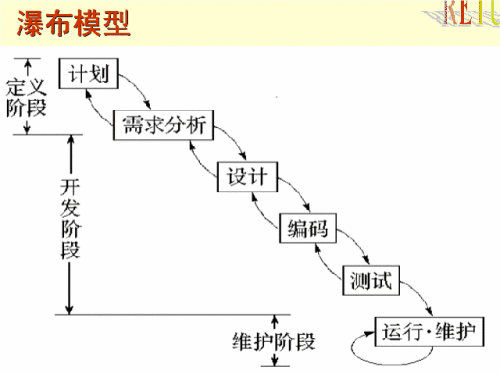

### 2.2 增量开发模型

- 增量模型是把待开发的软件系统模块化，将每个模块作为一个增量组件，从而分批次地分析、设计、编码和测试这些增量组件。

  

### 2.3 原型开发模型

原型模型指的是在执行实际软件的开发之前，应当建立系统的一个工作原型。


## 三、模型

### 3.1 模型与UML的介绍

> 建造一栋大楼前需要先把图纸将外观、内部结构描述清楚，这些图纸就是模型。
>
> `Unified Modeling Language (UML)`又称统一建模语言或标准建模语言

### 3.2 模型的特点

- 简化
- 多视角
- 通用符号

### 3.3 UML组成


### 3.4 UML开发软件

[staruml](http://staruml.io/)

## 四、视图

### 4.1 用例视图

> 从<font color="#f00">3.3节UML</font>可知，用例视图即由<font color="#08e">`用例图`</font>组成

#### 4.1.1 用例图

- 用例建模最主要的功能是表达系统的功能性需求或行为

- 参互者： 参与者指的是与系统交互的角色，可以是人，也可以是事物或其它系统

- 用例是系统为参与者提供的功能。用例名称一般是一个带有动作性的词语

- 如下图例↓↓↓

  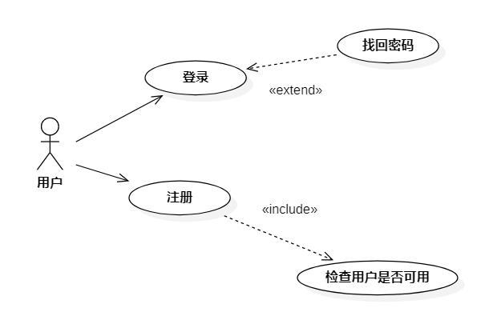

用例描述

| 项目       | 内容                                                         |
| :--------- | :----------------------------------------------------------- |
| 用例名称   | 登录                                                         |
| 用例ID     | login                                                        |
| 角色       | 用户                                                         |
| 用例说明   | 描述用户的登录过程                                           |
| 前置条件   | 打开网站页面                                                 |
| 基本事件流 | 1.点击登录 2. 输入用户名和秘密 3. 点击登录 4. 服务器会使用会话保存用户登录状态 |
| 其它事件流 | 1. 用户名为空提示用户名不能为空 2。密码为空提示密码不能为空  |
| 异常事件流 | 登录超时则返回登录页                                         |
| 后置条件   | 登录成功，进入个人中心                                       |

### 4.2 逻辑视图

逻辑视图包括<font color="#08e">`类图`</font>和<font color="#08e">`对象图`</font>组成

#### 4.2.1 类图

- 类图（Class Diagram）描述类的静态结构，定义类及描述类之间的联系，如关联、依赖、聚合等，还包括类的内部结构(类的属性和操作)

- 类图是一种静态模型类型,一个类图根据系统中的类以及各个类之间的关系描述系统的静态结构

- 类图包含7个元素：

  - 类(Class)
  - 接口(Interface)
  - 协作(Collaboration)
  - 依赖关系(Dependency)
  - 泛化关系(Generalization)
  - 关联关系(Association)
  - 实现关系(Realization)

- 在UML中,类用矩形来表示,分为3个部分: 名称部分(Name)、属性部分(Attribute)和操作部分(Operation)

- 类的表示方式

  | 类型     | 示例                                           |
  | :------- | :--------------------------------------------- |
  | 属性格式 | name : attribute type = default value          |
  | 操作格式 | name (parameter list) : type of value returned |

- 类图的几种关系

  > 关系可以从强到弱为 `依赖< 关联 <聚合 <组合`。
  >
  > 依赖是方法的参数，关联是属性。

  以下是类图关系图例↓↓

  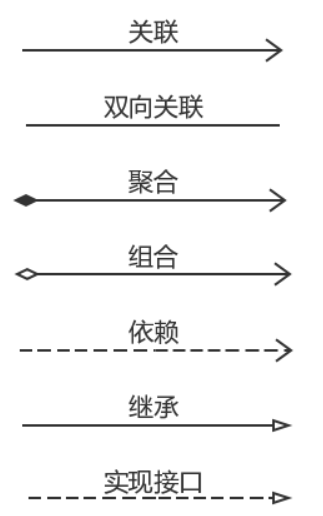

  - <font color="#f00">`依赖(Dependency)关系`</font>是类与类之间的联接。依赖关系表示一个类依赖于另一个类的定义。一般而言，依赖关系在Java语言中体现为局部变量、方法的形参，或者对静态方法的调用。(从使用以及生效范围来看，并不是单纯的定义，就算是定义为实例变量，但是使用上只在一个方法范围内使用，不在其他地方使用，也可以是依赖)

    >只要在类中用到了对方，那么它们之间就存在依赖关系，如果没有对方，连编译都通过不了
    >
    >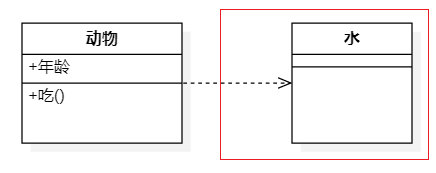

  - <font color="#f00">`关联(Association关系`</font>是类与类之间的联接，它使一个类知道另一个类的属性和方法(实例变量体现)。关联可以是双向的，也可以是单向的。两个类之前是一个层次的，不存在部分跟整体之间的关系。

    >- 关联关系实际上就是类与类之间的联系，他是依赖关系的特例。
    >- 关联关系比依赖的关系更强
    >- 关联具有导航性，即双向关系或单向关系，表示关系在那一方维护
    >- 关联具有多重性，如
    >  - `1` 表示有且仅有一个
    >  - `0...` 表示0或者多个
    >  - `0,1` 表示0个或者一个
    >  - `n..m` 表示n到m个都可以
    >  - `m...` 表示至少m个
    >
    >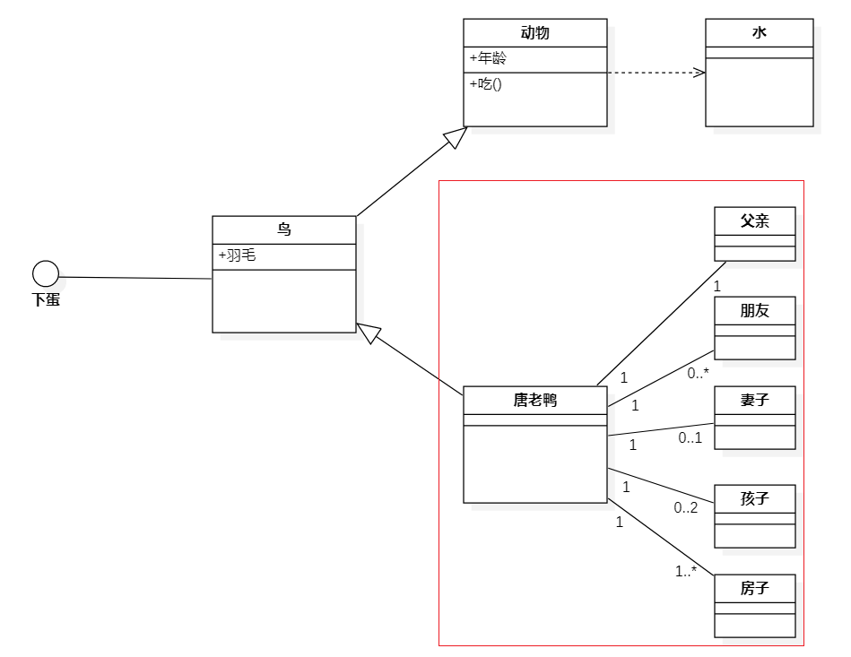

  - <font color="#f00">`聚合(Aggregation) 关系`</font> 是关联关系的一种，是强的关联关系。聚合是整体和个体之间的关系。例如，汽车类与引擎类、轮胎类，以及其它的零件类之间的关系便整体和个体的关系。与关联关系一样，聚合关系也是通过实例变量实现的。但是关联关系所涉及的两个类是处在同一层次上的，而在聚合关系中，两个类是处在不平等层次上的，一个代表整体，另一个代表部分。

    >- 聚合关系表示的是整体和部分的关系，整体与部分可以分开
    >- 聚合关系是关联关系的特例，所有它具有关联的导向性和多重性
    >- 聚合的双方生命周期是独立的
    >
    >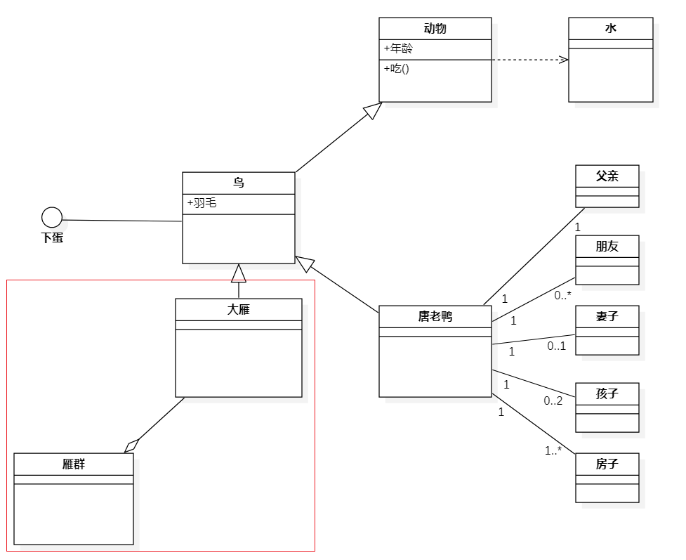

  - <font color="#f00">`组合(Composition)关系`</font>是关联关系的一种，是比聚合关系强的关系。它要求普通的聚合关系中代表整体的对象负责代表部分对象的生命周期，组合关系是不能共享的。代表整体的对象需要负责保持部分对象和存活，在一些情况下将负责代表部分的对象湮灭掉。代表整体的对象可以将代表部分的对象传递给另一个对象，由后者负责此对象的生命周期。换言之，代表部分的对象在每一个时刻只能与一个对象发生组合关系，由后者排他地负责生命周期。部分和整体的生命周期一样

    > - 也是整体和部分的关系，但是整理和部分不可分开
    > - 整体和部分生命周期一致
    >
    > 

#### 4.2.2 对象图

- 对象图描述一组对象和它们之间的关系，它是系统状态的某一时刻的快照，它的使用相当有限，它主要用于了解系统在某个特定时刻的具体状况和数据结构
- 对象图表示方法和类图大致相同，对象图中的对象属性可以有具体值，类图中的一个类可以对应成对象图中的多个对象，例如： 部门类的自关联就可以对应成多个部门之间的关联

### 4.3 并发视图

> 并发视图包括<font color="#08e">`顺序图`</font>、<font color="#08e">`协作图`</font>、<font color="#08e">`状态图`</font>、<font color="#08e">`活动图`</font>、<font color="#08e">`组件图`</font>、<font color="#08e">`配置图`</font>组成。

#### 4.3.1 顺序图（时序图）

- 时序图强调消息时间顺序的交互图
- 时序图描述类系统中类与类之间的交互，它讲这些交互建模换成消息交换
- 时序图用于描述对象之间如何随着时间进行协作
- 时序图由活动者(Actor)、对象(Object)、消息(Message)、生命线(Lifeline)和控制焦点(Focus Of Control)组成
- 不同元素有不同表示
  - 对象是一个矩形，对象名称下有下划线
  - 消息用由方向的箭头表示，调用是实线，返回消息是虚线
  - 生命线由纵向的虚线表示
  - 控制焦点是纵向的矩形，也就是活动条(Activiation Bar)


#### 4.3.2 协作图

- 协作图是时序图的一种变种
- 协作图强调的是发送和接受消息的对象之间的组织结构
- 协作图显示了一系列对象和在这些对象之间的联系以及对象间发送和接受的消息
- 时序图主要侧重与对象间消息传递在时间上的先后关系，而协作图则侧重与对象间以及对象和角色交互的静态关系


#### 4.3.3 状态图

略~

#### 4.3.4 活动图

- 在UML里，活动图本质上就是流程图，
- 它描述系统的活动，判断系统的活动，判断点和分支等。


#### 4.3.5 组件图

- 组件图用例建立系统的各个组件之间的关系，它们是通过软件或者文件组织在一起，使用组件图可以帮助读者了解某个功能位于软件包中的哪一个位置，以及各个版本的软件包含那些功能。
- 组件图可以用来帮助设计系统的整体架构

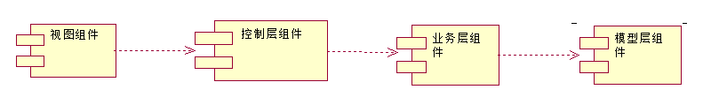

#### 4.3.6 配置图（部署图）

- 部署图是来帮助读者了解软件中的各个组件运行硬件什么位置，以及这些硬件之间的交互关系
- 节点： 用来表示一种硬件，它可以是服务器，计算机等。节点的符号是一个三位盒子，在左上角包含节点的名称
- 通信关联： 节点通过通信关联建立彼此的关系，采用从节点到节点绘制实线来表示关联

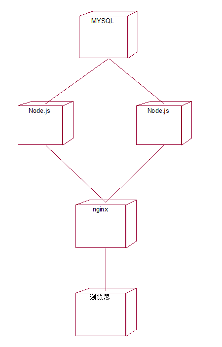

# 第2章：设计模式

## 零、调试安装

```bash
cnpm init -y
tsc --init
npm i ts-node -g
下载vscode插件 code runner
下载好之后，右键`run code`即可~
```


## 一、面向对象

> <font color=#f00>以类和对象作为组织代码的基本单位，并实现封装、抽象、继承、多态四个特性</font>

面向对象的过程中往往会涉及到软件生命周期的三个阶段：分析、设计、编码

- 面向对象分析(OOA) Object Oriented Analysis
- 面向对象设计(OOD) Object Oriented Design
- 面向对象编程(OOP)Object Oriented Programming

### 1.1 封装

- 把数据封装起来
- 减少耦合，不该外部访问的不要让外部访问
- 利于数据的接口权限管理
- 仅暴露有限的必要接口，提高类的易用性
- 实现
  - public:公有修饰符，可以在类内或者类外使用public修饰的属性或者行为，默认修饰符
  - protected:受保护的修饰符，可以本类和子类中使用protected修饰的属性和行为
  - private : 私有修饰符，只可以在类内使用private修饰的属性和行为

```typescript
class Animal {
    public name: string;
    protected age: number;
    private weight: number;
    constructor(name: string, age: number, weight: number) {
        this.name = name;
        this.age = age;
        this.weight = weight;
    }
}
class Person extends Animal {
    private money: number;
    constructor(name: string, age: number, weight: number, money: number) {
        super(name, age, weight);
        this.money = money;
    }
    getName() {
        console.log(this.name);
    }
    getAge() {
        console.log(this.age);
    }
    getWeight() {
        console.log(this.weight);
    }
    getMoney() {
        console.log(this.money);
    }
}
let p = new Person('zfpx', 9, 100, 100);
console.log(p.name);
console.log(p.age);
console.log(p.weight);
```

### 1.2 抽象

- 抽象主要是隐藏方法的实现，让调用者只关心有哪些功能而不是关心功能的实现
- 抽象可以提高代码的可扩展性和维护性，修改实现不需要改变定义，可以减少代码的改动范围

```typescript
interface IStorage {
    save(key: any, value: any): void;
    read(key: any): void;
}
class LocalStorage implements IStorage {
    save(key: any, value: any) {
        localStorage.setItem(key, value);
    }
    read(key: any) {
        return localStorage.getItem(key);
    }
}
class User {
    constructor(public name: string, public storage: IStorage) {

    }
    save() {
        this.storage.save('userInfo', JSON.stringify(this));
    }
    read() {
        return this.storage.read('userInfo');
    }
}
let user = new User('张三', new LocalStorage());
user.save();
user.read();
```

### 1.3 继承

- 继承主要的要处是实现代码复用
- 继承可以把父类和子类的公共方法抽离出来，提高复用，减少冗余
- 是一种 `is-a` 关系

```typescript
export { };
class Animal {
    name: string;
    constructor(name: string) {
        this.name = name;
    }
    eat() {
        console.log(`${this.name} eat`)
    }
}
let animal = new Animal('动物');
animal.eat();

class Dog extends Animal {
    age: number;
    constructor(name: string, age: number) {
        super(name);
        this.age = age;
    }
    speak() {
        console.log(`${this.name} is barking!`);
    }
}
let dog = new Dog('🐶', 5);
dog.eat();
dog.speak();
```

### 1.4 多态

- 多态是指，子类可以替换父类
- 保持子类的开放性和灵活性，可以重写父类中的方法
- 实现面向接口编程

```typescript
class Animal {
    public name: string;
    protected age: number;
    private weight: number;
    constructor(name: string, age: number, weight: number) {
        this.name = name;
        this.age = age;
        this.weight = weight;
    }
    speak() {
        throw new Error('此方法必须由子类实现!');
    }
}
class Person extends Animal {
    private money: number;
    constructor(name: string, age: number, weight: number, money: number) {
        super(name, age, weight);
        this.money = money;
    }
    getName() {
        console.log(this.name);
    }
    getAge() {
        console.log(this.age);
    }
    getMoney() {
        console.log(this.money);
    }
    speak() {
        console.log('你好!');
    }

}
class Dog extends Animal {
    constructor(name: string, age: number, weight: number) {
        super(name, age, weight);
    }
    speak() {
        console.log('汪汪汪!');
    }
}
let p = new Person('zfpx', 10, 10, 10);
p.speak();
let d = new Dog('zfpx', 10, 10);
d.speak();
```

## 二、设计原则

### 2.1 什么是设计？

- 按哪一种思路或者标准来实现功能
- 功能相同，可以有不同设计的方式
- 需求如果不断变化，设计的作用才能体现出来

### 2.2 SOLID五大设计原则

| 首字母 | 指代         | 概念                                                         |
| :----- | :----------- | :----------------------------------------------------------- |
| S      | 单一职责原则 | 单一功能原则认为对象应该仅具有一种`单一功能`的概念           |
| O      | 开放封闭原则 | 开闭原则认为`软件体应该是对于扩展开放的，但是对于修改封闭的`的概念 |
| L      | 里氏替换原则 | 里氏替换原则认为程序中的对象应该是可以在不改变程序正确性的前提下`被它的子类所替换`的的概念 |
| I      | 接口隔离原则 | 接口隔离原则认为`多个特定客户端接口要好于一个宽泛用途的接口`的概念 |
| D      | 依赖反转原则 | 依赖反转原则认为一个方法应该遵从`依赖于抽象而不是一个实例`的概念,依赖注入是该原则的一种实现方式。 |

#### 2.2.1 O 开放封闭原则

- `Open Closed Principle`
- 对扩展开放，对修改关闭
- 增加需求时，扩展新代码，而非修改已有代码
- 开闭原则是设计模式中的总原则
- 对近期可能会变化并且如果有变化但改动量巨大的地方要增加扩展点,扩展点过多会降低可读性

```js
class Customer {
    constructor(public rank: string) { }
}
class Product {
    constructor(public name: string, public price: number) {

    }
    cost(customer: Customer) {
        switch (customer.rank) {
            case 'member':
                return this.price * .8;
            case 'vip':
                return this.price * .6;
            default:
                return this.price;
        }
    }
}
let p1 = new Product('笔记本电脑', 1000);
let member = new Customer('member');
let vip = new Customer('vip');
let guest = new Customer('guest');
console.log(p1.cost(member));
console.log(p1.cost(vip));
console.log(p1.cost(guest));
class Customer {
+    constructor(public rank: string, public discount: number = 1) { }
+    getDiscount() {
+        return this.discount;
+    }
}
class Product {
    constructor(public name: string, public price: number) {

    }
    cost(customer: Customer) {
-        /*  switch (customer.rank) {
-             case 'member':
-                 return this.price * .8;
-             case 'vip':
-                 return this.price * .6;
-             default:
-                 return this.price;
-         } */
+        return this.price * customer.getDiscount();
    }
}
+let p1 = new Product('笔记本电脑', 1000);
+let member = new Customer('member', .8);
+let vip = new Customer('vip', .6);
let guest = new Customer('guest');
console.log(p1.cost(member));
console.log(p1.cost(vip));
console.log(p1.cost(guest));
import axios, { AxiosInstance, AxiosRequestConfig } from 'axios';
let instance: AxiosInstance = axios.create();
instance.interceptors.request.use((config: AxiosRequestConfig) => {
    config.url = 'http://localhost:8080' + config.url;
    return config;
});

instance.interceptors.response.use(response => {
    if (response.status !== 200 || response.data.code != 0) {
        return Promise.reject(response);
    } else {
        return response.data.data;
    }
})
/**
 * {code:0,data:{id:1,name:'zhufeng'}}
 */
instance({
    url: '/api/users'
}).then(result => {
    console.log(result);
}, error => {
    console.error(error);
});
```

#### 2.2.2 S 单一职责原则

- Single responsibility principle
- 一个类或者模块只负责完成一个职责,如果功能特别复杂就进行拆分
- 单一职责可以降低类的复杂性，提高代码可读性、可维护性
- 当类代码行数过多、方法过多、功能太多、职责太杂的时候就要对类进行拆分了
- 拆分不能过度，如果拆分过度会损失内聚性和维护性
- [lodashjs](https://www.lodashjs.com/docs/latest)
- [jquery](https://api.jquery.com/)

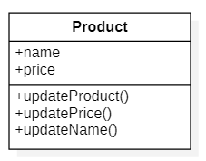

```diff
class Product {
    public name: string;
-    public categoryName: string;
-    public categoryIcon: string;
+     public category:Category;
}
+class Category {
+    public name: string;
+    public icon: string;
+}
```

#### 2.2.3 L 里氏替换原则

- Liskov Substitution Principle
- 所有引用基类的地方必须能透明地使用其子类的对象
- 子类能替换掉父类，使用者可能根本就不需要知道是父类还是子类,反之则不行
- 里氏替换原则是开闭原则的实现基础,程序设计的时候尽量使用基类定义及引用，运行时再决定使用哪个子类
- 里氏替换原则可以提高代码的复用性，提高代码的可扩展性，也增加了耦合性
- 相对于多态，这个原则是讲的是类如何设计，子类如果违反了父类的功能则表示违反了里氏替换原则


```js
abstract class AbstractDrink {
    abstract getName(): string;
}
class CocaCola extends AbstractDrink {
    getName(): string {
        return '可乐';
    }
}
class Sprite extends AbstractDrink {
    getName(): string {
        return '雪碧';
    }
}
class Fanta extends AbstractDrink {
    getName(): string {
        return '芬达';
    }
}
class Customer {
    drink(drink: AbstractDrink) {
        console.log('喝' + drink.getName());
    }
}
let customer = new Customer();
let cocaCola = new CocaCola();
let sprite = new Sprite();
let fanta = new Fanta();
customer.drink(cocaCola);
customer.drink(sprite);
customer.drink(fanta);
import React from 'react';
import ReactDOM from 'react-dom';
class App extends React.Component {
    render() {
        return (
            <div>App </div>
        )
    }
}
let element = React.createElement(App);
ReactDOM.render(element, document.getElementById('root'));
abstract class AbstractDrink {
    abstract getName(): any;
}
class CocaCola extends AbstractDrink {
    getName(): any {
        return 100;
    }
}
```

#### 2.2.4 D 依赖倒置原则

- Dependence Inversion Principle
- 面向接口编程，依赖于抽象而不依赖于具体实现
- 要求我们在程序代码中传递参数时或在关联关系中，尽量引用层次高的抽象层类
- 使用方只关注接口而不关注具体类的实现

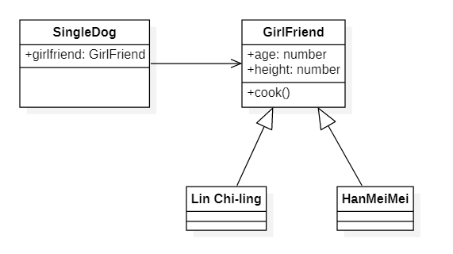

```js
abstract class GirlFriend {
    public age: number;
    public height: number;
    public abstract cook(): void;
}
class LinZhiLing extends GirlFriend {
    public cook(): void {

    }
}
class HanMeiMei extends GirlFriend {
    public cook(): void {

    }
}
class SingleDog {
    constructor(public girlFriend: GirlFriend) {

    }
}
let s1 = new SingleDog(new LinZhiLing());
let s2 = new SingleDog(new HanMeiMei());
import { createStore } from 'redux';
let store = createStore(state => state);
export interface Action<T = any> {
    type: T
}
export interface AnyAction extends Action {
    // Allows any extra properties to be defined in an action.
    [extraProps: string]: any
}
let action: AnyAction = { type: 'increment', payload: 5 }
store.dispatch(action);
```

#### 2.2.5 I 接口隔离原则

- Interface Segregation Principle
- 保持接口的单一独立，避免出现胖接口
- 客户端不应该依赖它不需要的接口，类间的依赖关系应该建立在最小的接口上
- 接口尽量细化，而且接口中的方法尽量的少
- 类似于单一职责原则，更关注接口

```js
interface IUserManager {
    updateUserInfo(): void;
    updatePassword(): void;
}
interface IProductManager {
    updateProduct(): void;
    updatePrice(): void;
}
```


```js
interface Running {
    run(): void;
}
interface Flying {
    fly(): void;
}
interface Swimming {
    swim(): void;
}
class Automobile implements Running, Flying, Swimming {
    run() { }
    fly() { }
    swim() { }
}
```

### 2.3 迪米特法则

- Law of Demeter，LOD
- 有时候也叫做最少知识原则
- 一个软件实体应当尽可能少地与其它实体发生相互作用
- 迪米特法则的初衷在于降低类之间的耦合
- 类定义时尽量要实现内聚,少使用`public`修饰符，尽量使用`private`、`protected` 等

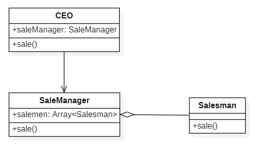

```js
class Salesman {
    constructor(public name: string) {

    }
    sale() {
        console.log(this.name + ' 销售中....');
    }
}
class SaleManager {
    private salesmen: Array<Salesman> = [new Salesman('张三'), new Salesman('李四')];
    sale() {
        this.salesmen.forEach(salesman => salesman.sale());
    }
}
class CEO {
    private saleManager: SaleManager = new SaleManager();
    sale() {
        this.saleManager.sale();
    }
}
let ceo = new CEO();
ceo.sale();
```

### 2.4 合成复用原则

#### 2.4.1 类的关系

- 类之间有三种基本关系，分别是关联(聚合和组合)、泛化和依赖

- 如果一个类单向依赖另一个类,那么它们之间就是单向关联。如果彼此依赖,则为相互依赖,即双向关联

- 关联关系包括两种特例：聚合和组合

  - 聚合，用来表示整体与部分的关系或者`拥有`关系,代表部分的对象可能会被整体拥有，但并不定定会随着整体的消亡而销毁,比如班级和学生

  - 合成或者说组合要比聚合关系强的多，部分和整体的生命周期是一致的,比如人和器官之间

    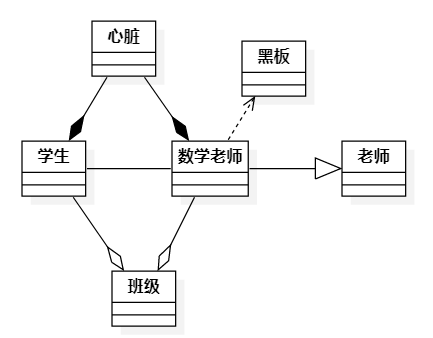

#### 2.4.2 合成复用原则

- 合成复用原则是通过将已有的对象纳入新对象中，作为新对象的成员对象来实现的
- 新对象可以调用已有对象的功能，从而达到复用
- 原则是尽量首先使用组合/聚合的方式，而不是使用继承
- 专业人做专业事

```js
class Cooker {
    cook() {

    }
}
class Person {
    private cooker: Cooker = new Cooker();
    cook() {
        this.cooker.cook();
    }
}
```

### 2.5 总结

- 开闭原则是核心，对修改关闭对扩展开放是软件设计的基石
- 单一职责要求我们设计接口和模块功能的时候尽量保证单一性和原子性，修改一条不影响全局和其它模块
- 里氏替换原则和依赖倒置原则要求面向接口和抽象编程,不要依赖具体实现，否则实现一改，上层调用者就要对应修改

### 2.6 如何写出好代码?

- 可维护性 BUG是否好改?
- 可读性 是否容易看懂?
- 可扩展性 是否可以添加新功能?
- 灵活性 添加新功能是否容易?老方法和接口是否容易复用?
- 简洁性 代码是否简单清晰?
- 可复用性 相同的代码不要写2遍?
- 可测试性 是否方便写单元测试和集成测试?

## 三、 22种设计模式总括

### 3.1 设计模式分类

> 通常可以分为 `创建型`、`结构型`、`行为型`。

#### 3.1.1 创建型

- `重要: 工厂模式(工厂方法模式、抽象工厂模式、简单工厂模式)、建造者模式、单例模式`
- 不重要: 原型模式

#### 3.1.2 结构型

- `重要: 代理模式、桥接模式、装饰器模式、适配器模式`
- 不重要: 外观模式、组合模式、享元模式 

#### 3.1.3 行为型

- `重要: 观察者模式、模版方法模式、策略模式、职责链模式、迭代器模式、状态模式`
- 不重要: 访问者模式、备忘录模式、命令模式、解释器模式、中介者模式

<font color=#f90>注意：以上总共分别22种，与java不同的是`创建型`中的工厂模式，java分为：<font color=#f00>工厂方法模式、抽象工厂模式、单例模式、建造者模式、原型模式</font>这五种。</font>

## 四、工厂模式

### 4.1 简单工厂模式

> 简单工厂模式是由一个工厂对象决定创建出哪一种产品类的实例。即<font color="#f00">`一个类通过传递的参数不同生成不同的实例`</font>。

#### 4.1.1 类图演示

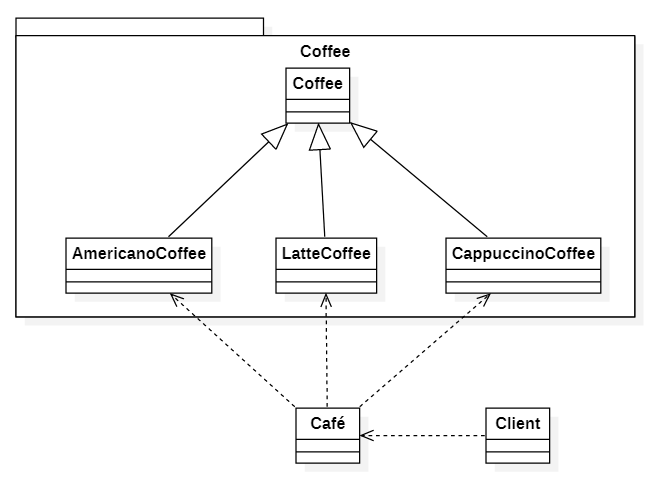

#### 4.1.2 代码演示

```tsx
abstract class Coffee {
    constructor(public name: string) {

    }
}
class AmericanoCoffee extends Coffee {
    constructor(public name: string) {
        super(name);
    }
}
class LatteCoffee extends Coffee {
    constructor(public name: string) {
        super(name);
    }
}
class CappuccinoCoffee extends Coffee {
    constructor(public name: string) {
        super(name);
    }
}

class Café {
    static order(name: string) {
        switch (name) {
            case 'Americano':
                return new AmericanoCoffee('美式咖啡');
            case 'Latte':
                return new LatteCoffee('拿铁咖啡');
            case 'Cappuccino':
                return new LatteCoffee('卡布奇诺');
            default:
                return null;
        }
    }
}
console.log(Café.order('Americano'));
console.log(Café.order('Latte'));
console.log(Café.order('Cappuccino'));

```

#### 4.1.3 缺点

- 如果产品的种类非常多`switch case`的判断会变得非常多
- 不符合开放—封闭原则,如果要增加或删除一个产品种类，就要修改`switch case`的判断代码

#### 4.1.4 前端应用场景

例如react源码中的[createElement](https://github.com/facebook/react/blob/main/packages/react/src/ReactElement.js#L313-L395 )

方法

```tsx
export function createElement(type, config, children) {
    return ReactElement(
        type,
        key,
        ref,
        self,
        source,
        ReactCurrentOwner.current,
        props,
    );
}
```

###   4.2 工厂方法模式

- 工厂方法模式`Factory Method`,又称多态性工厂模式。
- 在工厂方法模式中,核心的工厂类不再负责所有的产品的创建，而是将具体创建的工作交给工厂子类去做。

#### 4.2.1 类图演示

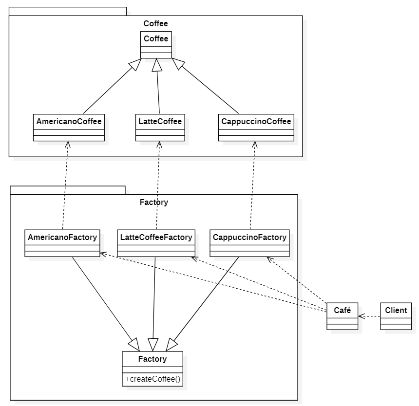

#### 4.2.2 代码演示

```js
export { }
abstract class Coffee {
    constructor(public name: string) {

    }
}
abstract class Factory {
    abstract createCoffee(): Coffee;
}
class AmericanoCoffee extends Coffee {
    constructor(public name: string) {
        super(name);
    }
}

class AmericanoCoffeeFactory extends Factory {
    createCoffee() {
        return new AmericanoCoffee('美式咖啡')
    }
}

class LatteCoffee extends Coffee {
    constructor(public name: string) {
        super(name);
    }
}
class LatteCoffeeFactory extends Factory {
    createCoffee() {
        return new LatteCoffee('拿铁咖啡')
    }
}
class CappuccinoCoffee extends Coffee {
    constructor(public name: string) {
        super(name);
    }
}
class CappuccinoFactory extends Factory {
    createCoffee() {
        return new CappuccinoCoffee('卡布奇诺')
    }
}
class Café {
    static order(name: string) {
        switch (name) {
            case 'Americano':
                return new AmericanoCoffeeFactory().createCoffee();
            case 'Latte':
                return new LatteCoffeeFactory().createCoffee();
            case 'Cappuccino':
                return new CappuccinoFactory().createCoffee();
            default:
                return null;
        }
    }
}
console.log(Café.order('Americano'));
console.log(Café.order('Latte'));
console.log(Café.order('Cappuccino'));
```

#### 4.2.3 应用场景

- [createFactory](https://github.com/facebook/react/blob/master/packages/react/src/ReactElement.js#L401-L409)

### 4.3 抽象工厂模式

- 抽象工厂模式可以向客户端提供一个接口，使客户端在不必指定产品的具体的情况下，创建多个产品族中的产品对象
- 工厂方法模式针对的是同一类或同等级产品,而抽象工厂模式针对的是多种类的产品设计
- 系统中有多个产品族，每个具体工厂负责创建同一族但属于不同产品等级(产品种类)的产品
- 产品族是一组相关或相互依赖的对象
- 系统一次只能消费某一族产品，即相同产品族的产品是一起被使用的
- 当系统需要新增一个产品族时，只需要增加新的工厂类即可，无需修改源代码；但是如果需要产品族中增加一个新种类的产品时，则所有的工厂类都需要修改

#### 4.3.1 类图演示

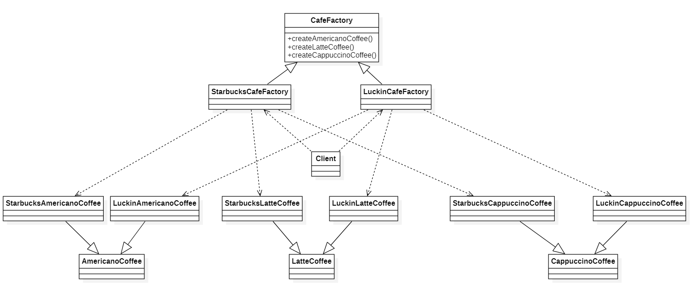

#### 4.3.2 代码演示

```js
export { };
abstract class AmericanoCoffee { }
abstract class LatteCoffee { }
abstract class CappuccinoCoffee { }

class StarbucksAmericanoCoffee extends AmericanoCoffee { }
class StarbucksLatteCoffee extends LatteCoffee { }
class StarbucksCappuccinoCoffee extends CappuccinoCoffee { }

class LuckinAmericanoCoffee extends AmericanoCoffee { }
class LuckinLatteCoffee extends LatteCoffee { }
class LuckinCappuccinoCoffee extends CappuccinoCoffee { }

abstract class CafeFactory {
    abstract createAmericanoCoffee(): AmericanoCoffee;
    abstract createLatteCoffee(): LatteCoffee;
    abstract createCappuccinoCoffee(): CappuccinoCoffee;
}
class StarbucksCafeFactory extends CafeFactory {
    createAmericanoCoffee() {
        return new StarbucksAmericanoCoffee();
    }
    createLatteCoffee() {
        return new StarbucksLatteCoffee();
    }
    createCappuccinoCoffee() {
        return new StarbucksCappuccinoCoffee();
    }
}
class LuckinCafeFactory extends CafeFactory {
    createAmericanoCoffee() {
        return new LuckinAmericanoCoffee();
    }
    createLatteCoffee() {
        return new LuckinLatteCoffee();
    }
    createCappuccinoCoffee() {
        return new LuckinCappuccinoCoffee();
    }
}

let starbucksCafeFactory = new StarbucksCafeFactory();
console.log(starbucksCafeFactory.createAmericanoCoffee());
console.log(starbucksCafeFactory.createCappuccinoCoffee());
console.log(starbucksCafeFactory.createLatteCoffee());

let luckinCafeFactory = new LuckinCafeFactory();
console.log(luckinCafeFactory.createAmericanoCoffee());
console.log(luckinCafeFactory.createCappuccinoCoffee());
console.log(luckinCafeFactory.createLatteCoffee());
```

## 五、单例模式

首先，单例模式有3个特点↓↓↓

1. 单例类只有一个实例对象；
2. 该单例对象必须由单例类自行创建；
3. 单例类对外提供一个访问该单例的全局访问点；

### 5.1、类图演示

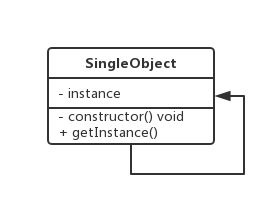

### 5.2 基本代码

#### 5.2.1 ES6单例模式

```tsx
export { };
class Window {
    private static instance: Window;
    private constructor() { }
    static getInstance() {
        if (!Window.instance) {
            Window.instance = new Window();
        }
        return Window.instance;
    }
}
//new Window();
var w1 = Window.getInstance();
var w2 = Window.getInstance();
console.log(w1 === w2);
```

#### 5.2.2 ES5单例模式

```js
interface Window {
    hello: any
}
function Window() { }
Window.prototype.hello = function () {
    console.log('hello');
}
Window.getInstance = (function () {
    let window: Window;
    return function () {
        if (!window)
            window = new (Window as any)();
        return window;
    }
})();
let window = Window.getInstance();
window.hello();
```

### 5.3 应用场景

#### 5.3.1 redux中的createStore

```tsx
function createStore(reducer: any) {
    let state: any;
    let listeners: any[] = [];
    function getState() {
        return state;
    }
    function dispatch(action: any) {
        state = reducer(state, action);
        listeners.forEach(l => l());
    }
    function subscribe(listener: any) {
        listeners.push(listener);
        return () => {
            listeners = listeners.filter(item => item != listener);
            console.log(listeners);
        }
    }
    dispatch({});
    return {
        getState,
        dispatch,
        subscribe
    }
}
let store = createStore((state: any, action: any) => state);
```

#### 5.3.2 commonjs中的  [HotModuleReplacement](https://github.com/webpack/webpack/blob/8070bcd333cd1d07ce13fe5e91530c80779d51c6/lib/hmr/HotModuleReplacement.runtime.js#L55)

```tsx
(function(modules) {
  // webpack的启动函数
  //模块的缓存
  var installedModules = {};
  //定义在浏览器中使用的require方法
  function __webpack_require__(moduleId) {
    //检查模块是否在缓存中
    if (installedModules[moduleId]) {
      return installedModules[moduleId].exports;
    }
    //创建一个新的模块并且放到模块的缓存中
    var module = (installedModules[moduleId] = {
      i: moduleId,
      l: false,
      exports: {}
    });

    //执行模块函数
    modules[moduleId].call(
      module.exports,
      module,
      module.exports,
      __webpack_require__
    );

    //把模块设置为已经加载
    module.l = true;

    //返回模块的导出对象
    return module.exports;
  }
}
```

#### 5.3.3 [jquery](https://code.jquery.com/jquery-3.4.1.js)

```tsx
if(window.jQuery!=null){
  return window.jQuery;
}else{
    //init~~~~~~~
}
```

## 六、适配器模式

- 适配器模式又称包装器模式,将一个类的接口转化为用户需要的另一个接口,解决类(对象)之间接口不兼容的问题
- 旧的接口和使用者不兼容
- 中间加一个适配器转换接口

### 6.1 类图演示

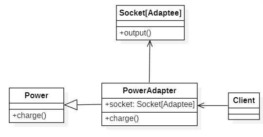

### 6.2 代码演示

```tsx
class Socket {
    output() {
        return '输出220V';
    }
}

abstract class Power {
    abstract charge(): string;
}
class PowerAdapter extends Power {
    constructor(public socket: Socket) {
        super();
    }
    //转换后的接口和转换前不一样
    charge() {
        return this.socket.output() + ' 经过转换 输出24V';
    }
}
let powerAdapter = new PowerAdapter(new Socket());
console.log(powerAdapter.charge());
```

### 6.3 应用场景

#### 6.3.1 [Axios](https://github.com/axios/axios/blob/master/lib/core/Axios.js#L6)

```tsx
//let axios = require('axios');
let url = require('url');
function axios(config: any): any {
    let adaptor = getDefaultAdapter();
    return adaptor(config);
}
axios({
    method: 'GET',
    url: 'http://localhost:8080/api/user?id=1'
}).then(function (response: any) {
    console.log(response);
}, function (error: any) {
    console.log(error);
})

function xhr(config: any) {
    return new Promise(function (resolve, reject) {
        var request = new XMLHttpRequest();
        request.open(config.method, config.url, true);
        request.onreadystatechange = function () {
            if (request.readyState == 4) {
                if (request.status == 200) {
                    resolve(request.response);
                } else {
                    reject('请求失败');
                }
            }
        }
    })
}
function http(config: any) {
    let http = require('http');
    let urlObject = url.parse(config.url);
    return new Promise(function (resolve, reject) {
        const options = {
            hostname: urlObject.hostname,
            port: urlObject.port,
            path: urlObject.pathname,
            method: config.method
        };
        var req = http.request(options, function (res: any) {
            let chunks: any[] = [];
            res.on('data', (chunk: any) => {
                chunks.push(chunk);
            });
            res.on('end', () => {
                resolve(Buffer.concat(chunks).toString());
            });
        });
        req.on('error', (err: any) => {
            reject(err);
        });
        req.end();
    })
}
function getDefaultAdapter(): any {
    var adapter;
    if (typeof XMLHttpRequest !== 'undefined') {
        adapter = xhr;
    } else if (typeof process !== 'undefined') {
        adapter = http;
    }
    return adapter;
}
```

#### 6.3.2  promisify

```tsx
let fs = require('fs');
var Bluebird = require("bluebird");
let readFile = Bluebird.promisify(fs.readFile);

(async function () {
    let content = await readFile('./1.txt', 'utf8');
    console.log(content);
})()


function promisify(readFile: any) {
    return function (filename: any, encoding: any) {
        return new Promise(function (resolve, reject) {
            readFile(filename, encoding, function (err: any, data: any) {
                if (err)
                    reject(err);
                else
                    resolve(data);
            })
        });
    }
}
```

#### 6.3.3 [sequelize](https://github.com/demopark/sequelize-docs-Zh-CN/tree/master)

```tsx
//cnpm i sequelize sqlite3 -S
const { Sequelize, Model, DataTypes } = require('sequelize');
const sequelize = new Sequelize('sqlite::memory:');

class User extends Model { }
User.init({
    username: DataTypes.STRING
}, { sequelize, modelName: 'user' });

sequelize.sync()
    .then(() => User.create({
        username: 'zhufeng'
    }))
    .then(result => {
        console.log(result.toJSON());
    });
```

## 七、装饰器模式

- 在不改变其原有的结构和功能为对象添加新功能的模式其实就叫做装饰器模式
- 最直观地就是我们买房后的装修
- 装饰比继承更加灵活,可以实现装饰者和被装饰者之间松耦合
- 被装饰者可以使用装饰者动态地增加和撤销功能

### 7.1 类图演示

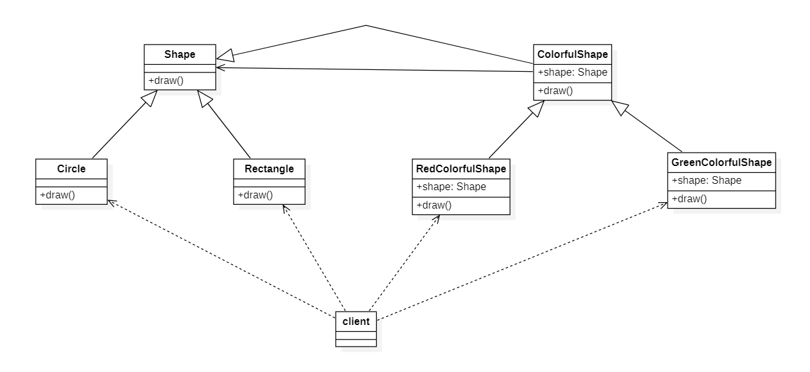

### 7.2 代码演示

```tsx
abstract class Shape {
    abstract draw(): void;
}
class Circle extends Shape {
    draw() {
        console.log('绘制圆形');
    }
}
class Rectangle extends Shape {
    draw() {
        console.log('绘制矩形');
    }
}

abstract class ColorfulShape extends Shape {
    public constructor(public shape: Shape) {
        super();
    }
    abstract draw(): void;
}

class RedColorfulShape extends ColorfulShape {
    draw() {
        this.shape.draw();
        console.log('把边框涂成红色');
    }
}
class GreenColorfulShape extends ColorfulShape {
    draw() {
        this.shape.draw();
        console.log('把边框涂成绿色');
    }
}

let circle = new Circle();
let redColorfulShape = new RedColorfulShape(circle);
redColorfulShape.draw();

let rectangle = new Rectangle();
let greenColorfulShape = new GreenColorfulShape(rectangle);
greenColorfulShape.draw();
```

### 7.3 应用场景

#### 7.3.1 类装饰器

- 装饰器是一种特殊类型的声明，它能够被附加到类声明、方法、属性或参数上，可以修改类的行为
- 常见的装饰器有类装饰器、属性装饰器、方法装饰器和参数装饰器
- 装饰器的写法分为普通装饰器和装饰器工厂

```tsx
export { }
namespace decorator {
    interface Animal {
        swings: string;
        fly: any
    }
    function flyable(target: any) {
        console.log(target);

        target.prototype.swings = 2;
        target.prototype.fly = function () {
            console.log('I can fly');
        }
    }
    @flyable
    class Animal {
        constructor() { }
    }
    let animal: Animal = new Animal();
    console.log(animal.swings);
    animal.fly();
}
```

#### 7.3.2 属性装饰器

- 属性装饰器表达式会在运行时当作函数被调用
- 属性分为实例属性和类属性
- 方法分为实例方法和类方法

```tsx
namespace property_namespace {
    //实例属性target是类的原型对象,key是属性名称
    function instancePropertyDecorator(target: any, key: string) {
    }
    //类属性target是的构造函数
    function classPropertyDecorator(target: any, key: string) {
    }
    //实例方法装饰器target是原型对象,key方法名,descriptor是方法描述符
    function instanceMethodDecorator(target: any, key: string, descriptor: PropertyDescriptor) {
    }
    //类方法装饰器target是类的构造函数
    function classMethodDecorator(target: any, key: string, descriptor: PropertyDescriptor) {
    }
    class Person {
        @instancePropertyDecorator
        instanceProperty: string;
        @classPropertyDecorator
        public static classProperty: string;
        @instanceMethodDecorator
        instanceMethod() {
            console.log('instanceMethod');
        }
        @classMethodDecorator
        classMethod() {
            console.log('classMethod');
        }
    }
}
```

## 八、外观模式

- 外观模式(Facade Pattern)又叫门面模式，定义一个将子系统的一组接口集成在一起的高层接口，以提供一个一致的外观
- 外观模式让外界减少与子系统内多个模块的直接交互，从而减少耦合，让外界可以更轻松地使用子系统
- 该设计模式由以下角色组成
  - 门面角色：外观模式的核心。它被客户角色调用,它熟悉子系统的功能。内部根据客户角色的需求预定了几种功能的组合
  - 子系统角色:实现了子系统的功能。它对客户角色和`Facade`是未知的
  - 客户角色:通过调用Facede来完成要实现的功能
- 遥控器、自动驾驶汽车、房屋中介

### 8.1 类图展示

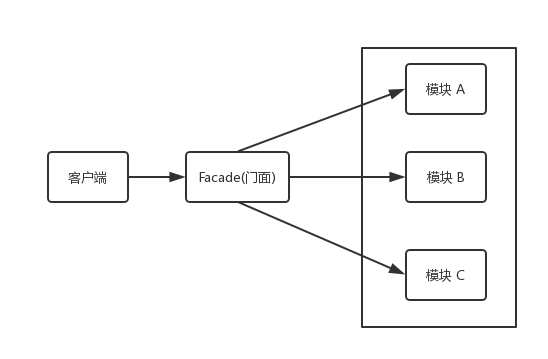

### 8.2 应用场景

```tsx
class Sum {
    sum(a, b) {
        return a + b;
    }
}
class Minus {
    minus(a, b) {
        return a - b;
    }
}
class Multiply {
    multiply(a, b) {
        return a * b;
    }
}
class Calculator {
    sumObj
    minusObj
    multiplyObj
    constructor() {
        this.sumObj = new Sum();
        this.minusObj = new Minus();
        this.multiplyObj = new Multiply();
    }
    sum(...args) {
        return this.sumObj.sum(...args);
    }
    minus(...args) {
        return this.minusObj.minus(...args);
    }
    multiply(...args) {
        return this.multiplyObj.multiply(...args);
    }
}
let calculator = new Calculator();
console.log(calculator.sum(1, 2));
console.log(calculator.minus(1, 2));
console.log(calculator.multiply(1, 2));
```

## 九、迭代器模式

迭代器模式(Iterator Pattern)用于顺序地访问聚合对象内部的元素，又无需知道对象内部结构。使用了迭代器之后，使用者不需要关心对象的内部构造，就可以按序访问其中的每个元素。

### 9.1 类图演示

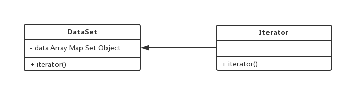

### 9.2 代码演示

```tsx
function createIterator(arr) {
    let index=0;
    return {
        next() {
            return index<arr.length?
                {value: arr[index++],done: false}:
                {done:true}
        }
    }
}
let it=createIterator([1,2]);
console.log(it.next());
console.log(it.next());
console.log(it.next());
```

### 9.3 应用场景

#### 9.3.1 使用for循环自己实现一个forEach

```tsx
Array.prototype.forEach = function (cb) {
  for (var i = 0; i < this.length; i++) {
      cb.call(this, this[i], i, arr);
  }
}
let arr = [1, 2, 3];
arr.forEach((item) => {
  console.log(item);
});
```

#### 9.2 yield

- yield*后面跟的是一个可遍历的结构，它会调用该结构的遍历器接口

```tsx
let generator = function* () {
    yield 1;
    yield* [2, 3];
    yield 4;
};

var iterator = generator();

console.log(iterator.next()); // { value: 1, done: false }
console.log(iterator.next()); // { value: 2, done: false }
console.log(iterator.next()); // { value: 3, done: false }
console.log(iterator.next()); // { value: 4, done: false }
console.log(iterator.next()); // { value: undefined, done: true }
```

## 十、代理模式

- 由于一个对象不能直接引用另外一个对象，所以需要通过代理对象在这两个对象之间起到中介作用
- 代理模式就是为目标对象创造一个代理对象，以实现对目标对象的访问
- 这样就可以在代理对象里增加一些逻辑判断、调用前或调用后执行一些操作，从而实现了扩展目标的功能
- 火车票代购、房产中介、律师、海外代购、明星经纪人

### 10.1 类图演示

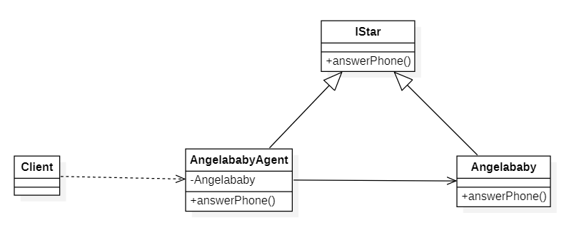

### 10.2 代码

```tsx
abstract class Star {
    abstract answerPhone(): void;
}

class Angelababy extends Star {
    public available: boolean = true;
    answerPhone(): void {
        console.log('你好,我是Angelababy.');
    }
}
class AngelababyAgent extends Star {
    constructor(private angelababy: Angelababy) {
        super();
    }
    answerPhone(): void {
        console.log('你好,我是Angelababy的经纪人.');
        if (this.angelababy.available) {
            this.angelababy.answerPhone();
        }
    }
}
let angelababyAgent = new AngelababyAgent(new Angelababy());
angelababyAgent.answerPhone();
```

### 10.3 场景

#### 10.3.1 事件委托代理

- 事件捕获指的是从document到触发事件的那个节点，即自上而下的去触发事件
- 事件冒泡是自下而上的去触发事件
- 绑定事件方法addEventListen的第三个参数，就是控制事件触发顺序是否为事件捕获。true为事件捕获；false为事件冒泡,默认false


#### 10.3.2 图片预加载

```js
// app.js
let express=require('express');
let path=require('path')
let app=express();
app.get('/images/loading.gif',function (req,res) {
    res.sendFile(path.join(__dirname,req.path));
});
app.get('/images/:name',function (req,res) {
    setTimeout(() => {
        res.sendFile(path.join(__dirname,req.path));
    }, 2000);
});
app.get('/',function (req,res) {
    res.sendFile(path.resolve('index.html'));
});
app.listen(8080);
```

```html
// index.html
<!DOCTYPE html>
<html lang="en">

<head>
    <meta charset="UTF-8">
    <meta name="viewport" content="width=device-width, initial-scale=1.0">
    <meta http-equiv="X-UA-Compatible" content="ie=edge">
    <title>Document</title>
    <style>
        .bg-container {
            width: 600px;
            height: 400px;
            margin: 100px auto;
        }

        .bg-container #bg-image {
            width: 100%;
            height: 100%;
        }
    </style>
</head>

<body>
    <div id="background">
        <button data-src="/images/bg1.jpg">背景1</button>
        <button data-src="/images/bg2.jpg">背景2</button>
    </div>
    <div class="bg-container">
        
    </div>
    <script>
        let container = document.querySelector('#background');

        class BackgroundImage {
            constructor() {
                this.bgImage = document.querySelector('#bg-image');
            }
            setSrc(src) {
                this.bgImage.src = src;
            }
        }
        class LoadingBackgroundImage { 
             static LOADING_URL= `/images/loading.gif`;
            constructor() {
                this.backgroundImage = new BackgroundImage();
            }
            setSrc(src) {
                this.backgroundImage.setSrc(LoadingBackgroundImage.LOADING_URL);
                let img = new Image();
                img.onload = () => {
                    this.backgroundImage.setSrc(src);
                }
                img.src = src;
            }
        }
        let loadingBackgroundImage = new LoadingBackgroundImage();
        container.addEventListener('click', function (event) {
            let src = event.target.dataset.src;
            loadingBackgroundImage.setSrc(src + '?ts=' + Date.now());
        });
    </script>
</body>

</html>
```

#### 10.3.3 防抖、节流代理

略~！

#### 10.3.4 跨域代理

#### 10.3.5 Proxy

## 十一、观察者模式

 观察者模式（有时又被称为模型（Model）-视图（View）模式、源-收听者(Listener)模式或从属者模式）是[软件设计模式](https://baike.baidu.com/item/软件设计模式/2117635)的一种。在此种模式中，一个目标物件管理所有相依于它的观察者物件，并且在它本身的状态改变时主动发出通知。这通常透过呼叫各观察者所提供的方法来实现。此种模式通常被用来实现事件处理系统。
观察者模式定义了一种一对多的依赖关系，让多个观察者对象同时监听某一个目标对象，当这个目标对象的状态发生变化时，会通知所有观察者对象，使它们能够自动更新

### 11.1 类图演示

- 主题对象(Subject) 该角色又称为被观察者,可以增加和删除观察者对象,它将有关状态存入具体观察者对象，在具体主题的内部状态改变时，给所有登记过(关联了观察关系)的观察者发出通知
- 观察者(Observer)角色：定义一个接收通知的接口(update),在得到主题的通知时更新自己

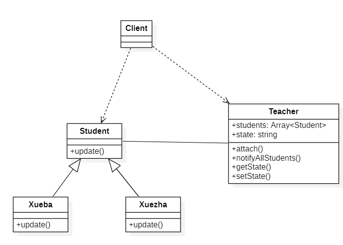

### 11.2 代码演示

```tsx
abstract class Student {
    constructor(public teacher: Teacher) { }
    public abstract update();
}
class Xueba extends Student {
    public update() {
        console.log(this.teacher.getState() + ',学霸抬头举手');
    }
}
class Xuezha extends Student {
    public update() {
        console.log(this.teacher.getState() + ',学渣低头祈祷');
    }
}

class Teacher {
    private students: Student[] = new Array<Student>();
    public state: string = '老师讲课'
    getState() {
        return this.state;
    }
    public askQuestion() {
        this.state = '老师提问';
        this.notifyAllStudents();
    }
    attach(student: Student) {
        this.students.push(student);
    }
    notifyAllStudents() {
        this.students.forEach(student => student.update());
    }
}
let teacher = new Teacher();
teacher.attach(new Xueba(teacher));
teacher.attach(new Xueza(teacher));
teacher.askQuestion();
```

### 11.3 应用场景

#### 11.3.1 原生DOM事件代理

```html
<!DOCTYPE html>
<html lang="en">

<head>
    <meta charset="UTF-8">
    <meta name="viewport" content="width=device-width, initial-scale=1.0">
    <meta http-equiv="X-UA-Compatible" content="ie=edge">
    <title>观察者模式</title>
</head>

<body>
    <button id="btn">click</button>
    <script>
        let btn = document.getElementById('btn');
        const handler1 = () => { console.log(1); }
        const handler2 = () => { console.log(2); }
        const handler3 = () => { console.log(3); }
        btn.addEventListener('click', handler1);
        btn.addEventListener('click',handler2);
        btn.addEventListener('click', handler3);
    </script>
</body>

</html>
```

#### 11.3.2 EventEmitter

略~！

#### 11.3.3 生命周期函数


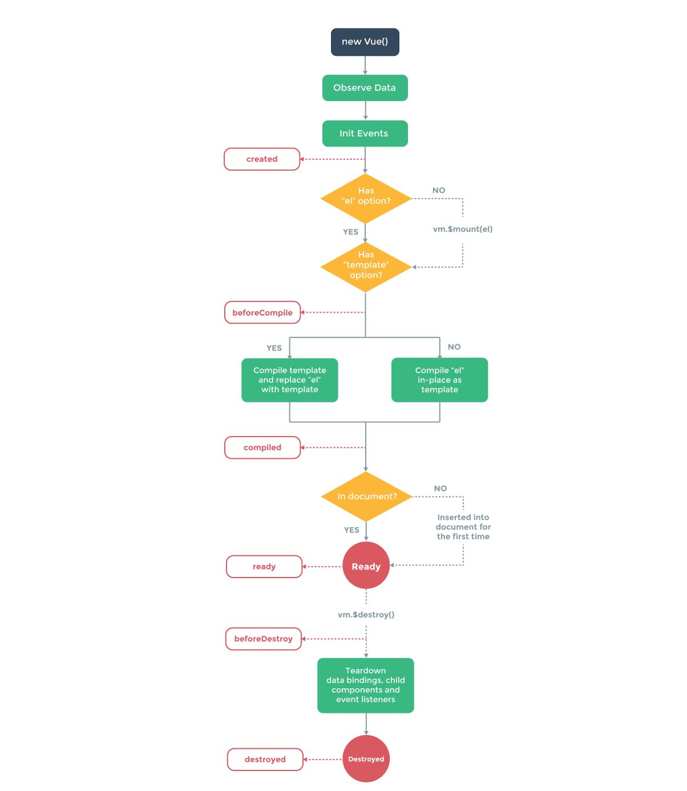

#### 11.3.4 eventBus

- 如果你觉得使用`$on`、`$emit`不方便,而你又不愿意引入`vuex`,可以使用`EventBus`
- 在要相互通信的兄弟组件之中，都引入一个新的vue实例，然后通过分别调用这个实例的事件触发和监听来实现通信和参数传递

#### 11.3.5 vue响应式

在 Vue 中，每个组件实例都有相应的 `watcher` 实例对象，它会在组件渲染的过程中把属性记录为依赖，之后当依赖项的 `setter` 被调用时，会通知 `watcher` 重新计算，从而致使它关联的组件得以更新

### 11.3 发布订阅模式

首先，发布订阅模式也是隶属于观察者模式的一种，其特点如下↓↓↓

- 订阅者把自己想订阅的事件注册到调度中心
- 当该事件触发时候，发布者发布该事件到调度中心,由调度中心统一调度订阅者注册到调度中心的处理代码。
- 虽然两种模式都存在订阅者和发布者（观察者可认为是订阅者、被观察者可认为是发布者）
- 但是观察者模式是由被观察者调度的，而发布/订阅模式是统一由调度中心调的
- 所以观察者模式的订阅者与发布者之间是存在依赖的，而发布/订阅模式则不会。

代码示例↓

```js
class Agency {
    _topics = {}
    subscribe(topic, listener) {
        let listeners = this._topics[topic];
        if (listeners) {
            listeners.push(listener);
        } else {
            this._topics[topic] = [listener];
        }
    }
    publish(topic, ...args) {
        let listeners = this._topics[topic] || [];
        listeners.forEach(listener => listener(...args));
    }
}
class Landlord {
    constructor(public agent: Agency) { }
    lend(topic, area, money) {
        this.agent.publish(topic, area, money);
    }
}

class Tenant {
    constructor(public agent: Agency, public name: string) { }
    order(topic) {
        this.agent.subscribe(topic, (area, money) => {
            console.log(this.name, `${area}平米, ${money}元`);
        });
    }
}
let agent = new Agency();
let rich = new Tenant(agent, '大款');
let poor = new Tenant(agent, '北漂');
let landlord = new Landlord(agent);
rich.order('豪宅');
poor.order('单间');
landlord.lend('豪宅', 10000, 1000000);
landlord.lend('单间', 10, 1000);
```

