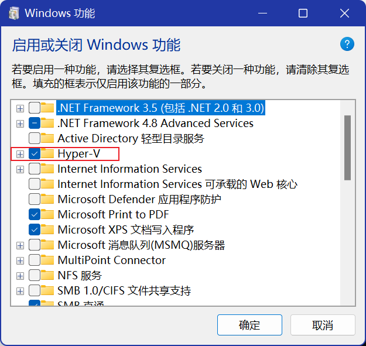
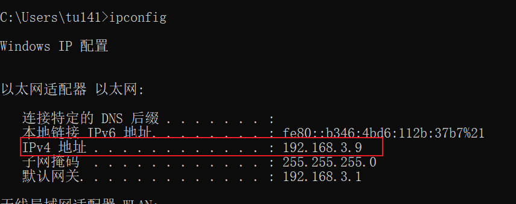
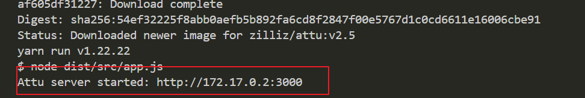
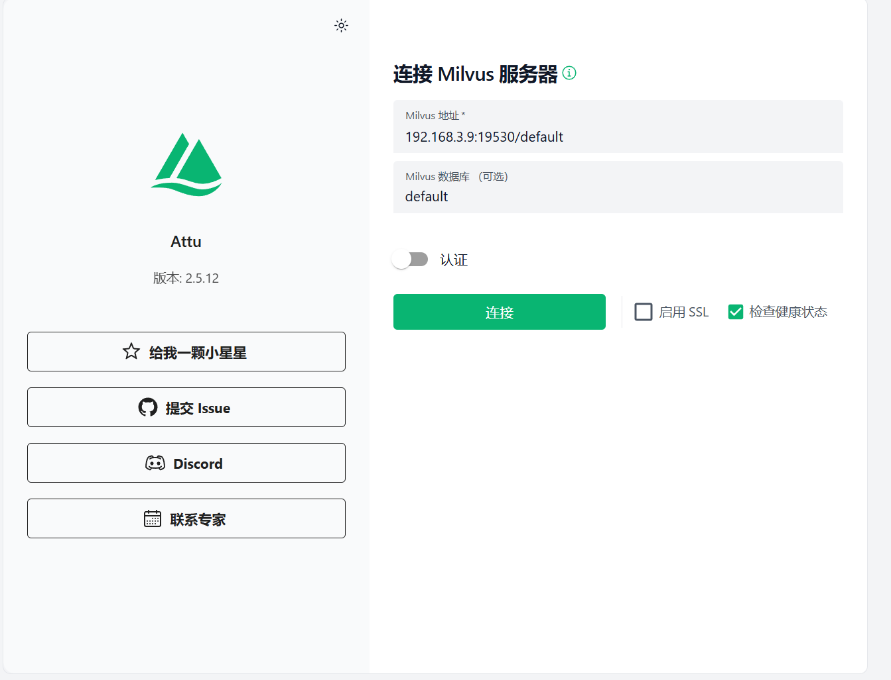

# 一、milvus安装

## 1.1 docker desktop安装

[安装地址](https://milvus.io/docs/zh/install_standalone-windows.md)

1. 根据链接下载docker desktop软件
2. 开启虚拟化

   > ①、任务栏搜索：启用或关闭windows功能
   > ②、点击勾选Virtual Machine Platform （虚拟机平台）、Hyper-V
   > 
   > ③、重启电脑
   >

### 使用 Docker Compose 运行 Milvus

1. 下载[yml文件](https://github.com/milvus-io/milvus/releases/download/v2.6.8/milvus-standalone-docker-compose.yml)
2. 将其命名为 `docker-compose.yml`,然后在集成终端打开
3. 执行 `docker compose up -d` 命令

### 使用Attu连接Milvus

* 通过 `ipconfig` 找到你当前的ip
  
* 输入以下命令

  > 注意：MilVUS_URL是你上一步得到的ip
  >

  ```bash
  docker run -p 8000:3000 -e MILVUS_URL=192.168.2.106:19530 zilliz/attu:v2.5
  ```
* 看到下图时，说明启动成功
  
* 在浏览器输入 `localhost:8000` ，回车
  
