# 浏览器相关

一些参考资料：

[[从浏览器多进程到JS单线程，JS运行机制最全面的一次梳理](https://segmentfault.com/a/1190000012925872)](https://segmentfault.com/a/1190000012925872)

[浏览器灵魂之问，请问你能接得住几个？](https://juejin.cn/post/6844904021308735502)

[深入理解现代浏览器](https://juejin.cn/post/6905952553490448397)

[前端都该懂的浏览器工作原理，你懂了吗？](https://juejin.cn/post/6844904158131126279)

[多角度理解浏览器工作（从输入url到页面呈现）](https://juejin.cn/post/6867075801133776909)

[送你18道浏览器面试题](https://juejin.cn/post/6854573215830933512)


## 1、进程和线程

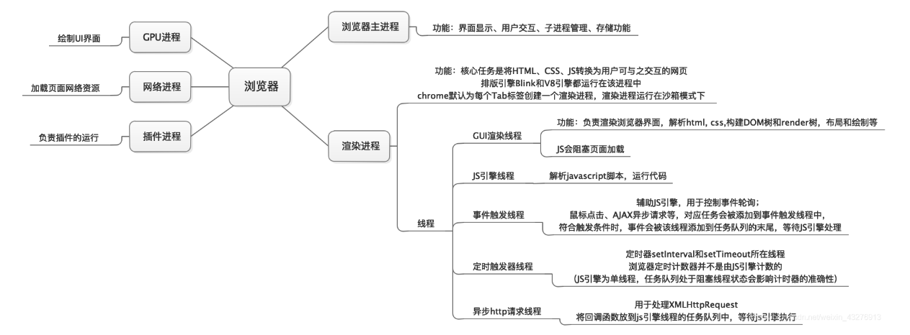


### 1-1、简单区分一下进程与线程

- 进程是一个工厂，工厂有它的独立资源，所以进程也有系统分配的一块独立内存
- 工厂之间相互独立，因此进程之间也是相互独立
- 线程是工厂中的工人，多个工人协作完成任务，多个线程在进程中协作完成任务
- 工厂内有一个或多个工人，所以对应的一个进程由一个或多个线程组成
- 工人之间共享空间，所以同一进程下的各个线程之间共享程序的内存空间（包括代码段、数据集、堆等）


**官方回答：**

- 进程是cpu资源分配的最小单位（是能拥有资源和独立运行的最小单位）
- 线程是cpu调度的最小单位（线程是建立在进程的基础上的一次程序运行单位，一个进程中可以有多个线程）


### 1-2、浏览器中的进程

上面说过，浏览器是多进程的，下面就来看看主要是哪些进程：

 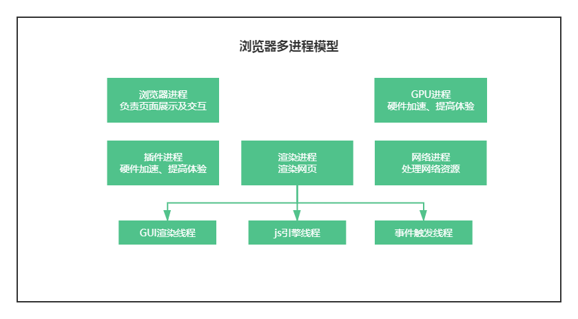

- 浏览器进程：负责页面展示、用户交互、子进程管理、提供存储等

  > 浏览器进程主要管理浏览器操作，例如打开页面，输入 url 等，它还有调度其他进程的功能

- 网络进程：主要负责网络资源加载（html、css、js、静态资源等）

- 渲染进程：每个 Tab 页卡都有单独的渲染进程，核心用于渲染页面

- `GPU`进程：3d 绘制，提高性能

- 插件进程：浏览器中安装的一些插件

> 不同进程之间也可以通信，不过代价较大


在浏览器内，每打开一个 tab，就相当于创建了一个独立的浏览器进程。当然，也不是一定的，浏览器有时会将多个进程合并（譬如打开多个空白标签页后，会发现多个空白标签页被合并成了一个进程）。

具体可以通过 Chrome 的 `更多工具 -> 任务管理器` 查看浏览器进程信息。


**多进程的优势：**

相比于单进程浏览器，多进程有如下优点：

- 避免单个页面崩溃影响整个浏览器
- 避免第三方插件崩溃影响整个浏览器
- 多进程充分利用多核优势
- 方便使用沙盒模型隔离插件等进程，提高浏览器稳定性

简单点理解：**如果浏览器是单进程，那么某个 Tab 页崩溃了，就影响了整个浏览器，体验非常差；同理如果是单进程，插件崩溃了也会影响整个浏览器；最主要的就是，多进程保证的浏览器的稳定性。**

当然，相应的内存等资源消耗也会更大，有点空间换时间的意思。


### 1-3、渲染进程

对于前端而言，最重要的是渲染进程。

下面是渲染进程的一些常驻线程：

- GUI 渲染线程
  - 负责渲染浏览器界面，解析 HTML，CSS，构建 DOM 树和 RenderObject 树，布局和绘制等。
  - 当界面需要重绘（Repaint）或由于某种操作引发回流(reflow)时，该线程就会执行。
  - 注意，**GUI 渲染线程与 JS 引擎线程是互斥的**，当 JS 引擎执行时 GUI 线程会被挂起（相当于被冻结了），GUI 更新会被保存在一个队列中**等到 JS 引擎空闲时**立即被执行。

- JS 引擎线程
  - 也称为 JS 内核，负责处理 Javascript 脚本程序。（例如 V8 引擎）
  - JS 引擎线程负责解析 Javascript 脚本，运行代码。
  - JS 引擎一直等待着任务队列中任务的到来，然后加以处理，一个 Tab 页（renderer进程）中无论什么时候都只有一个 JS 线程在运行 JS 程序。
  - 同样注意，**GUI渲染线程与JS引擎线程是互斥的**，所以如果 JS 执行的时间过长，这样就会造成页面的渲染不连贯，导致页面渲染加载阻塞。

- 事件触发线程
  - 归属于浏览器而不是 JS 引擎，用来控制事件循环。（可以理解，JS 引擎自己都忙不过来，需要浏览器另开线程协助）
  - 当 JS 引擎执行代码块如 setTimeOut 时（也可来自浏览器内核的其他线程,如鼠标点击、AJAX 异步请求等），会将对应任务添加到事件线程中。
  - 当对应的事件符合触发条件被触发时，该线程会把事件添加到待处理队列的队尾，等待 JS 引擎的处理。
  - 注意，由于 JS 的单线程关系，所以这些待处理队列中的事件都得排队等待JS引擎处理。（当 JS 引擎空闲时才会去执行）

- 定时触发器线程
  - 传说中的 `setInterval` 与 `setTimeout` 所在线程。
  - 浏览器定时计数器并不是由 JavaScript 引擎计数的。（因为 JavaScript 引擎是单线程的, 如果处于阻塞线程状态就会影响记计时的准确）
  - 因此通过单独线程来计时并触发定时。（计时完毕后，添加到事件队列中，等待 JS 引擎空闲后执行）
  - 注意，W3C 在 HTML 标准中规定，规定要求 setTimeout 中低于 4ms 的时间间隔算为 4ms。

- 异步 http 请求线程
  - 在 XMLHttpRequest 在连接后是通过浏览器新开一个线程请求。
  - 将检测到状态变更时，如果设置有回调函数，异步线程就**产生状态变更事件**，将这个回调再放入事件队列中。再由 JavaScript 引擎执行。


## 2、从输入 URL 到浏览器显示页面


### 2-1、进行 URL 解析

这里只考虑输入的是一个URL 结构字符串，如果是非 URL 结构的字符串，则会用浏览器默认的搜索引擎生成地址。（这一步是在浏览器进程里面完成的，并非是渲染进程）


**URL 的组成**


URL 主要由 `协议`、`主机`、`端口`、`路径`、`查询参数`、`锚点` 6 部分组成。

浏览器会进行 `URL` 解析，看看输入的内容是否符合 `URL` 规则，符合，就合成一个合法的 URL，浏览器进程会通过进程通信将 `URL` 请求发送给网络进程。


### 2-2、浏览器缓存

浏览器缓存主要分为强缓存和协商缓存。网络进程发起请求之前，会先去检查强缓存，查看是否能直接使用缓存。

强制缓存优先于协商缓存进行，若强制缓存 (Expires 和 Cache-Control) 生效则直接使用缓存，若不生效则进行协商缓存 (Last-Modified / If-Modified-Since 和 Etag / If-None-Match)，协商缓存由服务器决定是否使用缓存，若协商缓存失效，那么代表该请求的缓存失效，返回 200，重新返回资源和缓存标识，再存入浏览器缓存中；生效则返回 304，继续使用缓存。

 


#### 2-2-1、强缓存

强缓存：不会向服务器发送请求，直接从缓存中读取资源，在 chrome 控制台的 Network 选项中可以看到该请求返回 200 的状态码，并且 Size 显示 from disk cache【磁盘缓存】 或 from memory cache【内存缓存】。


在 `HTTP/1.0` 和 `HTTP/1.1` 当中，这个字段是不一样的。在早期，也就是 `HTTP/1.0` 时期，使用的是 **Expires**，而 `HTTP/1.1` 使用的是**Cache-Control**。


**Expires**

`Expires` 指定过期时间，存在于服务端返回的响应头中，告诉浏览器在这个过期时间之前可以直接从缓存里面获取数据，无需再次请求。例如：

```js
Expires: Wed, 1 Jun 2021 08:00:00 GMT
```

表示资源在 `2021年6月1号8点` 过期，过期了就得向服务端发请求。

这种方式最大的问题是：服务器的时间和浏览器的时间可能并不一致，那服务器返回的这个过期时间可能就是不准确的。所以在 http1.1 版本中抛弃了这种方法。


**Cache-Control**

Cache-Control：它并没有采用具体的过期时间点这个方式，而是采用过期时长来控制缓存。例如：

```js
Cache-Control:max-age=3600
```

代表这个响应返回后在 3600 秒，也就是一个小时之内可以直接使用缓存。

一些常用值：

- max-age：缓存的有效时间

- private：只有浏览器能缓存，中间的代理服务器不能缓存
- no-cache：跳过当前的强缓存，发送HTTP请求，即直接进入`协商缓存阶段`
- no-store：不进行任何形式的缓存
- s-maxage：与 max-age 差不多，只是 s-maxage 针对的是代理服务器的缓存


**Expires 与 Cache-Control 区别：**

Expires 是 http1.0 的产物，Cache-Control 是 http1.1 的产物，两者同时存在的话，Cache-Control 优先级高于 Expires


当 `强缓存` 失效了，接下来就进入到第二级屏障——**协商缓存**


#### 2-2-2、协商缓存

强缓存失效之后，浏览器在请求头中携带相应的`缓存标识`来向服务器发请求，由服务器根据这个tag，来决定是否使用缓存，这就是**协商缓存**。

> 需要注意的是，协商缓存是会发起请求的，所以协商缓存在 DNS 解析、TCP 连接之后

浏览器第一次请求数据时，服务器会将缓存标识与数据一起响应给客户端，客户端将它们备份至缓存中。再次请求时，客户端会先从缓存数据库拿到一个缓存的标识，然后向服务端验证标识是否失效，如果没有失效服务端会返回 304，这样客户端可以直接去缓存数据库拿出数据，如果失效，服务端会返回新的数据


协商缓存的标识有两种：

**Last-Modified**

即最后修改时间。在浏览器第一次给服务器发送请求后，服务器会在响应头中加上这个字段。

浏览器接收到后，如果再次请求，会在请求头中携带`If-Modified-Since`字段，这个字段的值也就是服务器传来的最后修改时间。

服务器拿到请求头中的`If-Modified-Since`的字段后，其实会和这个服务器中`该资源的最后修改时间`对比:

- 如果请求头中的这个值小于最后修改时间，说明是时候更新了。返回新的资源，跟常规的HTTP请求响应的流程一样。
- 否则返回304，告诉浏览器直接用缓存。


**ETag**

`ETag` 是服务器根据当前文件的内容，给文件生成的唯一标识，只要里面的内容有改动，这个值就会变。服务器通过`响应头`把这个值给浏览器。

浏览器接收到`ETag`的值，会在下次请求时，将这个值作为**If-None-Match**这个字段的内容，并放到请求头中，然后发给服务器。

服务器接收到**If-None-Match**后，会跟服务器上该资源的**ETag**进行比对:

- 如果两者不一样，说明要更新了。返回新的资源，跟常规的HTTP请求响应的流程一样。
- 否则返回304，告诉浏览器直接用缓存。


**Last-Modified 与 ETag 对比：**

在精准度上，ETag 优于 Last-Modified。优于 ETag 是按照内容给资源上标识，因此能准确感知资源的变化。而 Last-Modified 就不一样了，它在一些特殊的情况并不能准确感知资源变化，主要有两种情况：

- 编辑了资源文件，但是文件内容并没有更改，这样也会造成缓存失效。

- Last-Modified 能够感知的单位时间是秒，如果文件在 1 秒内改变了多次，那么这时候的 Last-Modified 并没有体现出修改了。

在性能上，Last-Modified 优于 ETag，也很简单理解，Last-Modified 仅仅只是记录一个时间点，而 Etag 需要根据文件的具体内容生成哈希值。


另外，如果两种方式都支持的话，服务器会优先考虑 ETag。


#### 2-2-3、缓存位置

浏览器中的缓存位置一共有四种，按优先级从高到低排列分别是：

Service Worker --> Memory Cache --> Disk Cache --> Push Cache


**1、Service Worker**

是运行在浏览器背后的独立线程，一般可以用来实现缓存功能。使用 Service Worker的话，传输协议必须为 HTTPS。因为 Service Worker 中涉及到请求拦截，所以必须使用 HTTPS 协议来保障安全。Service Worker 的缓存与浏览器其他内建的缓存机制不同，它可以让我们自由控制缓存哪些文件、如何匹配缓存、如何读取缓存，并且缓存是持续性的。


**2、Memory Cache**

指的是内存缓存，主要包含的是当前中页面中已经抓取到的资源，例如页面上已经下载的样式、脚本、图片等。读取内存中的数据肯定比磁盘快，内存缓存虽然读取高效，可是缓存持续性很短，当渲染进程结束后（比如 tab 标签关闭），内存缓存也就不存在了


**3、Disk Cache**

存储在硬盘中的缓存，读取速度慢点，但是什么都能存储到磁盘中，比之 Memory Cache 胜在容量大。

在所有浏览器缓存中，Disk Cache 覆盖面基本是最大的。它会根据 HTTP Herder 中的字段判断哪些资源需要缓存，哪些资源可以不请求直接使用，哪些资源已经过期需要重新请求。并且即使在跨站点的情况下，相同地址的资源一旦被硬盘缓存下来，就不会再次去请求数据。绝大部分的缓存都来自 Disk Cache。

memory cache 要比 disk cache 快的多。举个例子：从远程 web 服务器直接提取访问文件可能需要 500 毫秒(半秒)，那么磁盘访问可能需要 10-20 毫秒，而内存访问只需要 100 纳秒，更高级的还有 L1 缓存访问(最快和最小的 CPU 缓存)只需要 0.5 纳秒。


**4、Push Cache**

即推送缓存，是 HTTP/2 中的内容，当以上三种缓存都没有命中时，它才会被使用。它只在会话（Session）中存在，一旦会话结束就被释放，缓存时间也很短暂。


#### 2-2-4、刷新对于强缓存和协商缓存的影响

- 当 ctrl+f5 强制刷新网页时，直接从服务器加载，跳过强缓存和协商缓存。

- 当 f5 刷新网页时，跳过强缓存，但是会检查协商缓存。

- 浏览器地址栏中写入 URL，回车 浏览器发现缓存中有这个文件了，不用继续请求了，直接去缓存拿。（最快）


#### 2-2-5、案例

在利用 fiddler 抓包看不同网站缓存时，会发现，大部分网站的 cache-control 都设置的为 no-cache。

no-cache 不是不缓存，要缓存，只是跳过当前的强缓存，发送 HTTP 请求，即直接进入 `协商缓存阶段`，判断自己的缓存是不是最新，如果是就接着用，不是就请求最新的文件，缓存起来用，以此循环。

那么有必要设置过期时间 Expires 与 max-age 吗？有！

当我们第一次浏览一个页面，关闭后，第二次再打开还是属于新开窗口行为，如果设置了缓存时间，新开窗口会走强缓存，可以避免反复的文件下载，加快页面渲染，提升用户体验性。


### 2-3、DNS 解析

网络请求的第一步就是 DNS 解析。

DNS 解析：每台计算机都有一个唯一 IP 地址，但是 IP 地址不方便记忆，所以采用更方便记忆的域名网址去查找其他计算机，将域名网址转换成 IP 地址的过程就是 DNS 解析。


#### 2-3-1、DNS 解析的基本步骤

- 浏览器缓存，向浏览器的缓存中读取上一次的访问记录
- 操作系统的缓存，查找存储在系统运行内存中的缓存
- 去 `host` 文件中查找
- 路由器缓存：有些路由器会把访问过的域名存在路由器上
- 缓存中找不到，则在本地 `DNS` 服务器进行迭代查询 --> 根域名服务器 --> `.com` 顶级服务器 --> 主域名服务器 --> ...，根据上述方法逐级查找，直到服务器返回对应的 `IP`


#### 2-3-2、DNS 负载均衡

现在很多网站都有多个服务器，当一个网站访问量过大的时候，如果所有请求都请求在同一个服务器上，可能服务器就会崩掉，这时候就用到了 `DNS` 负载均衡技术，当一个网站有多个服务器地址时，在应答 `DNS` 查询的时候，`DNS` 可以根据每台机器的负载量、距离用户的距离等返回一个合适的服务器 `IP` 给用户。


### 2-4、TCP 三次握手建立连接

通过 DNS 域名解析拿到 IP 地址后，将进行 TCP 三次握手建立连接。

 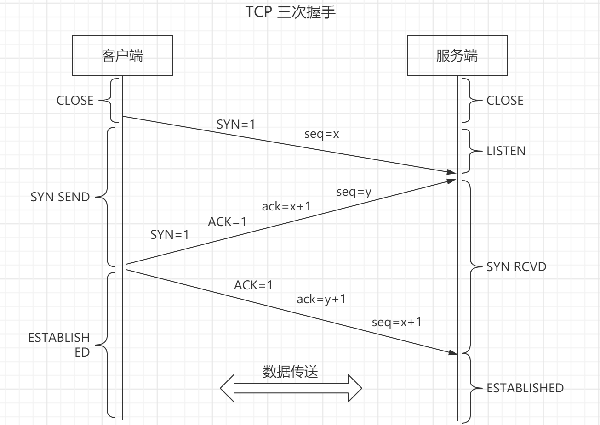

- `SYN`：连接请求/接收 报文段
- `seq`：发送的第一个字节的序号
- `ACK`：确认报文段
- `ack`：确认号。希望收到的下一个数据的第一个字节的序号


**刚开始客户端处于 `Closed` 的状态，而服务端处于 `Listen` 状态**：

> `CLOSED `：没有任何连接状态
>
> `LISTEN `：侦听来自远方 TCP 端口的连接请求


**第一次握手：**客户端向服务端发送一个 SYN 报文（SYN = 1），并指明客户端的初始化序列号 ISN(x)，即图中的 seq = x，表示本报文段所发送的数据的第一个字节的序号。此时客户端处于 `SYN_Send` 状态。

> `SYN-SENT` ：在发送连接请求后等待匹配的连接请求


**第二次握手：**服务器收到客户端的 SYN 报文之后，会发送 SYN 报文作为应答（SYN = 1），并且指定自己的初始化序列号 ISN(y)，即图中的 seq = y。同时会把客户端的 ISN + 1 作为确认号 ack 的值，表示已经收到了客户端发来的的 SYN 报文，希望收到的下一个数据的第一个字节的序号是 x + 1，此时服务器处于 `SYN_REVD` 的状态。

> `SYN-RECEIVED`：在收到和发送一个连接请求后等待对连接请求的确认


**第三次握手：**客户端收到服务器端响应的 SYN 报文之后，会发送一个 ACK 报文，也是一样把服务器的 ISN + 1 作为 ack 的值，表示已经收到了服务端发来的的 SYN 报文，希望收到的下一个数据的第一个字节的序号是 y + 1，并指明此时客户端的序列号 seq = x + 1（初始为 seq = x，所以第二个报文段要 +1），此时客户端处于 `Establised` 状态。

服务器收到 ACK 报文之后，也处于 `Establised 状态`，至此，双方建立起了 TCP 连接。

> `ESTABLISHED`：代表一个打开的连接，数据可以传送给用户


也就是说，对面是怎么确定是同一个发起连接的？首先，传过来的初始序号是 x，那么本地保存一个确认序号 x+1，如果下次传过来的序号不是 x+1，就可以确定不是同一个人发起的连接。


简单描述：

- 第一次握手，客户端告知服务端，我要发起请求

- 第二次握手，服务端表示收到通知，告知客户端可以开始发送请求

- 第三次握手，客户端收到，告知服务端，我要开始发送请求，请准备接收


由上面可以看出，进行数据传输，有一个重要的机制，就是接收方接收到数据包后必须要向发送方`确认`, 如果发送方没有接到这个`确认`的消息，就判定为数据包丢失，并重新发送该数据包。当然，发送的过程中还有一个优化策略，就是把`大的数据包拆成一个个小包`，依次传输到接收方，接收方按照这个小包的顺序把它们`组装`成完整数据包。

所以，TCP 保证稳定性的手段：一是`三次握手`确认连接，二是`数据包校验`保证数据到达接收方，三是通过`四次挥手`断开连接


### 2-5、HTTP 请求

建立了 TCP 连接，浏览器可以和服务器开始通信，即开始发送 HTTP 请求。


> - TCP 是底层通讯协议，定义的是数据传输和连接方式的规范
> - HTTP 是应用层协议，定义的是传输数据的内容的规范
> - HTTP 协议中的数据是利用 TCP 协议传输的，所以支持 HTTP 也就一定支持 TCP


#### 2-5-1、网络 OSI 七层模型与 TCP/IP 四层模型

**网络七层模型：**

- 物理层

- 数据链路层

  > 一般来讲，物理层与数据链路层归为网络接口层，比如说电缆、光纤之类的

- 网络层（ip）

- 传输层（tcp：安全可靠[三次握手]，分段传输，但是慢、udp：快[仅需发送一次确认]，但是会存在丢包）

- 会话层

- 表示层

- 应用层

  > 会话层、表示层、应用层归为应用层，主要就是 http


**一张经典的图：**


**网络 OSI 七层模型与 TCP/IP 四层模型：**

 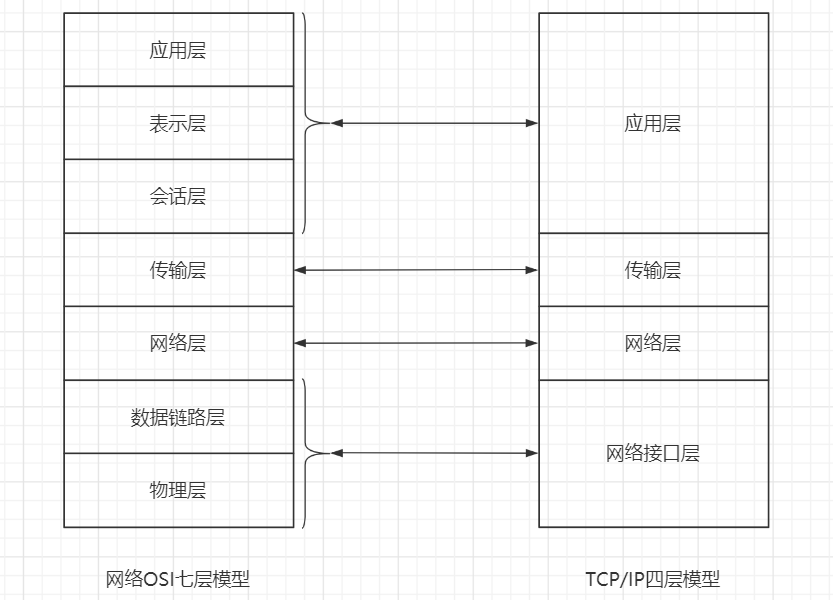


#### 2-5-2、HTTP 发展历史流程

1. http 0.9：只负责传输 html，最早的时候没有请求头和请求体，不能传输 js 或者静态资源等
2. http1.0：提供了请求头，那么就可以根据请求头的不同来处理不同的资源，但是它有很多缺点，例如每次请求完都会断开链接，需要重新创建链接，带来较大的时间成本，需要手动 keep-alive
3. http1.1：默认开启了 keep-alive 链路复用，管线化（一个域名下最多可以建立6个链接）。但是服务器处理请求是按照顺序来的，虽然发送是并发发送6个，但是响应还是按照顺序一一处理（即队头阻塞）。而且 6 个链接，会建立6个tcp，那么会有带宽争抢的情况
4. http2.0：所有数据以二进制传输。HTTP1.x 是基于文本的，用同一个 tcp 发送数据，一个域名一个 tcp（多路复用）、头部压缩、双向链接（不止客户端可以先发起请求，也可以服务端先推送数据）
5. http3.0：解决了 tcp 的队头阻塞问题。最重要的是 http3.0 不再采用 tcp，而是使用 udp，并且加了 QUIC 协议


#### 2-5-3、发起请求

浏览器发 HTTP 请求要携带三样东西：**请求行**、**请求头**和**请求体**。


请求行：一般是规定请求方式及版本 （GET / HTTP/1.1）

```js
// 请求方法是 GET，路径为根路径，HTTP 协议版本为1.1
GET / HTTP/1.1
```


请求头：请求报头允许客户端向服务器传递请求的附加信息和客户端自身的信息，比如 cookies、Cache-Control 等

```js
Accept: text/html,application/xhtml+xml,application/xml;q=0.9,image/webp,image/apng,*/*;q=0.8,application/signed-exchange;v=b3
Accept-Encoding: gzip, deflate, br
Accept-Language: zh-CN,zh;q=0.9
Cache-Control: no-cache
Connection: keep-alive
Cookie: /* 省略cookie信息 */
Host: www.baidu.com
Pragma: no-cache
Upgrade-Insecure-Requests: 1
User-Agent: Mozilla/5.0 (iPhone; CPU iPhone OS 11_0 like Mac OS X) AppleWebKit/604.1.38 (KHTML, like Gecko) Version/11.0 Mobile/15A372 Safari/604.1
```


请求体：需要向服务端传输的数据

```js
axios.post(url, data)
```


#### 2-5-4、拿到响应

网络响应具有三个部分：**响应行**、**响应头**和**响应体**。


响应行：由 HTTP 协议版本、状态码和状态描述组成

```js
HTTP/1.1 200 OK
```

常见状态码：

`1xx`：指示信息——表示请求已经接受，继续处理

- `100 Continue` 一般在发送 `post` 请求时，已发送了 `http header` 之后服务端返回此信息，表示确认，之后发送具体参数信息。

`2xx`：成功

- `200 OK` 正常返回信息
- `201 Created` 请求成功并且服务器创建了新的资源
- `202 Accepted` 服务器已接受请求，但尚未处理

`3xx`：重定向

- `301 Moved Permanently` 永久重定向
- `302 Found` 临时重定向
- `303 See Other` 临时重定向，且总是使用 `GET` 请求新的 `URI`
- `304 Not Modified` 请求内容未改动，走缓存

`4xx`：客户端错误

- `400 Bad Request` 服务器无法理解请求格式
- `401 Unauthorized` 请求未授权
- `403 Forbidden` 禁止访问
- `404 Not Found` 找不到与 `URI` 相匹配的资源

`5xx`：服务器错误。

- `500 Internal Server Error` 服务器内部错误
- `503 Service Unavailable` 服务器暂时无法处理请求


响应头：包含了服务器及其返回数据的一些信息, 服务器生成数据的时间、返回的数据类型以及对即将写入的 Cookie 信息等

```js
Cache-Control: no-cache
Connection: keep-alive
Content-Encoding: gzip
Content-Type: text/html;charset=utf-8
Date: Wed, 04 Dec 2019 12:29:13 GMT
Server: apache
Set-Cookie: rsv_i=f9a0SIItKqzv7kqgAAgphbGyRts3RwTg%2FLyU3Y5Eh5LwyfOOrAsvdezbay0QqkDqFZ0DfQXby4wXKT8Au8O7ZT9UuMsBq2k; path=/; domain=.baidu.com
```


响应体：从服务器请求的资源就放在这里面，例如 HTML, CSS, JS 等


### 2-6、TCP 四次挥手断开连接

响应完成，进行 TCP 四次挥手断开连接。

但是不一定会断开连接。这时候要判断 `Connection` 字段, 如果请求头或响应头中包含 **Connection: Keep-Alive**，表示建立了持久连接，这样 `TCP` 连接会一直保持，之后请求统一站点的资源会复用这个连接。

否则断开`TCP`连接, 请求-响应流程结束。

 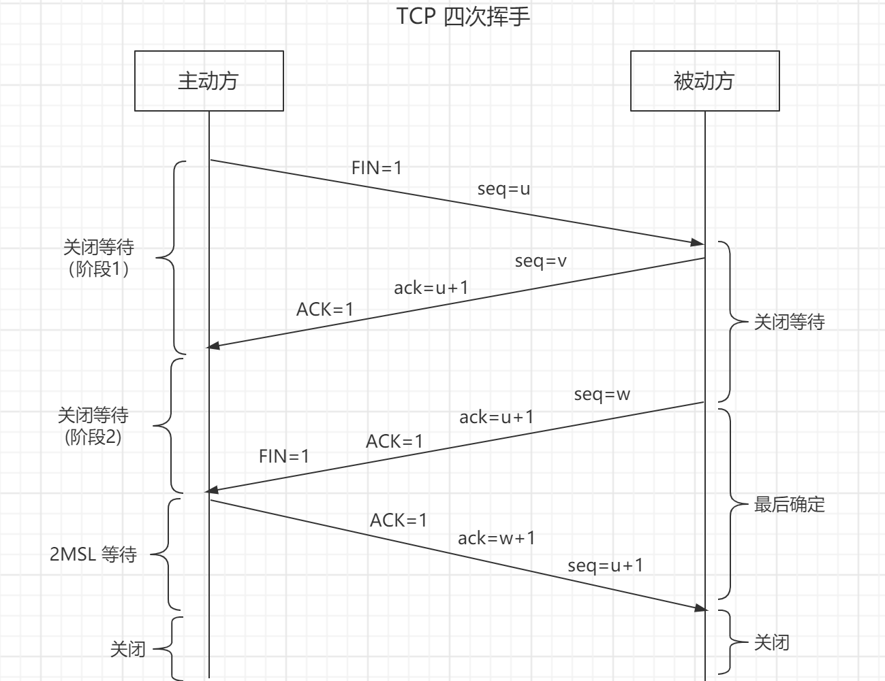

- `FIN` ：连接终止位
- `seq`：发送的第一个字节的序号
- `ACK`：确认报文段
- `ack`：确认号。希望收到的下一个数据的第一个字节的序号


四次挥手谁都可以先发起关闭，这里假设是客户端先发起关闭：

四次挥手谁都可以先发起关闭，这里假设是客户端先发起关闭：

- **第一次挥手**：客户端发送一个 FIN 报文（请求连接终止：FIN = 1），报文中会指定一个序列号 seq = u。并**停止再发送数据，主动关闭 TCP 连接，但是会继续接受数据**。此时客户端处于 `FIN_WAIT1` （第一阶段等待状态）状态，等待服务端的确认。

  > `FIN-WAIT-1`  等待远程TCP的连接中断请求，或先前的连接中断请求的确认；第一阶段等待状态

  

- **第二次挥手**：服务端收到 FIN 之后，会发送 ACK 报文，且把客户端的序号值 +1 作为 ACK 报文的序列号值，表明已经收到客户端的报文了，此时服务端处于 `CLOSE_WAIT` 状态。此时服务端处于关闭等待状态，不会再接收数据，但会继续发送数据；客户端进入`FIN_WAIT2`（下一阶段等待状态）

  > `CLOSE-WAIT`  等待从本地用户发来的连接中断请求
  >
  > `FIN-WAIT-2`  从远程TCP等待连接中断请求

  

- **第三次挥手**：如果服务端也想断开连接了（没有要向客户端发出的数据），和客户端的第一次挥手一样，发送 FIN 报文，且指定一个序列号。此时服务端处于 `LAST_ACK` (最后确认阶段)的状态，等待客户端的确认。此时服务端不再接受和发送数据。

  > `LAST-ACK` - 等待原来发向远程TCP的连接中断请求的确认

  

- **第四次挥手**：客户端收到 FIN 之后，一样发送一个 ACK 报文作为应答（ack = w+1），且把服务端的序列值 +1 作为自己 ACK 报文的序号值（seq=u+1），此时客户端处于 **`TIME_WAIT` （时间等待）状态**。服务端收到后，会立即断开。

  - 注意了，这个时候，客户端需要等待 2MSL 才关闭，在这段时间内如果客户端没有收到服务端的重发请求，那么表示 ACK 成功到达，挥手结束，否则客户端重发 ACK。


简单描述：假设是客户端先发起关闭

- 第一次挥手：客户端发送请求，申请断开，进入等待阶段，此时不会发送数据，但是会继续接收数据

- 第二次挥手：服务端接收到请求，告知客户端已明白，此时服务端进入等待状态，不会再接收数据，但会继续发送数据；而客户端则进入下一阶段的等待状态

- 第三次挥手：服务端发送完剩余的数据后，告知客户端可以断开连接，此时服务端不会发送和接收数据，进入最后确认状态

- 第四次挥手：客户端收到后，告知服务端我开始断开连接，服务端收到后，直接就断开连接


### 2-7、渲染流程

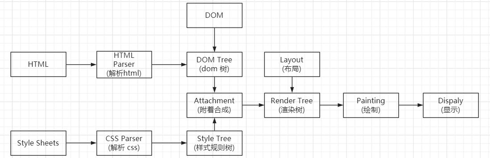


接下来就是浏览器的渲染流程：浏览器拿到资源会根据资源类型进行处理，比如是 `gzip` 压缩后的文件则进行解压缩，如果响应头 `Content-type` 为 `text/html`，则开始解析 `HTML`


#### 2-7-1、构建 DOM 树

浏览器无法直接理解和使用 HTML 文本，所以需要将 HTML 转换为浏览器能够理解的结构——DOM 树。并且 JavaScript 查询或修改页面结构也是通过 DOM 树。

 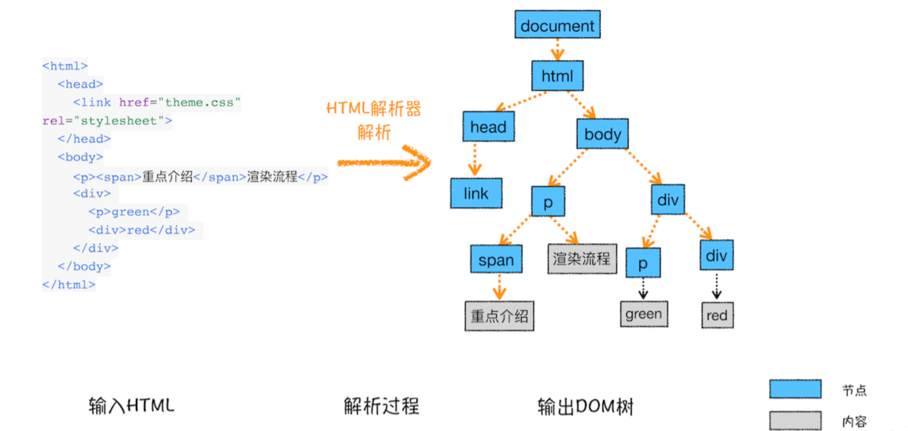

构建 DOM 树、样式计算都是由 GUI 渲染线程控制完成，但为了提高效率，具体的字节流解析工作，GUI 渲染线程会另起子线程完成。比如 HTMLParser 线程负责将 HTML 文本转换为 DOM 结构；CSSParser 线程将 CSS 文本转换为浏览器可以理解的结构——styleSheets。


#### 2-7-2、样式计算

 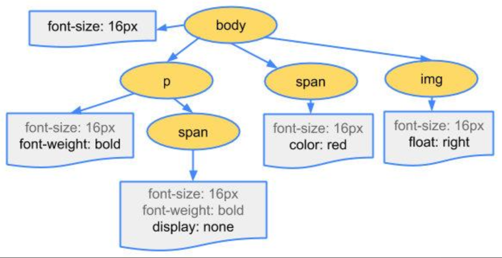

CSS 样式，来源一般就三种:

1. **link 标签引用**
2. **style 标签中的样式**
3. **元素的内嵌 style 属性**


**1、格式化样式表**

首先，浏览器是无法直接识别 CSS 样式文本的，因此渲染引擎接收到 CSS 文本之后第一件事情就是将其转化为一个结构化的对象，即styleSheets。在控制台中输入 document.styleSheets， 就可以查看其结构：

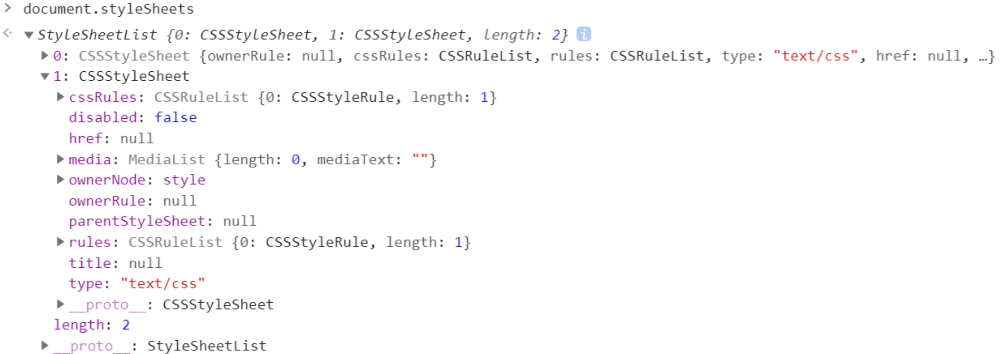


**2、标准化属性**

CSS文本中有一些属性值，如 em、red、bold 等，不容易被渲染引擎理解，需要将其为渲染引擎容易理解的、标准化的计算值。em --> px，red --> rgb(255,0,0)，bold --> 700.


**3、计算每个节点的具体样式**

计算的方式也并不复杂，主要就是两个规则: **继承**和**层叠**。

继承：每个子节点都会默认继承父节点的样式属性，如果父节点中没有找到，就会采用浏览器默认样式


DOM 元素最终的计算样式，可以通过浏览器的Element->Computed可以查看：

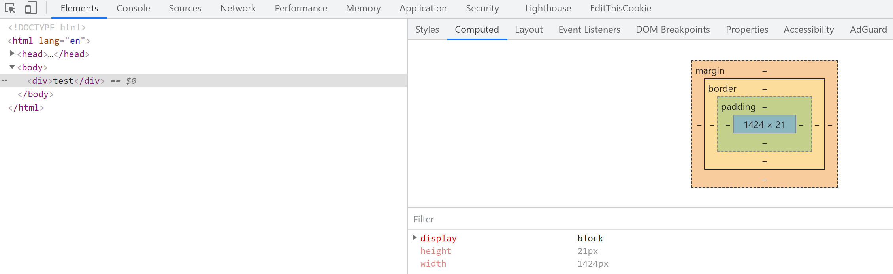


#### 2-7-3、生成布局树

- DOM 树与 CSSOM 树合并后形成渲染树
- 渲染树只包含渲染网页所需的节点，`display: none` 不可见节点以及 `head` 这种不可见标签不会插入到布局树里
- 计算布局树节点的坐标位置


#### 2-7-4、渲染（也就是绘制-->显示阶段）

渲染的过程主要就是以下几步：

- 创建 `图层树`  (`Layer Tree`)【分层】
- 生成 `绘制列表`
- 合成：生成 `图块` 并 `栅格化`
- 显示器显示内容


**1、创建图层树（分层）**

为什么需要分层？主要是为了处理页面中的一些复杂的效果，比如 3D 变换、页面滚动等，这些效果使得与之对应的 DOM 节点尺寸和坐标等不断更新。如果不分层，则需要重新计算整个布局树中每个元素的位置，而分层后，就只需要计算变换层中的元素位置信息。

- 需要分层的：`position: fixed/absolute`、`z-index:2`、`filter: blue(5px)`、`opacity: .5`等拥有层叠上下文属性的元素

- 需要裁剪的：比如一个div，你只给他设置 100 * 100 像素的大小，而你在里面放了非常多的文字，那么超出的文字部分就需要被剪裁。当然如果出现了滚动条，那么滚动条会被单独提升为一个图层


**2、生成绘制列表**

图层树的构建完成后，渲染引擎会对图层树中的每个图层进行绘制。对于每一个图层，渲染引擎会把对它的绘制拆分成很多小的绘制指令，然后再把这些指令按照顺序组成一个绘制列表

此时，并没有真正的绘制出页面，实际的绘制操作由合成线程来完成。


**3、合成**

合成线程会将图层划分为图块，然后按照视口附近的图块来优先生成位图。实际生成位图的操作是由栅格化线程来执行的。所谓栅格化，是指将图块转换为位图。

这些块的大小一般不会特别大，通常是 256 * 256 或者 512 * 512 这个规格

> 为什么需要划分图块？
>
> 一个页面可能很长，需要滚动显示，每次显示在视口中的只是页面的一小部分。对于这种情况，绘制出一整个长页，会产生太大的开销，而且也没必要。这些块的大小一般不会特别大，通常是 256 * 256 或者 512 * 512 这个规格


生成位图的过程实际上都会使用 GPU 进行加速，生成的位图最后发送给`合成线程`。


**4、显示**

一旦所有图块都被光栅化，合成线程向浏览器进程提交一个绘制图块位图的命令，浏览器进程将其内容绘制到内存之中，最后显示在屏幕上

到这里，浏览器就会显示出页面的内容了


### 2-8、性能优化


#### 2-8-1、网络请求阶段

**1、DNS 优化**

- `DNS` 预解析
- 采用 `CDN`，`DNS` 负载均衡

```html
<meta http-equiv="x-dns-prefetch-control" content="on">
<link rel="dns-prefetch" href="//g.alicdn.com" />  
```


**2、网络连接优化**

- 分服务器部署，区分 `web` 服务器、资源服务器、数据服务器，增加 `HTTP` 并发性
- 减少 `TCP` 的三次握手和四次挥手：`HTTP1.1默认开启的 Connection: keep-alive`


**3、数据缓存**

- 对于静态资源文件实现强缓存和协商缓存
- 对不经常更新的接口数据采用本地存储做数据缓存，比如地区数据


**4、数据传输**

- 减少数据传输的大小
  - 利用工具如 `webpack` 对传输内容进行压缩
  - 服务端开发 `GZIP` 压缩，一般能压缩 `60%` 左右
  - 大批量数据分批次请求，下拉刷新，分页
- 减少 `HTTP` 请求的次数
  - 资源文件合并处理
  - 使用雪碧图，图片懒加载等


**5、采用 HTTP2.0**

`HTTP1.1` 虽然在串行请求可以通过 `Connection: keep-alive` 复用同一个 `TCP` 连接，如果是并行发送多个请求，会建立多个连接，但是浏览器一般限制会限制同一域名下最多同时可以建立6个连接。

- 请求阻塞：在并发请求达最大限制时，请求必须等到上一个请求完成后，才可以复用这个 `TCP` 发出下一个请求，所以会受到前面请求的阻塞。
- 队头阻塞：请求响应的顺序必须和请求发送的顺序一致，如果后发送的请求响应完成了，也要等前面的阻塞的请求返回。

多路复用：允许同时通过单一的 `HTTP2.0` 连接发起的多重请求 - 响应消息，连接通道是共享的


`HTTP2.0` 的传输是基于二进制帧的，每个 `TCP` 连接中，都有多个双向流通的流，每个流都有独一无二的标识和优先级，而流就是由二进制帧组成的。二进制帧会标识自己是属于哪个流的，所以这些流可以交错传输，在接收端根据帧头组装成完整的信息，解决队头堵塞的问题。


头部压缩：`HTTP1.x` 的 `header` 中带有大量的信息，每次都要重复发送，`HTTP2.0` 使用 `HPACK` 算法对 `header` 数据进行压缩，减少需要传输的 `header` 大小，通讯双方各自缓存一个头部字典表，可以差异化更新头部，减少需要传输数据的大小


#### 2-8-2、浏览器渲染阶段


**1、js 与 css 加载顺序优化**

js 的加载会阻塞 DOM 解析和渲染，所以最好将 js 放在 body 最后面，或者使用 defer、async

css 的加载不会阻塞 DOM 解析，但是会阻塞 DOM 渲染，所以尽量使用 link 标签都放在 head 中，少使用 @import(会等到页面被加载完再加载)


**2、合理使用 CSS 选择器**

CSS 选择器的匹配是从右向左进行的，这一策略导致了不同的选择器之间的性能也存在差异：

- 避免使用通配符，只对需要用到的元素进行选择。

- 关注可以通过继承实现的属性，避免重复匹配重复定义。

- 减少嵌套。后代选择器的开销是最高的，因此我们应该尽量将选择器的深度降到最低。

- 减少用标签选择器和属性选择器。


**3、减少 DOM 操作**

- 缓存访问过的元素，例如：

  ```js
  for(var count=0;count<10000;count++){ 
    document.getElementById('container').innerHTML+='<span>我是一个小测试</span>'
  }
  
  // 改：只获取一次container，并缓存
  let container = document.getElementById('container')
  for(let count=0;count<10000;count++){ 
    container.innerHTML += '<span>我是一个小测试</span>'
  } 
  ```

- 避免频繁修改 DOM，尽量一次更新，比如 vue、react 的虚拟 dom

- 事件委托，只绑定一个事件函数，可以减少大量的内存消耗


**4、减少重绘回流**

回流：当我们对 DOM 的修改引发了 DOM 几何尺寸的变化，比如修改元素的宽、高或隐藏元素等，浏览器需要重新计算元素的几何属性进行布局，然后再将计算的结果绘制出来。这个过程就是回流（也叫重排或页面布局）。

重绘：当 DOM 需要更新属性，而这些属性只是影响其外观，风格，并不会影响布局，比如只修改了颜色或背景色，浏览器不需重新计算元素的几何属性，直接为该元素绘制新的样式。这个过程叫做重绘。

重绘不一定导致回流，回流一定会导致重绘。回流比重绘的代价要更高。


**5、节流防抖**

当网页交互过程中，有一些操作常常会频繁触发，如滚动页面触发的scroll事件，页面缩放触发resize事件、鼠标移动的mousemove\mouseover事件等。

频繁触发这些事件会导致相应回调函数的大量计算，从而引发页面抖动甚至卡顿，为了控制事件回调的触发频率，就需要用事件节流和事件防抖。


**6、分层与合成：动画效果**

对于一些复杂的动画效果，比如常见的点击菜单时弹出收回菜单的动画特效，还有一些炫酷的 3D 动画特效，如果没有采用分层机制，会经常引起回流重绘。

对于需要动画效果的元素，可以将其创建为单独图层，比如使用绝对定位，当它发生改变，不会引起其他元素的频繁回流。

使用 css3 的一些属性，例如 transform 和 opacity。开启 GPU 加速


## 3、重绘回流、GPU


### 3-1、重绘

当 DOM 需要更新属性，而这些属性只是影响其外观，风格，并不会影响布局，比如只修改了颜色或背景色，浏览器不需重新计算元素的几何属性，直接为该元素绘制新的样式。这个过程叫做重绘。


**重绘流程：**

 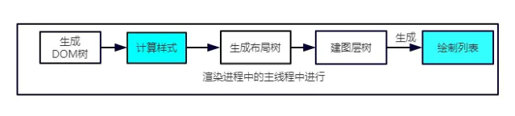

跳过了`生成布局树`和`建图层树`的阶段，直接生成绘制列表，然后继续进行分块、生成位图等后面一系列操作。


### 3-2、回流

当我们对 DOM 的修改引发了 DOM 几何尺寸的变化，比如修改元素的宽、高或隐藏元素等，浏览器需要重新计算元素的几何属性进行布局，然后再将计算的结果绘制出来。这个过程就是回流。回流肯定引发重绘，重绘不一定触发回流。


**回流过程：**

触发回流的时候，DOM 结构发生改变，则重新渲染 DOM 树，然后将后面的流程(包括主线程之外的任务)全部走一遍

 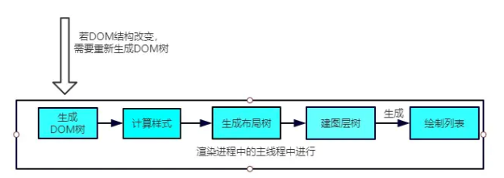


**引发回流的操作**

- 一个 DOM 元素的几何属性变化，常见的几何属性有`width`、`height`、`padding`、`margin`、`left`、`top`、`border` 等等
- 元素字体大小变化
- 浏览器窗口大小发生改变

- 使 DOM 节点发生`增减`或者`移动`

- `offset`族、`scroll`族和`client`族属性的时候，浏览器为了获取这些值，需要进行回流操作

- 调用 `window.getComputedStyle` 方法


### 3-3、GPU

还有一种情况，是直接合成。比如利用 CSS3 的`transform`、`opacity`、`filter` 这些属性就可以实现合成的效果，也就是大家常说的**GPU加速**。

在合成的情况下，会直接跳过布局和绘制流程，直接进入`非主线程`处理的部分，即直接交给`合成线程`处理。交给它处理有两大好处:

1. 能够充分发挥`GPU`的优势。合成线程生成位图的过程中会调用线程池，并在其中使用`GPU`进行加速生成，而GPU 是擅长处理位图数据的。
2. 没有占用主线程的资源，即使主线程卡住了，效果依然能够流畅地展示。


### 3-4、避免重绘回流

-   不要频繁使用 style，而是使用 class 进行一次性修改
-   避免使用 table 布局
-   将动画效果放到脱离文档流的 position 属性为 absolute 或 fixed 的元素上，实现分层
-   避免频繁操作 DOM，创建一个 documentFragment，在它上面应用所有 DOM 操作，最后再把它添加到文档中。
-   也可以先为元素设置 display: none，操作结束后再把它显示出来。因为在 display 属性为 none 的元素上进行的 DOM 操作不会引发回流和重绘
-   对于 resize、scroll 等进行防抖/节流处理
-   使用 css3 动画替代 js 操作 DOM，css3 动画会 GPU 加速


## 4、浏览器本地存储


### 4-1、cookie

`Cookie` 最开始被设计出来其实并不是来做本地存储的，而是为了弥补`HTTP`在**状态管理上的不足**。主要是因为 `HTTP`  协议是一个无状态协议，客户端向服务器发请求，服务器返回响应，故事就这样结束了，但是下次发请求如何让服务端知道客户端是谁呢？


这就需要 cookie 了。Cookie 本质上就是浏览器里面存储的一个很小的文本文件，内部以键值对的方式来存储(在 chrome 开发者面板的`Application` 这一栏可以看到)。向同一个域名下发送请求，都会携带相同的 Cookie，服务器拿到 Cookie 进行解析，便能拿到客户端的状态。


cookie 的一些缺点：

- 容量缺陷。Cookie 的体积上限只有`4KB`，只能用来存储少量的信息。
- 性能缺陷。Cookie 紧跟域名，不管域名下面的某一个地址需不需要这个 Cookie ，请求都会携带上完整的 Cookie，这样随着请求数的增多，其实会造成巨大的性能浪费的，因为请求携带了很多不必要的内容。
- 安全缺陷。由于 Cookie 以纯文本的形式在浏览器和服务器中传递，很容易被非法用户截获，然后进行一系列的篡改，在 Cookie 的有效期内重新发送给服务器，这是相当危险的。另外，在`HttpOnly`为 false 的情况下，Cookie 信息能直接通过 JS 脚本来读取。


### 4-2、对比 cookie 与 session

-   Session: 是在服务端保存的一个数据结构，用来跟踪用户的状态，这个数据可以保存在集群、数据库、文件中；session 的运行依赖 session id，而 session id 是存在 cookie 中的
-   Cookie: 是客户端保存用户信息的一种机制，用来记录用户的一些信息，也是实现 Session 的一种方式

1、 由于 HTTP 协议是无状态的协议，所以服务端需要记录用户的状态时，就需要用某种机制来识具体的用户，这个机制就是 Session。典型的场景比如购物车，当你点击下单按钮时，由于 HTTP 协议无状态，所以并不知道是哪个用户操作的，所以服务端要为特定的用户创建了特定的 Session，用用于标识这个用户，并且跟踪用户，这样才知道购物车里面有几本书。这个 Session 是保存在服务端的，有一个唯一标识

2、 思考一下服务端如何识别特定的客户?: 这个时候 Cookie 就登场了。每次 HTTP 请求的时候，客户端都会发送相应的 Cookie 信息到服务端。实际上大多数的应用都是用 Cookie 来实现 Session 跟踪的，第一次创建 Session 的时候，服务端会在 HTTP 协议中告诉客户端，需要在 Cookie 里面记录一个 Session ID，以后每次请求把这个会话 ID 发送到服务器，我就知道你是谁了


两者的主要区别：

-   cookie 数据存放在客户的浏览器上，session 数据放在服务器上
-   cookie 不是很安全，别人可以分析存放在本地的 cookie 并进行 cookie 欺骗，考虑到安全应当使用 session。用户验证这种场合一般会用 session
-   session 保存在服务器，客户端不知道其中的信息；反之，cookie 保存在客户端，服务器能够知道其中的信息
-   session 会在一定时间内保存在服务器上，当访问增多，会比较占用你服务器的性能，考虑到减轻服务器性能方面，应当使用 cookie，而 cookie 有大小限制
-   session 中保存的是对象，cookie 中保存的是字符串
-   session 不能区分路径，同一个用户在访问一个网站期间，所有的 session 在任何一个地方都可以访问到，而 cookie 中如果设置了路径参数，那么同一个网站中不同路径下的 cookie 互相是访问不到的


### 4-3、localStorage

localStorage 有一点跟 Cookie 一样，就是针对一个域名，即在同一个域名下，会存储相同的一段 localStorage。


**操作方式**

存：

```js
let obj = { name: "jack" };
localStorage.setItem("name", "jack"); 
localStorage.setItem("info", JSON.stringify(obj));
```

取：

```js
let name = localStorage.getItem("name");
let info = JSON.parse(localStorage.getItem("info"));
```

`localStorage` 其实存储的都是字符串，如果是存储对象需要调用`JSON`的`stringify`方法，并且用`JSON.parse`来解析成对象。


localStorage 主要是用来存储一些需要长期存储的数据，比如一些用户信息。


### 4-4、sessionStorage

`sessionStorage`以下方面和`localStorage`一致:

- 容量。容量上限也为 5M。
- 只存在客户端，默认不参与与服务端的通信。
- 接口封装。除了`sessionStorage`名字有所变化，存储方式、操作方式均和`localStorage`一样。

但`sessionStorage`和`localStorage`有一个本质的区别，那就是前者只是会话级别的存储，并不是持久化存储。会话结束，也就是页面关闭，这部分`sessionStorage`就不复存在了。


sessionStorage 主要用来存储一些不需要长期存储的信息，比如对表单信息进行维护，将表单信息存储在里面，可以保证页面即使刷新也不会让之前的表单信息丢失


### 4-5、cookie、localStorage 与 sessionStorage 区别

1.数据存储方面

-   cookie 数据始终在同源的 http 请求中携带（即使不需要），即 cookie 在浏览器和服务器间来回传递。cookie 数据还有路径（path）的概念，可以限制 cookie 只属于某个路径下
-   sessionStorage 和 localStorage 不会自动把数据发送给服务器，仅在本地保存

2.存储数据大小

-   存储大小限制也不同，cookie 数据不能超过 4K，同时因为每次 http 请求都会携带 cookie、所以 cookie 只适合保存很小的数据，如会话标识
-   sessionStorage 和 localStorage 虽然也有存储大小的限制，但比 cookie 大得多，可以达到 5M 或更大（不同浏览器不一样）

3.数据存储有效期

-   sessionStorage：仅在当前浏览器窗口关闭之前有效
-   localStorage：始终有效，窗口或浏览器关闭也一直保存，本地存储，因此用作持久数据
-   cookie：只在设置的 cookie 过期时间之前有效，即使窗口关闭或浏览器关闭

4.作用域不同

-   sessionStorage 不在不同的浏览器窗口中共享，即使是同一个页面；
-   localstorage 在所有同源窗口中都是共享的；也就是说只要浏览器不关闭，数据仍然存在；
-   cookie: 也是在所有同源窗口中都是共享的；


### 4-6、IndexDB

使用可以参考：https://www.ruanyifeng.com/blog/2018/07/indexeddb.html

**特点：**

- 键值对储存：IndexedDB 内部采用对象仓库（object store）存放数据。所有类型的数据都可以直接存入，包括 JavaScript 对象。对象仓库中，数据以"键值对"的形式保存，每一个数据记录都有对应的主键，主键是独一无二的，不能有重复，否则会抛出一个错误。

- 异步： IndexedDB 操作时不会锁死浏览器，用户依然可以进行其他操作，这与 LocalStorage 形成对比，后者的操作是同步的。异步设计是为了防止大量数据的读写，拖慢网页的表现。

- 支持事务： IndexedDB 支持事务（transaction），这意味着一系列操作步骤之中，只要有一步失败，整个事务就都取消，数据库回滚到事务发生之前的状态，不存在只改写一部分数据的情况。

- 同源限制：IndexedDB 受到同源限制，每一个数据库对应创建它的域名。网页只能访问自身域名下的数据库，而不能访问跨域的数据库。

- 储存空间大：IndexedDB 的储存空间比 LocalStorage 大得多，一般来说不少于 250MB，甚至没有上限。

- 支持二进制储存： IndexedDB 不仅可以储存字符串，还可以储存二进制数据（ArrayBuffer 对象和 Blob 对象）。


## 5、浏览器安全


### 5-1、XSS 攻击

可参考：

https://juejin.im/post/5df5bcea6fb9a016091def69#heading-64

https://juejin.cn/post/6854573215830933512#heading-74


XSS(Cross Site Script) 跨站脚本攻击。指的是攻击者向网页注入恶意的客户端代码，通过恶意的脚本对客户端网页进行篡改，从而在用户浏览网页时，对用户浏览器进行控制或者获取用户隐私数据的一种攻击方式


**XSS 攻击原理**

往 Web 页面里插入恶意 Script 代码


**XSS 一般可以做以下事情：**

- 窃取 Cookie

- 监听用户行为，比如输入账号密码后直接发送到黑客服务器

- 修改 DOM 伪造登录表单

- 在页面中生成浮窗广告


**主要是分为三种：**

- 存储型：即攻击被存储在服务端，常见的场景是留言评论区提交一段脚本代码，如果前后端没有做好转义的工作，那评论内容存到了数据库，然后客户端请求返回这些脚本，渲染执行，相当于执行一段未知逻辑的 JS 代码，是非常恐怖的。比如这段 JS 代码用于获取用户 cookie

- 反射型：将恶意脚本作为网络请求的一部分。服务端接收到 URL 将恶意代码当做参数取出并拼接在 HTML 里返回，浏览器解析此 HTML 后即执行恶意代码

  ```js
  // 比如输入：
  
  http://gweid.com?q=<script>alert("发起攻击！！！")</script>
  ```

-   文档型：文档型的 XSS 攻击并不会经过服务端，而是作为中间人的角色，在数据传输过程劫持到网络数据包，然后修改里面的 html 文档。这样的劫持方式包括 WIFI 路由器劫持或者本地恶意软件等


**如何防御 XSS 攻击：**

一个信念：不要相信用户输入；两个利用：1、利用 httpOnly 2、利用 CSP

-   输入检查：永远不要相信任何用户的输入，对输入内容中的 script 和 \<iframe\> 等标签进行转义或者过滤
-   设置 httpOnly：很多 XSS 攻击目标都是窃取用户 cookie 伪造身份认证，设置此属性可防止 JS 获取 cookie
-   开启 CSP：即开启白名单（浏览器中的内容安全策略），可阻止白名单以外的资源加载和运行
    - 限制加载其他域下的资源文件，这样即使黑客插入了一个 JavaScript 文件，这个 JavaScript 文件也是无法被加载的
    - 禁止向第三方域提交数据，这样用户数据也不会外泄
    - 提供上报机制，能帮助我们及时发现 XSS 攻击
    - 禁止执行内联脚本和未授权的脚本


### 5-2、CSRF 攻击

可参考：

https://juejin.im/post/5df5bcea6fb9a016091def69#heading-80

https://juejin.cn/post/6854573215830933512#heading-83


CSRF 攻击 (Cross-site request forgery) 跨站请求伪造。是一种劫持受信任用户向服务器发送非预期请求的攻击方式，通常情况下，它是攻击者借助受害者的 Cookie 骗取服务器的信任，但是它并不能拿到 Cookie，也看不到 Cookie 的内容，它能做的就是给服务器发送请求，然后执行请求中所描述的命令，以此来改变服务器中的数据，也就是并不能窃取服务器中的数据

比如：黑客诱导用户点击链接，打开黑客的网站，然后黑客利用用户目前的登录状态发起跨站请求


**CSRF 攻击原理：**

-   用户打开浏览器，访问受信任网站 A，输入用户名和密码请求登录网站 A；
-   在用户信息通过验证后，网站 A 产生 Cookie 信息并返回给浏览器，此时用户登录网站 A 成功，可以正常发送请求到网站 A；
-   用户未退出网站 A 之前，在同一浏览器中，打开一个 TAB 页访问网站 B；
-   网站 B 接收到用户请求后，返回一些攻击性代码，并发出一个请求要求访问第三方站点 A；
-   浏览器在接收到这些攻击性代码后，根据网站 B 的请求，在用户不知情的情况下携带 Cookie 信息，向网站 A 发出请求。网站 A 并不知道该请求其实是由 B 发起的，所以会根据用户 C 的 Cookie 信息以 C 的权限处理该请求，导致来自网站 B 的恶意代码被执行。


**CSRF 攻击方式：**

- 自动 GET 请求

  ```js
  // 假设用户在 abcd 网页登录
  
  // 而在黑客网页里面可能有一段这样的代码:
  
  
  // 这个请求会自动带上关于 abcd.com 的 cookie 信息
  ```

- 自动 POST 请求

  ```js
  // 黑客网页中有一个表单
  
  <form id='hacker-form' action="https://abcd.com/info" method="POST">
    <input type="hidden" name="user" value="hhh" />
    <input type="hidden" name="count" value="100" />
  </form>
  <script>document.getElementById('hacker-form').submit();</script>
  
  // 同样也会携带相应的用户 cookie 信息，让服务器误以为是一个正常的用户在操作，让各种恶意的操作变为可能。
  ```

- 诱导点击发送 GET 请求。

  ```js
  在黑客的网站上，可能会放上一个链接，驱使你来点击，点击后，自动发送 get 请求，接下来和自动发 GET 请求部分同理
  
  <a href="https://abcd/info?user=hhh&count=100" taget="_blank">这里有你想要的哦</a>
  ```


**防御 CSRF 攻击：**

-   验证 Token：浏览器请求服务器时，服务器返回一个 token，每个请求都需要同时带上 token 和 cookie 才会被认为是合法请求
-   验证 Referer：通过验证请求头的 Referer 来验证来源站点，Referer 包含了具体的 URL 路径，但请求头很容易伪造
-   设置 SameSite：设置 cookie 的 SameSite，可以让 cookie 不随跨域请求发出，禁止第三方请求携带 Cookie，但浏览器兼容不一。
    SameSite 可以设置为三个值，Strict、Lax 和 None。
    - 在 Strict 模式下，浏览器完全禁止第三方请求携带 Cookie。比如请求 abcd.com 网站只能在 abcd.com 域名当中请求才能携带 Cookie，在其他网站请求都不能。
    - 在 Lax 模式，就宽松一点了，但是只能在 get 方法提交表单况或者 a 标签发送 get 请求的情况下可以携带 Cookie，其他情况均不能。
    - 在 None 模式下，也就是默认模式，请求会自动携带上 Cookie。


## 6、跨域

跨域，是指浏览器不能执行其他网站的脚本。它是由**浏览器的同源策略**造成的，是浏览器对JavaScript实施的安全限制。


请求跨域了，那么请求到底发出去没有？

> 跨域并不是请求发不出去，请求能发出去，服务端能收到请求并正常返回结果，只是结果被浏览器拦截了


### 6-1、同源策略

同源策略就是：协议、域名、端口都相同的。同源策略主要是为了保护用户信息安全。

即便两个不同的域名指向同一个ip地址，也是不同源。


**同源策略限制内容有：**

- Cookie、LocalStorage、IndexedDB 等存储性内容。如果没有同源策略，那么只要任意一个脚本就能获取 cookies，去到相应网站发起恶意请求
- DOM 节点，不同源页面不能获取 DOM。主要防止通过 iframe 嵌套一个真正网站地址，拿取用户信息
- AJAX 请求发送后，结果被浏览器拦截了


### 6-2、跨域常用解决方案

可参考：https://juejin.cn/post/6844903767226351623


#### 6-2-1、JSONP

主要利用 script 标签的 src 天然支持跨域请求的原理。


**简单实现**

```js
function jsonp(url, params, callback) {
  params = {
    ...params,
    callback
  }

  const str = params.keys().map(item => {
    return `${item}=${params[item]}`
  }).join('&')

  const requireStr = `${url}?${str}`

  const script = document.createElement('script')
  script.setAttribute('src', requireStr)
  document.body.appendChild(script)
}

jsonp({
  url: 'http://www.xxxxx.com',
  params: {
    name: 'jack'
  },
  callback(res) {
    console.log(res);
  }
})
```

**JSONP 的优缺点：**

- 优点：
  - 它不像 XMLHttpRequest 对象实现的 Ajax 请求那样受到同源策略的限制，JSONP 可以跨越同源策略
  - 它的兼容性更好，在更加古老的浏览器中都可以运行
- 缺点：
  - 它只支持 GET 请求而不支持 POST 等其它类型的 HTTP 请求
  - 在调用失败的时候不会返回各种 HTTP 状态码
  - 安全性问题。假如提供 JSONP 的服务存在页面注入漏洞，即它返回的 javascript 的内容被人控制的。那么结果是什么？所有调用这个 JSONP 的网站都会存在漏洞。于是无法把危险控制在一个域名。所以在使用 JSONP 的时候必须要保证使用的 JSONP 服务必须是安全可信的


#### 6-2-2、CORS 跨域资源共享

CORS 需要服务端配合设置，常用的设置：

- Access-Control-Allow-Origin： 服务器允许访问的域名

-  Access-Control-Allow-Methods： 服务器允许使用的方法

- Access-Control-Allow-Headers： 服务器允许的首部字段

- Access-Control-Allow-Credentials：允许携带 cookie

- Access-Control-Max-Age： 该响应的有效时间(s), 在有效时间内浏览器无需再为同一个请求发送预检请求

  

#### 6-2-3、代理服务器

同源策略是浏览器需要遵循的标准，而如果是服务器向服务器请求就无需遵循同源策略。

**需要注意的是浏览器向代理服务器发送请求，也遵循同源策略**

 


- webpack 的 devServer 就是使用了代理服务器

- Node 中间件代理

  ```js
  // server1.js 代理服务器(http://localhost:3000)
  const http = require('http')
  // 第一步：接受客户端请求
  const server = http.createServer((request, response) => {
    // 代理服务器，直接和浏览器直接交互，需要设置CORS 的首部字段
    response.writeHead(200, {
      'Access-Control-Allow-Origin': '*',
      'Access-Control-Allow-Methods': '*',
      'Access-Control-Allow-Headers': 'Content-Type'
    })
    // 第二步：将请求转发给服务器
    const proxyRequest = http
      .request(
        {
          host: '127.0.0.1',
          port: 4000,
          url: '/',
          method: request.method,
          headers: request.headers
        },
        serverResponse => {
          // 第三步：收到服务器的响应
          var body = ''
          serverResponse.on('data', chunk => {
            body += chunk
          })
          serverResponse.on('end', () => {
            console.log('The data is ' + body)
            // 第四步：将响应结果转发给浏览器
            response.end(body)
          })
        }
      )
      .end()
  })
  server.listen(3000, () => {
    console.log('The proxyServer is running at http://localhost:3000')
  })
  ```


#### 6-2-4、Nginx 反向代理

实现原理类似于 Node 中间件代理，需要你搭建一个中转 nginx 服务器，用于转发请求。

使用 nginx 反向代理实现跨域，是最简单的跨域方式。只需要修改 nginx 的配置即可解决跨域问题，支持所有浏览器，支持 session，不需要修改任何代码，并且不会影响服务器性能。


实现思路：通过nginx配置一个代理服务器（域名与domain1相同，端口不同）做跳板机，反向代理访问domain2接口，并且可以顺便修改cookie中domain信息，方便当前域cookie写入，实现跨域登录。

将 nginx 目录下的 nginx.conf 修改如下：

```js
// 代理服务器
server {
    listen       81;
    server_name  www.domain1.com;
    location / {
        proxy_pass   http://www.domain2.com:8080;  #反向代理
        proxy_cookie_domain www.domain2.com www.domain1.com; #修改cookie里域名
        index  index.html index.htm;

        # 当用 webpack-dev-server 等中间件代理接口访问 nignx 时，此时无浏览器参与，故没有同源限制，下面的跨域配置可不启用
        add_header Access-Control-Allow-Origin http://www.domain1.com;  #当前端只跨域不带cookie时，可为*
        add_header Access-Control-Allow-Credentials true;
    }
}
```
