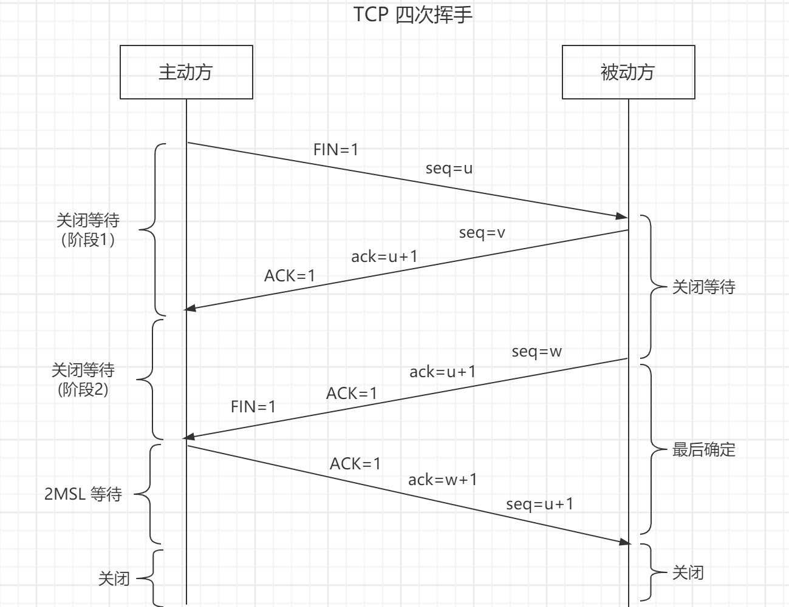

# 网络知识

本文为网络知识点随笔。

可参考：

[TCP协议灵魂之问，巩固你的网路底层基础](https://juejin.cn/post/6844904070889603085)

[关于 TCP 三次握手和四次挥手，满分回答在此](https://juejin.cn/post/6915024149203288072)

[计算机网络：TCP三次握手四次挥手面试题总结](https://juejin.cn/post/6867821346312290312)

[HTTP灵魂之问，巩固你的 HTTP 知识体系](https://juejin.cn/post/6844904100035821575)

[经得住拷问的HTTPS原理解析](https://juejin.cn/post/6942671833304924197)

[一文夯实你的网络基础](https://juejin.cn/post/6916818167205625863)

[网络知识点灵魂拷问](https://juejin.cn/post/6864175613209640973)

## 1、网络 OSI 七层模型与 TCP/IP 四层模型


### 1-1、网络 OSI 七层模型

- 物理层

- 数据链路层

  > 一般来讲，物理层与数据链路层归为网络接口层，比如说电缆、光纤之类的

- 网络层（ip）

- 传输层（tcp：安全可靠【三次握手】，分段传输，但是慢、udp：快【仅需发送一次确认】，但是会存在丢包）

- 会话层

- 表示层

- 应用层

  > 会话层、表示层、应用层归为应用层，主要就是 http

### 1-2、TCP/IP 四层模型


## 2、TCP

TCP 是传输层协议，是 HTTP 的上一层，所以可以说 HTTP 是基于 TCP 传输协议的。

### 2-1、TCP 与 UDP

TCP 是一个**面向连接的、可靠的、基于字节流的传输层协议。**

UDP 是一个**面向无连接的传输层协议。**

**两者之间的区别：**

- 面向连接：所谓的连接，指的是客户端和服务器的连接，在双方互相通信之前，TCP 需要三次握手建立连接；而 UDP 没有相应建立连接的过程，是即刻传输数据

- 可靠的：TCP 花了非常多的功夫保证连接的可靠性，主要体现在有状态和可控制。

  - TCP 有状态：精准记录哪些数据发送了，哪些数据被对方接收了，哪些没有被接收到，保证数据包按序到达，不允许半点差错
  - TCP 可控制：当意识到丢包了或者网络环境不佳，TCP 会根据具体情况调整自己的行为，控制自己的发送速度或者重发

  而 UDP 是无状态不可控的，所以 UDP 不能保证可靠性。

- 基于字节流：UDP 的数据传输是基于数据报的，这是因为仅仅只是继承了 IP 层的特性，而 TCP 为了维护状态，将一个个 IP 包变成了字节流

- 高效性（首部开销）：因为 UDP 没有 TCP 那么复杂，需要保证数据不丢失且有序到达。所以 UDP 的头部开销小，只有八字节，相比 TCP 的至少二十字节要少得多，在传输数据报文时是很高效的

- 拥塞控制：UDP 没有拥塞控制，一直会以恒定的速度发送数据。即使网络条件不好，也不会对发送速率进行调整。这样实现的弊端就是在网络条件不好的情况下可能会导致丢包，但是优点也很明显，在某些实时性要求高的场景（比如电话会议）就需要使用 UDP 而不是 TCP；TCP 有拥塞控制和流量控制机制，保证数据传输的安全性

- 服务对象：TCP 是一对一的两点服务，即一条连接只有两个端点；UDP 支持一对一、一对多、多对多的交互通信

**应用场景：**

由于 TCP 是面向连接，能保证数据的可靠性交付，因此经常用于：

- FTP 文件传输
- HTTP / HTTPS

由于 UDP 面向无连接，它可以随时发送数据，再加上UDP本身的处理既简单又高效，因此经常用于：

- 包总量较少的通信，如 DNS 、SNMP 等
- 视频、音频等多媒体通信
- 广播通信

### 2-2、TCP 报文段首部格式


其中几个比较重要的概念：

- **序号 Seq**：在一个 TCP 连接中传送的字节流中的每一个字节都按顺序编号。该字段表示本报文段所发送的数据的第一个字节的序号。**初始序号称为 Init Sequense Number, ISN**
- **确认号 ack**：期望收到对方下一个报文段的第一个数据字节的序号。若确认号为 N，则表明：到序号 N-1 为止的所有数据都已正确收到
- **确认 ACK**：仅当 ACK = 1 时确认号字段才有效，当 ACK = 0 时确认号无效。TCP 规定，在连接建立后所有传送的报文段都必须把 ACK 置为 1
- **同步 SYN**：SYN = 1 表示这是一个连接请求或连接接受报文。当 SYN = 1 而 ACK = 0 时，表明这是一个连接请求报文段。对方若同意建立连接，则应在响应的报文段中使 SYN = 1 且 ACK = 1。
- **终止 FIN**：用来释放一个连接。当 FIN = 1时，表明此报文段的发送发的数据已发送完毕，并要求释放运输连接。

### 2-3、TCP 三次握手

#### 2-3-1、握手过程

[](https://github.com/gweid/study/tree/master/http)

- `SYN`：连接请求/接收 报文段
- `seq`：发送的第一个字节的序号
- `ACK`：确认报文段
- `ack`：确认号。希望收到的下一个数据的第一个字节的序号

**刚开始客户端处于 `Closed` 的状态，而服务端处于 `Listen` 状态**：

> `CLOSED `：没有任何连接状态
>
> `LISTEN `：侦听来自远方 TCP 端口的连接请求

**第一次握手：**客户端向服务端发送一个 SYN 报文（SYN = 1），并指明客户端的初始化序列号 ISN(x)，即图中的 seq = x，表示本报文段所发送的数据的第一个字节的序号。此时客户端处于 `SYN_Send` 状态。

> `SYN-SENT` ：在发送连接请求后等待匹配的连接请求

**第二次握手：**服务器收到客户端的 SYN 报文之后，会发送 SYN 报文作为应答（SYN = 1），并且指定自己的初始化序列号 ISN(y)，即图中的 seq = y。同时会把客户端的 ISN + 1 作为确认号 ack 的值，表示已经收到了客户端发来的的 SYN 报文，希望收到的下一个数据的第一个字节的序号是 x + 1，此时服务器处于 `SYN_REVD` 的状态。

> `SYN-RECEIVED`：在收到和发送一个连接请求后等待对连接请求的确认

**第三次握手：**客户端收到服务器端响应的 SYN 报文之后，会发送一个 ACK 报文，也是一样把服务器的 ISN + 1 作为 ack 的值，表示已经收到了服务端发来的的 SYN 报文，希望收到的下一个数据的第一个字节的序号是 y + 1，并指明此时客户端的序列号 seq = x + 1（初始为 seq = x，所以第二个报文段要 +1），此时客户端处于 `Establised` 状态。

服务器收到 ACK 报文之后，也处于 `Establised 状态`，至此，双方建立起了 TCP 连接。

> `ESTABLISHED`：代表一个打开的连接，数据可以传送给用户

也就是说，对面是怎么确定是同一个发起连接的？首先，传过来的初始序号是 x，那么本地保存一个确认序号 x+1，如果下次传过来的序号不是 x+1，就可以确定不是同一个人发起的连接。

> 另外需要提醒你注意的是，SYN 是需要消耗一个序列号的，下次发送对应的 ACK 序列号要加1，因为凡是需要对端确认的，一定消耗TCP 报文的序列号。
>
> SYN 需要对端的确认， 而 ACK 并不需要，因此 SYN 消耗一个序列号而 ACK 不需要。

简单描述：

- 第一次握手，客户端告知服务端，我要发起请求
- 第二次握手，服务端表示收到通知，告知客户端可以开始发送请求
- 第三次握手，客户端收到，告知服务端，我要开始发送请求，请准备接收

由上面可以看出，进行数据传输，有一个重要的机制，就是接收方接收到数据包后必须要向发送方`确认`, 如果发送方没有接到这个`确认`的消息，就判定为数据包丢失，并重新发送该数据包。当然，发送的过程中还有一个优化策略，就是把`大的数据包拆成一个个小包`，依次传输到接收方，接收方按照这个小包的顺序把它们`组装`成完整数据包。

#### 2-3-2、三次握手过程中可以携带数据么

第三次握手的时候，可以携带。前两次握手不能携带数据。

如果前两次握手能够携带数据，那么一旦有人想攻击服务器，那么他只需要在第一次握手中的 SYN 报文中放大量数据，那么服务器势必会消耗更多的**时间**和**内存空间**去处理这些数据，增大了服务器被攻击的风险。

第三次握手的时候，客户端已经处于 `ESTABLISHED` （建立连接）状态，并且已经能够确认服务器的接收、发送能力正常，这个时候相对安全了，可以携带数据。

#### 2-3-3、为什么是三次握手？不是两次、四次？

**为什么不是两次？**

根本原因: 无法确认客户端的接收能力。

例如：失效的连接请求：主机 A 发出的连接请求没有收到主机 B 的确认，于是经过一段时间后，主机 A 又重新向主机 B 发送连接请求，且建立成功，顺序完成数据传输。但是连接关闭后，主机 A 第一次发送的连接请求并没有丢失，而是因为网络节点导致延迟达到主机 B，主机 B 以为是主机 A 又发起的新连接，于是主机 B 同意连接，并向主机 A 发回确认，但是此时主机 A 根本不会理会，主机 B 就一直在等待主机 A 发送数据，导致主机 B 的资源浪费。

**四次握手可以？**

三次握手的目的是确认双方 `发送` 和 `接收` 的能力，四次当然是可以的，100 次都可以。但为了解决问题，三次就足够了，再多用处不大，并且会有建立连接耗时过长问题。

### 2-4、四次挥手

#### 2-4-1、挥手过程

[](https://github.com/gweid/study/tree/master/http)

- `FIN` ：连接终止位
- `seq`：发送的第一个字节的序号
- `ACK`：确认报文段
- `ack`：确认号。希望收到的下一个数据的第一个字节的序号

四次挥手谁都可以先发起关闭，这里假设是客户端先发起关闭：

- **第一次挥手**：客户端发送一个 FIN 报文（请求连接终止：FIN = 1），报文中会指定一个序列号 seq = u。并**停止再发送数据，主动关闭 TCP 连接，但是会继续接受数据**。此时客户端处于 `FIN_WAIT1` （第一阶段等待状态）状态，等待服务端的确认。

  > `FIN-WAIT-1` 等待远程TCP的连接中断请求，或先前的连接中断请求的确认；第一阶段等待状态

- **第二次挥手**：服务端收到 FIN 之后，会发送 ACK 报文，且把客户端的序号值 +1 作为 ACK 报文的序列号值，表明已经收到客户端的报文了，此时服务端处于 `CLOSE_WAIT` 状态。此时服务端处于关闭等待状态，不会再接收数据，但会继续发送数据；客户端进入`FIN_WAIT2`（下一阶段等待状态）

  > `CLOSE-WAIT` 等待从本地用户发来的连接中断请求
  >
  > `FIN-WAIT-2` 从远程TCP等待连接中断请求

- **第三次挥手**：如果服务端也想断开连接了（没有要向客户端发出的数据），和客户端的第一次挥手一样，发送 FIN 报文，且指定一个序列号。此时服务端处于 `LAST_ACK` (最后确认阶段)的状态，等待客户端的确认。此时服务端不再接受和发送数据。

  > `LAST-ACK` - 等待原来发向远程TCP的连接中断请求的确认

- **第四次挥手**：客户端收到 FIN 之后，一样发送一个 ACK 报文作为应答（ack = w+1），且把服务端的序列值 +1 作为自己 ACK 报文的序号值（seq=u+1），此时客户端处于 **`TIME_WAIT` （时间等待）状态**。服务端收到后，会立即断开。

  - 注意了，这个时候，客户端需要等待 2MSL 才关闭，在这段时间内如果客户端没有收到服务端的重发请求，那么表示 ACK 成功到达，挥手结束，否则客户端重发 ACK。

简单描述：假设是客户端先发起关闭

- 第一次挥手：客户端发送请求，申请断开，进入等待阶段，此时不会发送数据，但是会继续接收数据
- 第二次挥手：服务端接收到请求，告知客户端已明白，此时服务端进入等待状态，不会再接收数据，但会继续发送数据；而客户端则进入下一阶段的等待状态
- 第三次挥手：服务端发送完剩余的数据后，告知客户端可以断开连接，此时服务端不会发送和接收数据，进入最后确认状态
- 第四次挥手：客户端收到后，告知服务端我开始断开连接，服务端收到后，直接就断开连接

#### 2-4-2、为什么需要等待 2MSL

保证客户端发送的最后一个 ACK 报文能够到达服务器，因为这个 ACK 报文可能丢失，若丢失，站在服务器的角度看来，我已经发送了请求断开了，客户端还没有给我回应，应该是我发送的请求断开报文它没有收到，于是服务器又会重新发送一次，而客户端就能在这个 2MSL 时间段内收到这个要求重传的报文，接着给出回应报文，并且会重启 2MSL 计时器

等待 1MSL 不可以吗？为什么要 2MSL

- 1 个 MSL 确保第四次挥手中主动关闭方最后的 ACK 报文最终能达到对端
- 1 个 MSL 确保对端如果没有收到 ACK，那么对端重新发送的 FIN 报文可以到达

#### 2-4-3、为什么是四次而不是三次

因为服务端在接收到`FIN`, 往往不会立即返回`FIN`, 必须等到服务端所有的报文都发送完毕了，才能发`FIN`。因此先发一个`ACK`表示已经收到客户端的`FIN`，延迟一段时间才发`FIN`。这就造成了四次挥手。

如果是三次挥手会有什么问题？

等于说服务端将`ACK`和`FIN`的发送合并为一次挥手，这个时候长时间的延迟可能会导致客户端误以为`FIN`没有到达客户端，从而让客户端不断的重发`FIN`。

### 2-5、半连接队列

服务器第一次收到客户端的 SYN 之后，就会处于 `SYN_RCVD` 状态，此时双方还没有完全建立其连接，服务器会把这种状态下的请求连接放在一个队列里，我们把这种队列称之为**半连接队列**。

当然还有一个**全连接队列**，完成三次握手后建立起的连接就会放在全连接队列中。如果队列满了就有可能会出现丢包现象。

### 2-6、SYN Flood 洪泛攻击

SYN 攻击就是 **客户端在短时间内伪造大量不存在的 IP 地址，并向服务端不断地发送 SYN 包**，服务端则需要回复确认包，并等待客户端确认，由于 IP 源地址不存在，服务端长时间收不到客户端的 ACK，因此服务端需要不断重发直至超时。而这些伪造的 SYN 包将长时间占用半连接队列，导致正常的 SYN 请求因为队列满而被丢弃。

SYN 攻击属于典型的 DoS/DDoS 攻击。

**应对 SYN Flood 洪泛攻击**

- 增加 SYN 连接，也就是增加半连接队列的容量。
- 减少 SYN + ACK 重试次数，避免大量的超时重发。
- 利用 SYN Cookie 技术，在服务端接收到 SYN 后不立即分配连接资源，而是根据这个 SYN 计算出一个 Cookie，连同第二次握手回复给客户端，在客户端回复 ACK 的时候带上这个 Cookie 值，服务端验证 Cookie 合法之后才分配连接资源。

## 3、HTTP

HTTP 协议是对客户端和服务器端之间数据之间实现可靠性的传输文字、图片、音频、视频等超文本数据的规范，格式简称为“超文本传输协议”。

HTTP 协议属于应用层，基于 TCP（HTTP 主要解决数据以何种格式传输，TCP 是决定数据怎么传输），及用户访问的第一层就是 HTTP。

http：超文本传输协议，无连接、无状态，规定了每段数据以什么形式表达才是能够被另外一台计算机理解

- 无连接：无连接的含义是限制每次连接只处理一个请求
- 无状态：无状态是指协议对于事务处理没有记忆能力。这也是为什么需要 session 标记用户的原因
- 灵活：HTTP 允许传输任意类型的数据对象。正在传输的类型由 Content-Type 加以标记

### 3-1、HTTP 请求报文


如上图，可以发现，请求报文主要由：请求行、请求头、请求体 组成

#### 3-1-1、请求行

类似下面：

```
GET /home HTTP/1.1
```

由请求方法、路径、HTTP 协议版本构成。

#### 3-1-2、请求头

常见的请求头字段：

| 首部字段名          | 说明                                                         |
| ------------------- | ------------------------------------------------------------ |
| `Accept`            | 告诉服务器，客户端支持的数据类型。                           |
| `Accept-Charset`    | 告诉服务器，客户端采用的编码。                               |
| `Accept-Encoding`   | 告诉服务器，客户机支持的数据压缩格式。                       |
| `Accept-Language`   | 告诉服务器，客户机的语言环境。                               |
| `Host`              | 客户机通过这个头告诉服务器，想访问的主机名。                 |
| `If-Modified-Since` | 客户机通过这个头告诉服务器，资源的缓存时间。                 |
| `Referer`           | 客户机通过这个头告诉服务器，它是从哪个资源来访问服务器的。（一般用于防盗链） |
| `User-Agent`        | 客户机通过这个头告诉服务器，客户机的软件环境。               |
| `Cookie`            | 客户机通过这个头告诉服务器，可以向服务器带数据。             |
| `Connection`        | 客户机通过这个头告诉服务器，请求完后是关闭还是保持链接。     |
| `Date`              | 客户机通过这个头告诉服务器，客户机当前请求时间               |

#### 3-1-3、请求体

请求体一般是需要向服务端传输的信息，例如：

```
// data 就是需要向服务端传输的数据
axios.post(url, data)
```

#### 3-1-4、常见的请求方法

【HTTP1.1】：

- GET：通常用来获取资源
- HEAD：获取资源的元信息
- POST：提交数据，即上传数据
- PUT：修改数据
- DELETE：删除资源(几乎用不到)
- CONNEC： 建立连接隧道，用于代理服务器
- OPTIONS：列出可对资源实行的请求方法，用来跨域请求
- TRACE：追踪请求-响应的传输路径

#### 3-1-5、GET 与 POST 请求的区别

- get 请求参数在 url 上，post 请求参数在请求体里
- get 请求的参数有大小限制，一般为 2048，根据浏览器不同会有区别；post 请求的参数可以无限大
- post 请求相对于 get 请求会稍微安全，因为请求参数不暴露在 url 上，但仅仅是相对的
- get 请求能缓存，post 不能

### 3-2、HTTP 响应报文


由图片可以看出，响应报文主要由：响应行、响应头、响应体 组成。

#### 3-2-1、响应行

类似：

```
HTTP/1.1 200 OK
```

由 协议版本、状态码、状态描述 组成

#### 3-2-2、响应头

常见的响应头字段：

| Response Header                                   | 描述                                                         |
| ------------------------------------------------- | ------------------------------------------------------------ |
| `Date: Mon, 30 Jul 2018 02:50:55 GMT`             | 服务端发送资源时的服务器时间                                 |
| `Expires: Wed, 31 Dec 1969 23:59:59 GMT`          | 较过时的一种验证缓存的方式，与浏览器（客户端）的时间比较，超过这个时间就不用缓存（不和服务器进行验证），适合版本比较稳定的网页 |
| `Cache-Control: no-cache`                         | 现在最多使用的控制缓存的方式，会和服务器进行缓存验           |
| `etag: "fb8ba2f80b1d324bb997cbe188f28187-ssl-df"` | 一般是Nginx静态服务器发来的静态文件签名，浏览在没有 “Disabled cache” 情况下，接收到 etag 后，同一个 url 第二次请求就会自动带上 “If-None-Match” |
| `Last-Modified: Fri, 27 Jul 2018 11:04:55 GMT`    | 服务器发来的当前资源最后一次修改的时间，下次请求时，如果服务器上当前资源的修改时间大于这个时间，就返回新的资源内容 |
| `Content-Type: text/html; charset=utf-8`          | 如果返回是流式的数据，我们就必须告诉浏览器这个头，不然浏览器会下载这个页面，同时告诉浏览器是utf8编码，否则可能出现乱码 |
| `Content-Encoding: gzip`                          | 告诉客户端，应该采用gzip对资源进行解码                       |
| `Connection: keep-alive`                          | 告诉客户端服务器的tcp连接也是一个长连接                      |

#### 3-2-3、响应体

响应体：从服务器请求的资源数据就放在这里面，例如 HTML, CSS, JS 等。

#### 3-2-4、常见的状态码

**1xx：** 指示信息--表示请求已接收，需要后面继续处理

**2xx：** 成功--表示请求已被成功接收、理解、接受

**3xx：** 重定向--要完成请求必须进行更进一步的操作

**4xx：** 客户端错误--请求有语法错误或请求无法实现

**5xx：** 服务器端错误--服务器未能实现合法的请求

| 状态码 | 状态描述              | 说明                                                         |
| ------ | --------------------- | ------------------------------------------------------------ |
| 100    | Continue              | 服务器已收到初始请求，现正在等待接收其余部分                 |
| 101    | Switching Protocols   | 切换协议。服务器根据客户端的请求切换协议。只能切换到更高级的协议，例如切换到HTTP的新版本协议 |
| 200    | OK                    | 客户端请求成功                                               |
| 301    | Moved Permanently     | 永久重定向                                                   |
| 302    | Found                 | 临时重定向                                                   |
| 303    | See Other             | 对于 POST 请求，它表示请求已经被处理，客户端可以接着使用GET方法去请求 Location 里的 URI |
| 304    | Not Modified          | 资源缓存                                                     |
| 307    | Temporary Redirect    | 对于 POST 请求，表示请求还没有被处理，客户端应该向 Location 里的 URI 重新发起 POST 请求 |
| 400    | Bad Reque             | 客户端请求有语法错误，服务器无法理解                         |
| 401    | Unauthorized          | 请求未经授权，要求用户的身份认证                             |
| 403    | Forbidden             | 服务器收到请求，但是拒绝提供服务                             |
| 404    | Not Found             | 请求的资源不存在                                             |
| 500    | Internal Server Error | 服务器内部错误，无法完成客户端请求                           |
| 503    | Service Unavailable   | 当前服务器暂时无法处理客户端请求，一段时间后，服务端可能恢复正常 |

**301、302、303、307 之间的区别**

- 301：永久性重定向
- 302：临时性重定向
- 303 和 307 都是临时重定向，是对 302 的细化，主要区别在于 post 请求上（302 是http1.0，303 和 307 是 http1.1）
- 303：对于 POST 请求，它表示请求已经被处理，客户端可以接着使用 GET 方法去请求 Location 里的 URI
- 307：对于 POST 请求，表示请求还没有被处理，客户端应该向 Location 里的 URI 重新发起 POST 请求

**301 和 302 对于 seo 哪个更好**

使用 301 表示永久性跳转，如果A页面已经被搜索引擎收录了，那么搜索引擎会知道以后再也没有A页面这个页面了，它已经转移到B页面上去了，搜索引擎会把原来对于A页面的排名权重转移到B页面上去，平稳过渡，然后在搜索引擎的数据库中删除A页面，替换成B页面

使用302表示暂时性跳转，302与301的区别在于，搜索引擎的数据库不会删除A页面，但仍会增加B页面。原来A网页页面的权重值排行并不会迁移到B网页页面

**百度搜索一直注重应用301**

### 3-3、请求报文与响应报文都有空行，空行作用？

主要用来区分开 `头部` 和 `实体`。

问: 如果说在头部中间故意加一个空行会怎么样？

那么空行后的内容全部被视为实体。

### 3-4、HTTP 历史

**http 0.9：**

- 只负责传输 html，最早的时候没有请求头和请求体，不能传输 js 或者静态资源
- 只有一个 GET 方法等

**http1.0：**

- 提供了请求头，那么就可以根据请求头的不同来处理不同的资源
- 除了 GET 命令，还引入了 POST 命令和 HEAD 命令
- 但是它有很多缺点，例如每次请求完都会断开链接，需要重新创建链接，带来较大的时间成本，需要手动 keep-alive

**http1.1：**

- 长连接：默认开启了 keep-alive 链路复用，管线化（一个域名下最多可以建立6个连接）。
- 缓存处理： HTTP/1.1 引入 Entity tag，If-Unmodified-Since, If-Match, If-None-Match 等新的请求头来控制缓存，详见浏览器缓存小节
- 带宽优化及网络连接的使用： HTTP1.1 则在请求头引入了 range 头域，支持断点续传功能
- Host 头处理： 在 HTTP/1.0 中认为每台服务器都有唯一的 IP 地址，但随着虚拟主机技术的发展，多个主机共享一个 IP 地址愈发普遍，HTTP1.1 的请求消息和响应消息都应支持 Host 头域，且请求消息中如果没有 Host 头域会 400 错误

缺点：

- 但是服务器处理请求是按照顺序来的，虽然发送是并发发送6个，但是响应还是按照顺序一一处理（即队头阻塞）。而且 6 个连接，会建立6个tcp，那么会有带宽争抢的情况
- 在使用时，header 里携带的内容过大，在一定程度上增加了传输的成本，并且每次请求 header 基本不怎么变化，尤其在移动端增加用户流量。
- HTTP/1.1 在传输数据时，所有传输的内容都是明文，客户端和服务器端都无法验证对方的身份，这在一定程度上无法保证数据的安全性

例如："免费 WiFi 陷阱”；黑客就是利用了 HTTP 明文传输的缺点，在公共场所架设一个 WiFi 热点开始“钓鱼”，诱骗网民上网。一旦你连上了这个 WiFi 热点，所有的流量都会被截获保存，里面如果有银行卡号、网站密码等敏感信息的话那就危险了，黑客拿到了这些数据就可以冒充你为所欲为。

**http2.0：**

- 二进制传输，应用层（HTTP/2.0）和传输层（TCP or UDP）之间增加一个二进制分帧层，从而突破 HTTP1.1 的性能限制，改进传输性能，实现低延迟和高吞吐量
- 多路复用，允许同时通过单一的 HTTP/2 连接发起多重的请求-响应消息。一个 request 对应一个 id，这样一个连接上可以有多个 request，每个连接的 request 可以随机的混杂在一起，接收方可以根据 request 的 id 将 request 再归属到各自不同的服务端请求里面
- Header 压缩，使用 HPACK 算法对 header 的数据进行压缩，这样数据体积小了，在网络上传输就会更快。高效的压缩算法可以很大的压缩 header ，减少发送包的数量从而降低延迟
- 服务器推送，双向通讯，服务器可以对客户端的一个请求发送多个响应，即服务器可以额外的向客户端推送资源，而无需客户端明确的请求
- 更安全

**http3.0：**解决了 tcp 的队头阻塞问题。最重要的是 http3.0 不再采用 tcp，而是使用 udp，并且加了 QUIC 协议

### 3-5、HTTP 队头阻塞

当 http 开启长连接 keep-alive 时，共用一个 TCP 连接，同一时刻只能处理一个请求，那么当前请求耗时过长的情况下，其它的请求只能处于阻塞状态，这就是著名的**队头阻塞**问题。

解决队头阻塞：

- 并发连接：对于一个域名允许分配多个长连接，那么相当于增加了任务队列，不至于一个队伍的任务阻塞其它所有任务。在 RFC2616规定过客户端最多并发 2 个连接，不过事实上在现在的浏览器标准中，这个上限要多很多，Chrome 中是 6 个。
- 域名分片：一个域名不是可以并发 6 个长连接吗？那就多分几个域名。比如：abcd.com 与 aabbcc.com，使它们都指向同样的一台服务器，能够并发的长连接数更多了，事实上也更好地解决了队头阻塞的问题。

## 4、HTTPS

HTTPS 并非是应用层的一种新协议。只是 HTTP 通信接口部分用 SSL(Secure Socket Layer)和 TLS(Transport Layer Security)协议代替而已。

通常，HTTP 直接和 TCP 通信。当使用 SSL 时，则演变成先和 SSL 通信，再由 SSL 和 TCP 通信了。简言之，所谓 HTTPS，其实就是身披 SSL 协议这层外壳的 HTTP。


在采用 SSL 后，HTTP 就拥有了 HTTPS 的加密、证书和完整性保护这些功能。也就是说HTTP 加上加密处理和认证以及完整性保护后即是 HTTPS。

### 4-1、HTTPS 的工作流程

HTTPS 主要是采用**对称密钥加密和非对称密钥加密组合而成的混合加密机制**进行传输。

也就是发送密文的一方用"对方的公钥"进行加密处理"对称的密钥"，然后对方在收到之后使用自己的私钥进行解密得到"对称的密钥"，这在确保双发交换的密钥是安全的前提下使用对称密钥方式进行通信。

这个过程简单来说就是：


- 客户端发起一个 HTTPS 请求。
  - 注意这个过程中客户端会发送一个密文族给服务端，密文族是浏览器所支持的加密算法的清单。
- 服务端把数字证书（公钥证书）返回给客户端。
  - 采用 HTTPS 协议的服务器必须要有一套数字证书，可以自己制作，也可以向组织申请。区别就是自己颁发的证书需要客户端验证通过才可以继续访问，而使用受信任的公司申请的证书则不会弹出提示页面。
- 客户端验证公钥证书，验证通过。客户端使用伪随机数生成器生成加密所使用的对称密钥，然后用服务端给的公钥加密这个对称密钥，发给服务端。
- 服务端使用自己的私钥解密这个消息，得到对称密钥。至此，客户端和服务端双方都持有了相同的对称密钥。
- 服务端使用对称密钥加密“明文内容 A”，发送给 客户端。
- 客户端使用对称密钥解密响应的密文，得到“明文内容 A”。
- 客户端再次发起 HTTPS 的请求，使用对称密钥加密请求的“明文内容 B”，然后服务端使用对称密钥解密密文，得到“明文内容 B”。

### 4-2、对称密钥加密和非对称密钥加密区别？

- **对称密钥加密**：
  - 是指加密和解密使用同一个密钥的方式，这样带来的好处就是加解密效率很快。
  - 但是存在的最大问题就是密钥发送问题，即如何安全地将密钥发给对方；
  - 既然数据在传输的过程中可以被劫持到，那么密钥也是可以的，如果有人拿到了这把密钥那谁都可以进行解密了。
- **非对称密钥加密**：
  - 是指使用一对非对称密钥，即公钥和私钥，公钥可以随意公开，但私钥只有自己知道。
  - 发送密文的一方使用对方的公钥进行加密处理，对方接收到加密信息后，使用自己的私钥进行解密。 由于非对称加密的方式不需要发送用来解密的私钥，所以相对安全。
  - 但是和对称加密比起来，非常的慢。
  - 而且，非对称密钥加密也不是绝对的安全，比如：通过中间人，伪造一对密钥，将公钥发送给客户端，而客户端又无法验证这把公钥的真实性，那么数据也会用这把公钥进行加密，如果加密的是银行卡密码之类的，那么中间人也可以通过这把伪造的私钥解开加密信息。【这就是中间人攻击】

### 4-3、信息的安全性

要保证信息的安全性，就要做到：

1. 信息的保密性
2. 信息的完整性
3. 身份识别

在 HTTPS 中，**通过混合加密保证信息的保密性，通过数字签名保证信息的完整性，通过数字证书验证信息的发送方的身份**

### 4-4、HTTPS 的加密方式、混合加密的优缺点

HTTPS 使用的是对称密钥加密和非对称密钥加密组合而成的混合加密加密机制进行数据传输。

也就是发送密文的一方用 "对方的公钥" 进行加密处理 "对称的密钥"，然后对方在收到之后使用自己的私钥进行解密得到 "对称的密钥"，这在确保双方交换的密钥是安全的前提下使用对称密钥方式进行通信。

**混合加密**

- **混合加密的好处：**对称密钥的优点是加解密效率快，在客户端与服务端确定了连接之后就可以用它来进行加密传输。不过前提是得解决双方都能安全的拿到这把对称密钥。这时候就可以利用非对称密钥加密来传输这把对称密钥，因为我们知道非对称密钥加密的优点就是能保证传输的内容是安全的。 所以好处是即保证了对称密钥能在双方之间安全的传输，又能使用对称加密方式进行通信，这比单纯的使用非对称加密通信快了很多。以此来解决了 HTTP 中内容可能被窃听的问题。
- **混合加密的缺点：**混合加密并不能保证数据的完整性，也就是说在传输的时候数据是有可能被第三方篡改的，比如完全替换掉，所以说它并不能校验数据的完整性。如果需要做到这一点就需要使用到数字签名。

### 4-5、数字签名？

数字签名的产生主要就是为了解决 HTTPS 中内容可能被篡改的问题，即校验数据的完整性。它能确定消息是发送方发送过来的，因为这里会有一个验证数字签名的过程，别人是假冒不了发送方的签名的。比如：小明向老王借钱，需要打借条，那么如何保证借条不被篡改呢？就是在借条上签名按压指纹，数字签名就跟这里的签名按压指纹是一样的道理。

**数字签名产生过程：**【数字签名是在证书颁发的时候生成，再交给服务端，服务端再传给客户端】

- 第一步：用**散列算法如 SHA1、MD5 将原文（即证书信息：颁发者、公钥，域名、有效期等）进行一次 hash \**生成一个\**消息摘要**
- 第二步：用 CA 机构的私钥对这个消息摘要进行进行加密。这个产生的东西就叫做数字签名，它会与原文一起发送给接收者。

**验证数字签名的过程：**【验证数字签名是在客户端】

- 首先发送方会将原文与数字签名(也就是加密后的摘要)一起发送给接收方

- 接收方会接收到这两样东西，即原文和数字签名

- 接收方用 Hash 函数处理原文会得到一份消息摘要

- 同时用 CA 的公钥解密数字签名也会得到一份消息摘要

  > 注意，这个 CA 公钥不是服务端发给客户端的那个公钥，而是 CA 机构的公钥。
  >
  > CA 公钥是在安装操作系统的时候，就被一起植入到操作系统里面的，如果是 window 平台，就是微软信任的证书机构才可以植入。可以通过 命令行 --> mmc 查看。
  >
  > 而服务器发送给客户端的公钥是用来加密对称密钥的。

  

- 只要比较这两份消息摘要是否相等就可以验证出数据有没有被篡改了

当然这里关键的一步就是要保证发送方传递过来的公钥是可信赖的，这时候就得用到数字证书了。

### 4-6、数字证书？

在传输的过程中，可能通过中间人，伪造一对密钥，将公钥发送给客户端，而客户端又无法验证这把公钥的真实性，那么数据也会用这把公钥进行加密，如果加密的是银行卡密码之类的，那么中间人也可以通过这把伪造的私钥解开加密信息。【这就是中间人攻击】

所以这时就需要**数字证书进行身份验证**了。数字证书也叫公钥证书，或者简称证书。它主要是为了解决通信方身份遭伪装的问题，也就是验证通信方的身份。比如：有一个富翁去世了，他的儿子想要继承遗产，那么就要出示证明，证明你是这个富翁的儿子，才能拿到遗产，那么怎么证明呢？就需要这个儿子去找一个有公信力的机构，例如公安局，去给他开一个证明，证明他就是富翁的儿子。

它简单来说其实是由一些权威的数字认证机构颁发给服务器的一个文件。数字认证机构简称CA，它是客户端和服务端都信任的第三方机构。至于颁发证书的流程，主要是为：

- 服务器的运营人员会向认证机构提交自己的公钥、公司信息、域名、联系方式等申请认证

- 而认证机构在拿到这些信息后会通过线上、线下各种途径验证申请者提交信息的真实性

- 在确认其真实性后，认证机构颁发证书，证书包含：颁发者、公钥，域名、有效期等，我们简称为明文信息。

  - 数字证书是如何保证公钥来自请求的服务器呢？数字证书上由持有人的相关信息，通过这点可以确定其不是一个中间人
  - 但是证书是可以伪造的，如何保证证书为真呢？就需要数字签名了。

- 进行数字签名：

  - 通过 Hash 函数处理明文信息（即证书包含的：颁发者、公钥，域名、有效期、使用什么 hash 算法等）生成一个信息摘要。
  - 再用 CA 机构的私钥对信息摘要进行加密处理。
  - 通过这两个步骤生成的文件就叫数字签名。

  > 也就是说，在证书颁发的过程会进行数字签名

- 之后会将明文信息（颁发者、公钥，域名、有效期、使用什么 hash 算法）和数字签名组合而成的证书颁发给申请者，也就是服务器。


**问题：为什么使用 hash 算法：**

- 只要内容有任意一点不一样，hash 的结果就会不一样
- hash 算法是不可逆的，所以也就无法通过 hash 算法逆推出原文

所以，只要对比 hash 是否一致，就可以确认数据是否被篡改。

**证书的组成：**

主要由两部分组成：

- 明文信息
  - 申请者的公钥
  - 申请者的组织信息、个人信息
  - 签发机构 CA 的信息
  - 有效时间、证书序列号等明文信息
- 签名
  - 它的产生过程其实就是上面介绍到的数字签名的产生
  - 产生过程：CA 先是通过 Hash 函数对公开的明文信息做处理生成一个信息摘要，接着用自己的私钥对信息摘要加密生成签名。

### 4-7、为什么数字证书能对通信方的身份进行验证？

- 那是因为在客户端第一次给服务端发送 HTTPS 请求的时候，服务端会将它自己的证书随着其它的信息(例如server_random、 server_params、需要使用的加密套件等东西)一起返给客户端。

- 客户端在收到之后首先会验证这个证书，只有验证通过之后才会有后续操作。而验证的过程其实也就是数字签名的验证过程。

- 前面说过了，证书其实是由明文信息(颁发者、公钥，域名、有效期、使用什么 hash 算法等)和这个明文信息的数字签名（对原文先 hash，再使用私钥加密）组成的。

- 客户端会用 Hash 函数处理明文信息生成一个信息摘要。

- 然后再用内置在浏览器上(或者系统)的 CA 的公钥来解密证书里的数字签名公钥来解密证书里的数字签名，得到一个信息摘要。

  > 注意，这个 CA 公钥不是服务端发给客户端的那个公钥，而是 CA 机构的公钥。
  >
  > CA 公钥是在安装操作系统的时候，就被一起植入到操作系统里面的，如果是 window 平台，就是微软信任的证书机构才可以植入。可以通过 命令行 --> mmc 查看。
  >
  > 而服务器发送给客户端的公钥是用来加密对称密钥的。

  

- 最后再将两个信息摘要进行对比，若是一样则能保证通信方的身份是正确的。

- 其实验证证书的过程不仅仅是数字签名的验证，客户端还会验证证书相关的域名信息，有效时间，是不是在 CRL 吊销列表里，以及它的上一级是否有效等等。

### 4-8、HTTPS 的加密传输过程，涉及到哪些算法？

在HTTPS加密传输中，实际上涉及到 SSL/TLS 协议，这里是有一个 TSL 握手的过程。对于传统的 TLS 握手也就是 RSA 握手我就不描述了，主要是说一下现在主流的 TLS1.2 版本的握手，也就是 ECDHE 握手。

它的过程大致来说是这样的：

- 客户端在第一次发送 HTTPS 请求的时候，会把 client_random、TSL版本号、加密套件列表发送给服务器
- 服务器在接收到之后确认TSL 的版本号，同时发送 server_random、server_params、需要使用的加密套件、以及自己的证书给客户端
- 客户端在收到这些信息之后，首先是会对服务器的证书进行验证，若是验证成功则会传递一个 client_params 给服务器
- 与此同时客户端会通过 ECDHE 算法计算出一个 pre_random，其中是传入了两个参数，一个是 client_params，还一个是 server_params。(也就是说：ECDHE(client_params, server_params) = per_random)
- 这时候客户端就同时拥有了 client_random、server_random、pre_random，它会将这三个参数通过一个伪随机函数计算得出最终的 secret，这个 secret 就是它们后续通信所要用的对称密钥。
- 而在客户端生成完 secret 之后，会给服务器发送一个收尾消息，告诉服务器之后都要用对称加密，且对称加密的算法是用第一次约定好的。
- 服务器它在接收到刚刚传递过来的 client_params 之后，也会使用和客户端一样的方式生成 secret，并且也会发送一个收尾消息给客户端。
- 当双方都收到收尾消息并验证成功之后，握手就结束了。后面开始用这个 secret 对称密钥加密报文进行传输。

### 4-9、描述一下 RSA 握手

**简单版：**

- 客户端首先向服务端发送一个HTTPS请求
- 服务端会把事先配置好的公钥证书随着其它的信息返回给客户端
- 客户端在收到服务端发来的证书之后进行验证，验证的过程参考数字证书验证，会得到服务端的信息以及它的公钥
- 验证成功之后会用伪随机函数计算出一个加密所需要的对称密钥(secret)，并且用服务端的公钥加密这个对称密钥发送给服务端
- 服务端再用自己的私钥解密刚刚的消息，得到里面的对称密钥。此时服务端和客户端都有了对称密钥 secret 。
- 后面的传输都会用这个对称密钥 secret 进行对称密钥加解密传输

**详细版：**

- 客户端首先发送 client_random、TSL版本号、加密套件列表给服务器
- 服务器在接收到之后确认TSL版本号，同时发送server_random、需要使用的加密套件、自己的证书给客户端
- 客户端在收到这些信息之后，首先是会对服务器的证书进行验证(也就是题目7)，若是验证成功则会用RSA算法生成一个pre_random，且用服务器的公钥(在证书中)加密pre_random发送给服务器。
- 此时，客户端有了 client_random、server_random、pre_random，它会将这三个参数通过一个伪随机函数计算得出最终的secret，这个secret就是它们后续通信所要用的对称密钥。
- 服务器接收到了刚刚用自己公钥加密的pre_random之后，用自己的私钥进行解密，得到里面的 pre_random，用和客户端一样的方式生成secret。
- 之后就用这个 secret对称密钥加密报文传输。

### 4-11、ECDHE 握手和 RSA 握手区别？

它们的区别主要是：

- 生成secret(对称密钥)的过程不同。RSA 中是使用 RSA 算法生成一个 pre_random 并用服务器的公钥加 pre_random 发送给服务器，然后各自用伪随机函数生成相同的 secret 对称密钥；而在 ECDHE 握手中，它没有用到 RSA 算法，而是用 ECDHE 算法生成的pre_random，且这个过程中比 RSA 多了client_params 和 server_params 两个参数。
- 在生成完 secret 之后，ECDHE 握手在客户端发送完收尾消息后可以提前抢跑，直接发送 HTTP 报文，节省了一个 RTT，不必等到收尾消息到达服务器，然后等服务器返回收尾消息给自己，直接开始发请求。这也叫 TLS False Start。 最主要的：RSA不具备向前安全性，ECDHE 有

### 4-12、向前安全性？

一句话概括：一次破解并不影响历史信息的性质就是向前安全性。

比如在 RSA 握手的过程中，客户端拿到了服务端的公钥，然后用此公钥加密 pre_random 给服务端。如果此时有第三方有服务端的私钥，并且截获了之前所有报文的时候，那么它就可以破解这段密文并拿到 pre_random、client_random、server_random 并根据对应的伪随机函数生成 secret，即拿到了最终通信的对称密钥，每一个历史报文都能通过这样的方式进行破解。它就不具有向前安全性。

但是ECDHE在每次握手的时候都会产生一个零时的密钥对(也就是client_params、server_params)，即使第三方有了私钥能破解，但是对之前的历史报文并没有影响。它就具有向前安全性。

### 4-13、TSL1.3 版本？较 TSL1.2 做了哪些改进？

TSL1.3 版本是 2018 年推出的。它较 TSL1.2 主要是做了以下改进：

- 强化安全：废除了很多的加密算法，只保留了5个加密套件。其中最主要的是废弃了 RSA，因为在 2015 年发现了 PRAEK 攻击，即已经有人发现了 RSA 的漏洞能进行破解；而且 RSA 不具备向前安全性。
- 提高性能：同时利用会话复用节省了重新生成密钥的时间，利用 PSK 做到了 0-RTT 连接。